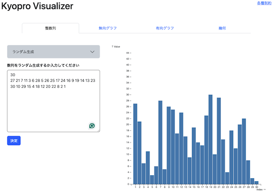
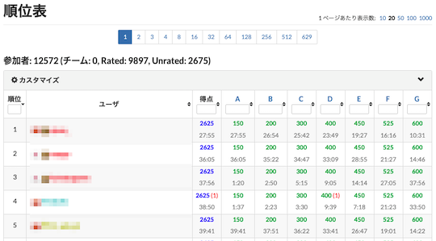

# AtCoder Clans

【非公式】競技プログラミングサイト[AtCoder](https://atcoder.jp/)がもっと楽しくなるリンク集です。有志による非公式サービス・ツール・ライブラリ・記事などをまとめています。

    
    
    
    

  

---

## 特長

* **網羅性が高い**: 初心者から上級者向けの情報まで幅広く掲載しています。
* **最新**: 最新の情報が入手できます。また、[X (旧 Twitter)](https://twitter.com/atcoderclans)で直近1週間の内容をお届けしています。
* **日本語の紹介文**: 日本語で紹介しています。
* **眺めるだけでも楽しい**: サービス・ツールのサムネイルが豊富です。
* **目的に応じて探せる**: 欲しい情報がすぐに探せるように、カテゴリ分けをしています。

## 対象ユーザとメリット

- [AtCoder](https://atcoder.jp/)ユーザ - 困ったことや不便なことが解決できるかもしれません。気になったサービス・ツールなどを使ってみましょう!

- 開発者 - 公開したサービスやツールなどの利用者が増えるだけでなく、ネタ探しや共同開発につながることも期待しています。

- [AtCoder](https://atcoder.jp/)運営チーム - 非公式サービス・ツールの全体像を踏まえ、公式として対応の有無を判断する材料の一つになると思います。また、企業向けの参考資料にもなるかもしれません。

- 企業の採用担当者 - [AtCoder](https://atcoder.jp/)ユーザの実務能力・ポテンシャルの評価材料の一つになると思います。ひいては人材発掘の効率化にも、つながるかもしれません。

---

## 最新情報を確認する

### AtCoder公式

<!-- markdown-link-check-disable -->

- [AtCoderInfo](https://info.atcoder.jp/) - [AtCoder](https://atcoder.jp/)の公式ポータルサイトです。コンテストの参加方法や取り組み方、採用担当者向け情報などが公開されています。

#### コンテストに関するルール変更

- [AtCoder生成AI対策ルール - 20241206版](https://info.atcoder.jp/entry/llm-rules-ja) - AtCoder Beginner Contest (通称 ABC) および AtCoder Regular Contest (同 ARC)のコンテスト開催中を対象として、生成AIの利用における禁止事項が説明されています ([英語版](https://info.atcoder.jp/entry/llm-rules-en))。
    - [生成AIの技術向上に伴うABCおよびARCにおけるルール変更について](https://atcoder.jp/posts/1347) - 上記のルール変更の背景、作成方針、概要、今後の変更の可能性について言及されています ([英語版](https://atcoder.jp/posts/1350))。
    - [ARCのDivision制に伴うルール変更について](https://atcoder.jp/posts/1368) - ARC の Division制の導入に伴うルールの変更点が紹介されています。

- [ARCのDivision制についての告知](https://atcoder.jp/posts/1364) - ARC189以降、AtCoder Regular Contest (通称 ARC) は難易度の異なる2種類のコンテストに分けられることが告知されています。

#### セキュリティ対策

- [AtCoderアカウントのパスワード管理について](https://atcoder.jp/posts/1366) - 不正アクセス防止のため、[AtCoder](https://atcoder.jp/)アカウントのパスワード確認・必要に応じて変更を促しています。
- [【重要なお知らせ】AtCoderを騙る偽サイトにご注意ください](https://atcoder.jp/posts/1268) - [AtCoder](https://atcoder.jp/)の偽サイトへのアクセス・ログインなどをしないように注意喚起している記事です。

#### 中学生・高校生向け

- [競技プログラミング教室](https://atcoder.jp/contests/atcoder_programming_class) - [AtCoder](https://atcoder.jp/)が開催を予定している中学生・高校生向けの教室です。競技プログラミングに興味があり、国内トップクラスの実力を身につけたいユーザが対象です。

<!-- markdown-link-check-enable -->

### 非公式サービス・ツール・ライブラリ・記事など

直近1〜2週間の更新状況を掲載しています(ベータ版)。

=== "Webアプリ・Webサイト"

    2025-01-22

    - 「[問題を解くときの補助ツール](web_app/support_tools)」ページ
        - [Kyopro Visualizer](https://yukitonegawa.github.io/visualizer.html)

    

      
    

=== "ユーザスクリプト"

    2025-01-29

    - 「[コンテストの成績や関連する統計情報を見る](user_scripts/view_scores)」ページ
        - [AtCoder Participants Display](https://greasyfork.org/ja/scripts/523852-atcoder-participants-display)

    

      
    

=== "記事"

    2025-02-04

    - 「[コンテストに関する統計情報を見る](articles/view_scores)」ページ
        - [AtCoder Junior League 2024 Winter - 学校ランキング (2025年2月3日時点)](https://x.com/atcoder/status/1886251197230936368)

    2025-02-03

    - 「[ヒューリスティック問題を解く](articles/heuristic)」ページ
        - [AtCoder Heuristic Contest 042参加メモ](https://kaede2020.hatenablog.com/entry/2025/02/03/091637)

    2025-02-01

    - 「[コードを書くための環境構築を行う](articles/development_env)」ページ
        - [JavaでのAtCoder環境構築](https://qiita.com/HERUESTA/items/bed73a2906115c68ce11)

    2025-01-31

    - 「[コードを書くための環境構築を行う](articles/development_env)」ページ
        - [AndroidスマホにAtCoder精進用CLI環境を構築してみた](https://qiita.com/VOT/items/c9ce841e9c30b6ba5b36)

    2025-01-28

    - 「[ヒューリスティック問題を解く](articles/heuristic)」ページ
        - [AHC041 参加記・本番 1 位解法の説明](https://rsm9.hatenablog.com/entry/2025/01/22/213923)

    2025-01-27

    - 「[コンテストに関する統計情報を見る](articles/view_scores)」ページ
        - [AtCoder Junior League 2024 Winter - 学校ランキング (2025年1月27日時点)](https://x.com/atcoder/status/1883695093561061486)

    2025-01-24

    - 「[ヒューリスティック問題を解く](articles/heuristic)」ページ
        - [AHC041 解説](https://speakerdeck.com/terryu16/ahc041jie-shuo)

    2025-01-23

    - 「[ヒューリスティック問題を解く](articles/heuristic)」ページ
        - [AHC初心者向け、ローカルテスタの使い方](https://qiita.com/thun-c/items/bb090c1d8d4c38d5e4d2)

    2025-01-21

    - 「[ヒューリスティック問題を解く](articles/heuristic)」ページ
        - [ALGO ARTIS プログラミングコンテスト2025 冬（AtCoder Heuristic Contest 041）参加メモ](https://kaede2020.hatenablog.com/entry/2025/01/20/194438)

=== "ブログ"
    アルゴリズム部門・ヒューリスティック部門におけるランキング上位の日本人ユーザのブログをまとめています(順不同)。

    2025-01-25

    - 「[ヒューリスティック部門 - C++](blogs/heuristic/cpp)」ページ
        - [asi1024](https://atcoder.jp/users/asi1024)さん - [はてなブログ](https://asi1024.hatenablog.com/)
        - [tatyam](https://atcoder.jp/users/tatyam)さん - [はてなブログ](https://tatyam.hatenablog.com/)、[Qiita](https://qiita.com/tatyam)
    - 「[ヒューリスティック部門 - Python](blogs/heuristic/python)」ページ
        - [hirayuu_At](https://atcoder.jp/users/hirayuu_At)さん - [はてなブログ](https://halc-kyopro.hatenablog.com/)

=== "色変記事"

    色変記事とは、コンテストの参加者が所定のレーティングに到達した喜びをつづった記事(動画も含む)のことです。

    2025-01-22

    - 「[レーティング2000〜2399(黄色)](milestones/yellow)」ページ
        - [miiitomi](https://atcoder.jp/users/miiitomi)さん - [【色変記事】AtCoderアルゴレートで黄色になりました！](https://miiitomi.github.io/p/yellow/)

=== "アーカイブス"

    諸事情により提供・開発が終了した(と思われる)サービス・ツールなどに対して、感謝や敬意を表するため掲載しています。

    2025-02-02

    - AtCoder-Ebbing

## AtCoder公式グッズを購入する

- [SUZURI](https://suzuri.jp/AtCoder) - [AtCoder](https://atcoder.jp/)のロゴ入りグッズが購入できる。

    

        
    

## 競プロLINEスタンプ・グッズ(非公式)を購入する

- [LINE STORE](https://store.line.me/stickershop/product/22113834/en) - [burioden](https://atcoder.jp/users/burioden)さんが作成・配信している競プロLINEスタンプ(非公式)。[第2弾](https://store.line.me/stickershop/product/22810021/en)、[第3弾](https://store.line.me/stickershop/product/22851268/en)、[第4弾](https://store.line.me/stickershop/product/25256215/en)もある。
    - [kyopro-neko](https://github.com/burioden/kyopro-neko)  - 「競プロするねこ」のイラスト集。
        - [アドバイスするねこ](https://github.com/burioden/kyopro-neko/tree/main/advice_neko) - 同キャラクターが、さまざまなアドバイスをしてくれる。
    - [SUZURI](https://suzuri.jp/burioden) - 「競プロするねこ」のイラストが書かれたグッズを購入できる。

    

        
    

## 本サービスのスポンサー(敬称略・順不同)

本サービスの開発・運営を応援してくださり、ありがとうございます。

[GitHub Sponsors](https://github.com/sponsors/KATO-Hiro)で寄付していただいた方には、いくつかの特典をご用意しております。

### 💚 AtCoder Clans Sponsor

- [chokudai](https://github.com/chokudai)

### 🌐 Domain Supporter

- [KoyanagiHitoshi](https://github.com/KoyanagiHitoshi)

### 🍨 Ice Cream Supporter

- ia7ck
- tomii9273
- toshi201

### 🙂 Special Supporter

- otsuneko
- yunix-kyopro
