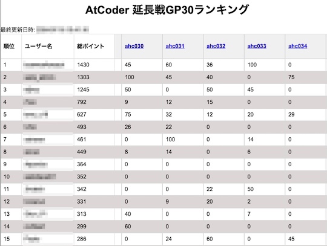
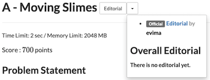
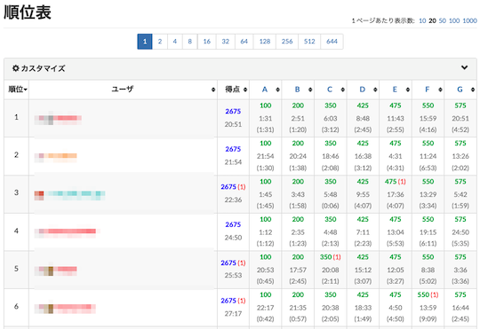
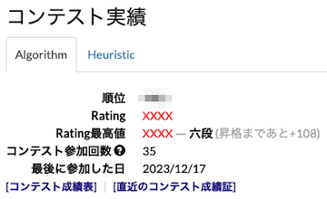
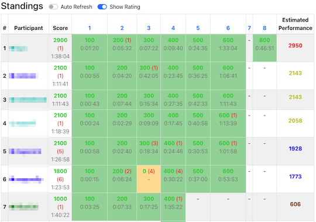
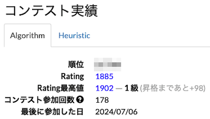
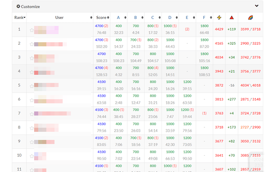

# AtCoder Clans

【非公式】競技プログラミングサイト[AtCoder](https://atcoder.jp/)がもっと楽しくなるリンク集です。有志による非公式サービス・ツール・ライブラリ・記事などをまとめています。

    
    
    
    

  

---

## 特長

* **網羅性が高い**: 初心者から上級者向けの情報まで幅広く掲載しています。
* **最新**: 最新の情報が入手できます。また、[X (旧 Twitter)](https://twitter.com/atcoderclans)で直近1週間の内容をお届けしています。
* **日本語の紹介文**: 日本語で紹介しています。
* **眺めるだけでも楽しい**: サービス・ツールのサムネイルが豊富です。
* **目的に応じて探せる**: 欲しい情報がすぐに探せるように、カテゴリ分けをしています。

## 対象ユーザとメリット

- [AtCoder](https://atcoder.jp/)ユーザ - 困ったことや不便なことが解決できるかもしれません。気になったサービス・ツールなどを使ってみましょう!

- 開発者 - 公開したサービスやツールなどの利用者が増えるだけでなく、ネタ探しや共同開発につながることも期待しています。

- [AtCoder](https://atcoder.jp/)運営チーム - 非公式サービス・ツールの全体像を踏まえ、公式として対応の有無を判断する材料の一つになると思います。また、企業向けの参考資料にもなるかもしれません。

- 企業の採用担当者 - [AtCoder](https://atcoder.jp/)ユーザの実務能力・ポテンシャルの評価材料の一つになると思います。ひいては人材発掘の効率化にも、つながるかもしれません。

---

## 最新情報を確認する

### AtCoder公式

<!-- markdown-link-check-disable -->

- [AtCoderInfo](https://info.atcoder.jp/) - [AtCoder](https://atcoder.jp/)の公式ポータルサイトです。コンテストの参加方法や取り組み方、採用担当者向け情報などが公開されています。

- [【重要なお知らせ】AtCoderを騙る偽サイトにご注意ください](https://atcoder.jp/posts/1268) - [AtCoder](https://atcoder.jp/)の偽サイトへのアクセス・ログインなどをしないように注意喚起している記事。

<!-- markdown-link-check-enable -->

### 非公式サービス・ツール・ライブラリ・記事など

直近1〜2週間の更新状況を掲載しています(ベータ版)。

=== "Webアプリ・Webサイト"

    2024-07-17

    - 「[コンテストの成績を見る](web_app/view_and_compare_scores)」ページ
        - [AtCoder 延長戦GP30ランキング](https://qropa.github.io/extended-gp30-ranking/)

    

      
    

=== "ユーザスクリプト"

    2024-07-20

    - 「[解説を読む・テストケースを見る](user_scripts/read_editorials)」ページ
        - [Editorials Dropdown for AtCoder](https://greasyfork.org/ja/scripts/500819-editorials-dropdown-for-atcoder)

    

      
    

    2024-07-17

    - 「[コンテストの成績や関連する統計情報を見る](user_scripts/view_scores)」ページ
        - [Atcoder AC Submission Duration](https://greasyfork.org/ja/scripts/500705-atcoder-ac-submission-duration)

    

      
    

    2024-07-15

    - 「[コンテストの成績や関連する統計情報を見る](user_scripts/view_scores)」ページ
        - [AtCoder-HiderRatingAndPerformance](https://greasyfork.org/ja/scripts/492653-atcoder-hiderratingandperformance)

    

      
    

    2024-07-13

    - 「[Webページに色付けする](user_scripts/colors)」ページ
        - [Virtual Contest Result Highlighter](https://greasyfork.org/ja/scripts/500190-virtual-contest-result-highlighter)

    

      
    

    2024-07-08

    - 「[Webページに色付けする](user_scripts/colors)」ページ
        - [ac-hide-official-rating-icon](https://greasyfork.org/ja/scripts/499759-ac-hide-official-rating-icon)

    

      
    

=== "Chrome拡張機能"

    2024-07-16

    - 「[コンテストの成績を見る](chrome_extensions/view_scores)」ページ
        - [AtCoder Companion](https://chromewebstore.google.com/detail/atcoder-companion/bflhekmjlbpdlibcmojpikplaldgceec)

    

      
    

=== "記事"

    2024-07-23

    - 「[コンテストに関する統計情報を見る](articles/view_scores)」ページ
        - [AtCoder Junior League 2024 Summer - 学校ランキング (7月22日時点)](https://x.com/atcoder/status/1815218587344531576)

    2024-07-17

    - 「[コンテストに関する統計情報を見る](articles/view_scores)」ページ
        - [AtCoder Junior League 2024 Summer - 学校ランキング (7月16日時点)](https://x.com/atcoder/status/1813035584010539051)

    - 「[コンテストに向けた練習方法を知る](articles/how_to_practice)」ページ
        - [競技プログラミングの練習法](https://hitoare.hatenablog.com/entry/2024/07/14/195940)

    2024-07-09

    - 「[コンテストに関する統計情報を見る](articles/view_scores)」ページ
        - [AtCoder Junior League 2024 Summer - 学校ランキング (7月8日時点)](https://x.com/atcoder/status/1810142588697301171)

=== "ブログ"
    アルゴリズム部門・ヒューリスティック部門におけるランキング上位の日本人ユーザのブログをまとめています(順不同)。

    2024-07-22

    - 「[ヒューリスティック部門 - C++](blogs/heuristic/cpp)」ページ
        - [peroon](https://atcoder.jp/users/peroon)さん - [はてなブログ](https://perogram.hateblo.jp/)
        - [tokumini](https://atcoder.jp/users/tokumini)さん - [はてなブログ](https://tokumini.hatenablog.com/)

    - 「[ヒューリスティック部門 - Python](blogs/heuristic/python)」ページ
        - [Koi51](https://atcoder.jp/users/Koi51)さん - [Qiita](https://qiita.com/koi51)

    - 「[ヒューリスティック部門 - Rust](blogs/heuristic/rust)」ページ
        - [tanakh](https://atcoder.jp/users/tanakh)さん - [Qiita](https://qiita.com/tanakh)

=== "動画"

    2024-07-18

    - 「[YouTube - 個別の動画](youtube/video)」ページ
        - [特別講義「定数倍高速化の技術」by tatyam](https://www.youtube.com/live/j1KGQHlHJ5E)

    2024-07-11

    - 「[YouTube - 個別の動画](youtube/video)」ページ
        - [0.999…は1か？【ゆっくり解説】](https://www.youtube.com/watch?v=Zp4I_fDtdi8)

    2024-07-07

    - 「[YouTube - 個別の動画](youtube/video)」ページ
        - [コンピュータが永久にできないこと【ゆっくり解説】](https://www.youtube.com/watch?v=zPbNx0nmxVw)

=== "国内外のコンテストサイト"

    2024-07-19

    - 「[数学系コンテスト](related_contest_sites/math)」ページ
        - [OMC水までの問題に使う知識まとめ](https://note.com/orangekid1210/n/nfab310b51ec3)

    2024-07-14

    - 「[Topcoder](related_contest_sites/topcoder)」ページ
        - [Single Round Match (SRM) の最新情報 (2024年7月時点)](https://archive.topcoder.com/)

    2024-07-10

    - 「[ICPC (国際大学対抗プログラミングコンテスト)](related_contest_sites/icpc)」ページ
        - [【ICPC国内予選】テストケース並列化でなぐろう](https://hackmd.io/@tatyam-prime/SyfzRuBwR)

=== "アーカイブス"

    諸事情により提供・開発が終了した(と思われる)サービス・ツールなどに対して、感謝や敬意を表するため掲載しています。

    2024-07-21

    - Topcoder ARENA (Practice Problem List)
    - Topcoder (Problem Search)
    - Greed

    2024-07-12

    - AC heatmap
    - Algorithm Visualizer
    - AtCoder Rating Comparison
    - Codeforces Rating Comparison

## AtCoder公式グッズを購入する

- [SUZURI](https://suzuri.jp/AtCoder) - [AtCoder](https://atcoder.jp/)のロゴ入りグッズが購入できる。

    

        
    

## 競プロLINEスタンプ・グッズ(非公式)を購入する

- [LINE STORE](https://store.line.me/stickershop/product/22113834/en) - [burioden](https://atcoder.jp/users/burioden)さんが作成・配信している競プロLINEスタンプ(非公式)。[第2弾](https://store.line.me/stickershop/product/22810021/en)、[第3弾](https://store.line.me/stickershop/product/22851268/en)、[第4弾](https://store.line.me/stickershop/product/25256215/en)もある。
    - [kyopro-neko](https://github.com/burioden/kyopro-neko)  - 「競プロするねこ」のイラスト集。
    - [SUZURI](https://suzuri.jp/burioden) - 「競プロするねこ」のイラストが書かれたグッズを購入できる。

    

        
    

## 本サービスのスポンサー(敬称略・順不同)

本サービスの開発・運営を応援してくださり、ありがとうございます。

[GitHub Sponsors](https://github.com/sponsors/KATO-Hiro)で寄付していただいた方には、いくつかの特典をご用意しております。

### 💚 AtCoder Clans Sponsor

- [chokudai](https://github.com/chokudai)

### 🌐 Domain Supporter

- [KoyanagiHitoshi](https://github.com/KoyanagiHitoshi)

### 🍨 Ice Cream Supporter

- ia7ck
- tomii9273
- toshi201

### 🙂 Special Supporter

- otsuneko
