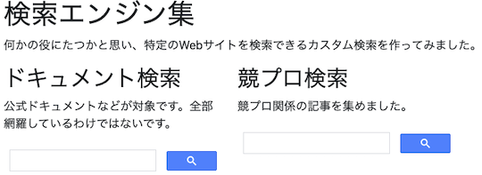
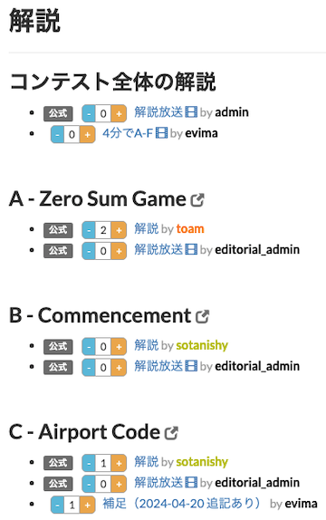
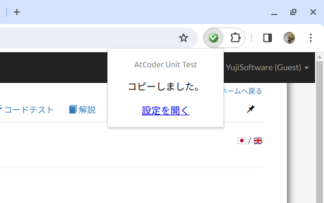
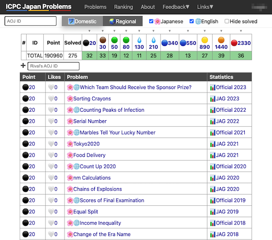

# AtCoder Clans

【非公式】競技プログラミングサイト[AtCoder](https://atcoder.jp/)がもっと楽しくなるリンク集です。有志による非公式サービス・ツール・ライブラリ・記事などをまとめています。

    
    
    
    

  

---

## 特長

* **網羅性が高い**: 初心者から上級者向けの情報まで幅広く掲載しています。
* **最新**: 最新の情報が入手できます。また、[X (旧 Twitter)](https://twitter.com/atcoderclans)で直近1週間の内容をお届けしています。
* **日本語の紹介文**: 日本語で紹介しています。
* **眺めるだけでも楽しい**: サービス・ツールのサムネイルが豊富です。
* **目的に応じて探せる**: 欲しい情報がすぐに探せるように、カテゴリ分けをしています。

## 対象ユーザとメリット

- [AtCoder](https://atcoder.jp/)ユーザ - 困ったことや不便なことが解決できるかもしれません。気になったサービス・ツールなどを使ってみましょう!

- 開発者 - 公開したサービスやツールなどの利用者が増えるだけでなく、ネタ探しや共同開発につながることも期待しています。

- [AtCoder](https://atcoder.jp/)運営チーム - 非公式サービス・ツールの全体像を踏まえ、公式として対応の有無を判断する材料の一つになると思います。また、企業向けの参考資料にもなるかもしれません。

- 企業の採用担当者 - [AtCoder](https://atcoder.jp/)ユーザの実務能力・ポテンシャルの評価材料の一つになると思います。ひいては人材発掘の効率化にも、つながるかもしれません。

---

## 最新情報を確認する

### AtCoder公式

<!-- markdown-link-check-disable -->

- [AtCoderInfo](https://info.atcoder.jp/) - [AtCoder](https://atcoder.jp/)の公式ポータルサイトです。コンテストの参加方法や取り組み方、採用担当者向け情報などが公開されています。

<!-- markdown-link-check-enable -->

### 非公式サービス・ツール・ライブラリ・記事など

直近1〜2週間の更新状況を掲載しています(ベータ版)。

=== "Webアプリ・Webサイト"

    2024-04-26

    - 「[問題を解くときの補助ツール](web_app/support_tools)」ページ
        - [検索エンジン集](https://magurofly.github.io/tools/search)

    

      
    

    2024-04-17

    - 「[問題を解く](web_app/solve_problems)」ページ
        - [searchapp](https://andoryoto.github.io/WebApplication/searchapp/)

    

      
    

=== "ボット"

    2024-04-21

    - 「[Bot](bot)」ページ
        - [Bluesky競プロ部](https://bsky.app/profile/kyopro.bsky.social)

=== "ユーザスクリプト"

    2024-04-20

    - 「[解説を読む・テストケースを見る](user_scripts/read_editorials)」ページ
        - [AtCoder Editorial Voting](https://greasyfork.org/ja/scripts/492964-atcoder-editorial-voting)

    

      
    

=== "Chrome拡張機能"

    2024-04-14

    - 「[ソースコードの提出・確認を簡単に](chrome_extensions/submit_codes)」ページ
        - [AtCoder Unit Test](https://chrome.google.com/webstore/detail/atcoder-unit-test/lmahhninbclefepjbcdfbcjnancipfmi?hl=ja&gl=UA)

    

      
    

=== "記事"

    2024-04-24

    - 「[ヒューリスティック問題を解く](articles/heuristic)」ページ
        - [いま、ここにしかない、出会い。(AtCoder 第一回マスターズ選手権 -決勝- で五位入賞しました。)](https://tsukammo.hatenablog.com/entry/2024/04/21/161831)
        - [第一回マスターズ参加記](https://amentorimaru.hatenablog.com/entry/2024/04/21/034648)

    2024-04-23

    - 「[コンテストに関する統計情報を見る](articles/view_scores)」ページ
        - [AtCoder Junior League 2024 Summer - 学校ランキング (4月22日時点)](https://twitter.com/atcoder/status/1782249854766546993)

    2024-04-19

    - 「[アルゴリズムを学ぶ](articles/algorithm)」ページ
        - [期待値DPと確率DPの例](https://paruma184.hatenablog.com/entry/2024/04/17/211859)

    2024-04-15

    - 「[ヒューリスティック問題を解く](articles/heuristic)」ページ
        - [世界一やさしいAHC体験記](https://d-burioden.hateblo.jp/entry/2024/04/13/154639)

=== "ブログ"
    アルゴリズム部門・ヒューリスティック部門におけるランキング上位の日本人ユーザのブログをまとめています(順不同)。

    2024-04-22

    - 「[アルゴリズム部門 - C++](blogs/algorithm/cpp)」ページ
        - [deuteridayo](https://atcoder.jp/users/deuteridayo)さん - [Qiita](https://qiita.com/deuteridayo)
        - [ococonomy1](https://atcoder.jp/users/ococonomy1)さん - [はてなブログ](https://ococonomy1.hateblo.jp/)

    2024-04-21

    - 「[アルゴリズム部門 - Python](blogs/algorithm/python)」ページ
        - [nahco314](https://atcoder.jp/users/nahco314)さん - [Qiita](https://qiita.com/NaHCO3)

    2024-04-18

    - 「[アルゴリズム部門 - C++](blogs/algorithm/cpp)」ページ
        - [a1048576](https://atcoder.jp/users/a1048576)さん - [Qiita](https://qiita.com/a1048576/)

    2024-04-14

    - 「[アルゴリズム部門 - Nim](blogs/algorithm/nim)」ページ
        - [kemuniku](https://atcoder.jp/users/kemuniku)さん - [Qiita](https://qiita.com/kemuniku)

=== "SNS"

    2024-04-21

    - 「[SNS](sns)」ページ
        - [競プロフィード](https://bsky.app/profile/did:plc:oxqrfur74k6qr4xy4g3clfe3/feed/aaahi3lkvvr6i)

=== "色変記事"

    色変記事とは、コンテストの参加者が所定のレーティングに到達した喜びをつづった記事(動画も含む)のことです。

    2024-04-25

    - 「[アルゴリズム部門 - レーティング800〜1199(緑色)](milestones/green)」ページ
        - [dhirabayashi](https://atcoder.jp/users/dhirabayashi)さん - [AtCoderでぴったり入緑したので、落ちないうちに色変記事を書かせてくださいお願いします](https://qiita.com/dhirabayashi/items/ae3a685140d1910747a9)

    2024-04-22

    - 「[アルゴリズム部門 - レーティング2000〜2399(黄色)](milestones/yellow)」ページ
        - [ococonomy1](https://atcoder.jp/users/ococonomy1)さん - [AtCoder 黄になりました！！](https://ococonomy1.hateblo.jp/entry/2024/04/21/201152)

    2024-04-18

    - 「[アルゴリズム部門 - レーティング2000〜2399(黄色)](milestones/yellow)」ページ
        - [a1048576](https://atcoder.jp/users/a1048576)さん - [AtCoderで入黄しました](https://qiita.com/a1048576/items/635a7c2798bbb0d21bef)

    2024-04-12

    - 「[アルゴリズム部門 - レーティング1600〜1999(青色)](milestones/blue)」ページ
        - [viral](https://atcoder.jp/users/viral)さん - [AtCoderで青色になって落ち着いたから書いた記事](https://qiita.com/viral_8/items/6ce0fbc58dbe55f8e7ae)

=== "国内外のコンテストサイト"

    2024-04-16

    - 「[yukicoder](related_contest_sites/yukicoder)」ページ
        - [yukicoder 1962 の解説の解説の解説](https://koba-e964.hatenablog.com/entry/2024/04/15/230008)

    2024-04-13

    - 「[ICPC (国際大学対抗プログラミングコンテスト)](related_contest_sites/icpc)」ページ
        - [ICPC Japan Problems](https://icpc-japan-problems.irrrrr.cc/)

    

      
    

## AtCoder公式グッズを購入する

- [SUZURI](https://suzuri.jp/AtCoder) - [AtCoder](https://atcoder.jp/)のロゴ入りグッズが購入できる。

    

        
    

## 競プロLINEスタンプ・グッズ(非公式)を購入する

- [LINE STORE](https://store.line.me/stickershop/product/22113834/en) - [burioden](https://atcoder.jp/users/burioden)さんが作成・配信している競プロLINEスタンプ(非公式)。[第2弾](https://store.line.me/stickershop/product/22810021/en)、[第3弾](https://store.line.me/stickershop/product/22851268/en)、[第4弾](https://store.line.me/stickershop/product/25256215/en)もある。
    - [kyopro-neko](https://github.com/burioden/kyopro-neko)  - 「競プロするねこ」のイラスト集。
    - [SUZURI](https://suzuri.jp/burioden) - 「競プロするねこ」のイラストが書かれたグッズを購入できる。

    

        
    

## 本サービスのスポンサー(敬称略・順不同)

本サービスの開発・運営を応援してくださり、ありがとうございます。

[GitHub Sponsors](https://github.com/sponsors/KATO-Hiro)で寄付していただいた方には、いくつかの特典をご用意しております。

### 💚 AtCoder Clans Sponsor

- [chokudai](https://github.com/chokudai)

### 🌐 Domain Supporter

- [KoyanagiHitoshi](https://github.com/KoyanagiHitoshi)

### 🍨 Ice Cream Supporter

- ia7ck
- tomii9273
- toshi201

### 🙂 Special Supporter

- otsuneko
