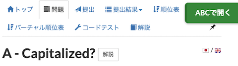

# AtCoder Clans

【非公式】競技プログラミングサイト[AtCoder](https://atcoder.jp/)がもっと楽しくなるリンク集です。有志による非公式サービス・ツール・ライブラリ・記事などをまとめています。

    
    
    
    

  

---

## 特長

* **網羅性が高い**: 初心者から上級者向けの情報まで幅広く掲載しています。
* **最新**: 最新の情報が入手できます。また、[X (旧 Twitter)](https://twitter.com/atcoderclans)で直近1週間の内容をお届けしています。
* **日本語の紹介文**: 日本語で紹介しています。
* **眺めるだけでも楽しい**: サービス・ツールのサムネイルが豊富です。
* **目的に応じて探せる**: 欲しい情報がすぐに探せるように、カテゴリ分けをしています。

## 対象ユーザとメリット

- [AtCoder](https://atcoder.jp/)ユーザ - 困ったことや不便なことが解決できるかもしれません。気になったサービス・ツールなどを使ってみましょう!

- 開発者 - 公開したサービスやツールなどの利用者が増えるだけでなく、ネタ探しや共同開発につながることも期待しています。

- [AtCoder](https://atcoder.jp/)運営チーム - 非公式サービス・ツールの全体像を踏まえ、公式として対応の有無を判断する材料の一つになると思います。また、企業向けの参考資料にもなるかもしれません。

- 企業の採用担当者 - [AtCoder](https://atcoder.jp/)ユーザの実務能力・ポテンシャルの評価材料の一つになると思います。ひいては人材発掘の効率化にも、つながるかもしれません。

---

## 最新情報を確認する

### AtCoder公式

<!-- markdown-link-check-disable -->

- [AtCoderInfo](https://info.atcoder.jp/) - [AtCoder](https://atcoder.jp/)の公式ポータルサイトです。コンテストの参加方法や取り組み方、採用担当者向け情報などが公開されています。

#### 公式コンテストの日時を確認

- [公式コンテストカレンダー運用のお知らせ](https://atcoder.jp/posts/1422) - Google カレンダーに追加すると、公式コンテストの開催日時を簡単に確認できます。
    - [ABCカレンダー](https://calendar.google.com/calendar/u/0?cid=Y180MzA3MDIxZTE0ZDhhMzNlYzgzNjI5YmM1MWQ2OTEzMWMwNjMxOGJiNGQ1ZmRjOTYwODNlZDE2ODFmMGEwZWQ2QGdyb3VwLmNhbGVuZGFyLmdvb2dsZS5jb20)
    - [ARCカレンダー](https://calendar.google.com/calendar/u/0?cid=Y185NGJiMDZmYmI0MDA2NjEzM2VmOTlkNTQ2NDhiZjIzYjI4MTEwNzdjZjU0MWE0ZGMyZDJlYjFiODI1MmU2NmZhQGdyb3VwLmNhbGVuZGFyLmdvb2dsZS5jb20)
    - [AGCカレンダー](https://calendar.google.com/calendar/u/0?cid=Y18wMTk0MDA5MTllZmYyNTI2MzNjNGIxNWE3MTA5YjUyNjhjNTkyNmFhMTFlMDQ2NWE5OWVmNTE5NDdhOTI4YmQ0QGdyb3VwLmNhbGVuZGFyLmdvb2dsZS5jb20)
    - [AHCカレンダー](https://calendar.google.com/calendar/u/0?cid=Y18yYTZiOWYxNTc3Nzg0N2E5YmNlNDhlMDI2OTkyYmY2ZGZjOWE2ZTlhMjk3Mjk4YTFjNjQ5NWMwYjE3NjQ5NjU0QGdyb3VwLmNhbGVuZGFyLmdvb2dsZS5jb20)

#### コンテストに関するルール変更

- [AtCoder生成AI対策ルール - 20241206版](https://info.atcoder.jp/entry/llm-rules-ja) - AtCoder Beginner Contest (通称 ABC) および AtCoder Regular Contest (同 ARC)のコンテスト開催中を対象として、生成AIの利用における禁止事項が説明されています ([英語版](https://info.atcoder.jp/entry/llm-rules-en))。
    - [生成AIの技術向上に伴うABCおよびARCにおけるルール変更について](https://atcoder.jp/posts/1347) - 上記のルール変更の背景、作成方針、概要、今後の変更の可能性について言及されています ([英語版](https://atcoder.jp/posts/1350))。
    - [ARCのDivision制に伴うルール変更について](https://atcoder.jp/posts/1368) - ARC の Division制の導入に伴うルールの変更点が紹介されています。

- [ARCのDivision制についての告知](https://atcoder.jp/posts/1364) - ARC189以降、AtCoder Regular Contest (通称 ARC) は難易度の異なる2種類のコンテストに分けられることが告知されています。
    - [ARC Div.1 の rated 上限の変更について](https://atcoder.jp/posts/1433) - ARC196 以降の ARC Div.1 の 開催形式の変更に関するお知らせです。

#### セキュリティ対策

- [AtCoderアカウントのパスワード管理について](https://atcoder.jp/posts/1366) - 不正アクセス防止のため、[AtCoder](https://atcoder.jp/)アカウントのパスワード確認・必要に応じて変更を促しています。
- [【重要なお知らせ】AtCoderを騙る偽サイトにご注意ください](https://atcoder.jp/posts/1268) - [AtCoder](https://atcoder.jp/)の偽サイトへのアクセス・ログインなどをしないように注意喚起している記事です。

#### 中学生・高校生向け

- [競技プログラミング教室](https://atcoder.jp/contests/atcoder_programming_class) - [AtCoder](https://atcoder.jp/)が開催を予定している中学生・高校生向けの教室です。競技プログラミングに興味があり、国内トップクラスの実力を身につけたいユーザが対象です。

<!-- markdown-link-check-enable -->

### 非公式サービス・ツール・ライブラリ・記事など

直近1〜2週間の更新状況を掲載しています(ベータ版)。

=== "Webアプリ・Webサイト"

    2025-03-30

    - 「[クイズ・ゲーム・ネタアプリ](web_app/quiz_and_game)」ページ
        - [嘘解法4コマジェネレーター](https://catupper.github.io/usokaiho-comic-generator/)

    

      
    

=== "ユーザスクリプト"

    2025-03-29

    - 「[問題を解く](user_scripts/solve_problems)」ページ
        - [ADT⇄ABC Converter Button](https://greasyfork.org/ja/scripts/531079-adt-abc-converter-button)

    

      
    

    2025-03-16

    - 「[問題を解く](user_scripts/solve_problems)」ページ
        - [AtCoderNotesForBeginners](https://greasyfork.org/ja/scripts/529251-atcodernotesforbeginners)

    

      
    

=== "記事"

    2025-03-28

    - 「[アルゴリズムを学ぶ](articles/algorithm)」ページ
        - [Manacher's algorithm でダミー文字を使わなくて済む方法](https://ngtkana.hatenablog.com/entry/2024/03/17/034026)

    2025-03-26

    - 「[ヒューリスティック問題を解く](articles/heuristic)」ページ
        - [AtCoder Heuristic First-step Vol.1 講義スライド 〜問題理解と貪欲法〜](https://speakerdeck.com/terryu16/atcoder-heuristic-first-step-vol-dot-1-jiang-yi-suraido)
        - [AtCoder Heuristic First-step Vol.1 講義スライド 〜山登り法・焼きなまし法編〜](https://speakerdeck.com/takumi152/atcoder-heuristic-first-step-vol-dot-1-jiang-yi-suraido-shan-deng-rifa-shao-kinamasifa-bian)

    2025-03-24

    - 「[コンテストに関する統計情報を見る](articles/view_scores)」ページ
        - [AtCoder Junior League 2024 Winter - 学校ランキング (2025年3月24日時点)](https://x.com/atcoder/status/1903989351903821897)

    2025-03-21

    - 「[ヒューリスティック問題を解く](articles/heuristic)」ページ
        - [AHC044 解説](https://www.terry-u16.net/entry/ahc044)

    2025-03-20

    - 「[コンテストに関する統計情報を見る](articles/view_scores)」ページ
        - [AtCoder Junior League 2024 Winter - 学校ランキング (2025年3月17日時点)](https://x.com/atcoder/status/1901458780032045328)

=== "ブログ"
    アルゴリズム部門・ヒューリスティック部門におけるランキング上位の日本人ユーザのブログをまとめています(順不同)。

    2025-03-17

    - 「[ヒューリスティック部門 - C++](blogs/heuristic/cpp)」ページ
        - [KKT89](https://atcoder.jp/users/KKT89)さん - [はてなブログ](https://kkt89.hatenablog.com/)

=== "コマンドラインツール"

    2025-03-19

    - 「[ソースコードにバグがないか確認](cli/test_tools)」ページ
        - [aclogin](https://github.com/key-moon/aclogin) 

    2025-03-18

    - 「[問題作成に関する便利ツール](cli/tools_for_writers)」ページ
        - [rime + testlib で部分点の制約チェックをする](https://sapphire15.hatenablog.com/entry/2025/03/17/231709)

=== "色変記事"

    色変記事とは、コンテストの参加者が所定のレーティングに到達した喜びをつづった記事(動画も含む)のことです。

    2025-03-30

     - 「[レーティング1200〜1599(水色)](milestones/cyan)」ページ
        - [yoniha](https://atcoder.jp/users/yoniha)さん - [ABC399でAlgorithm入水したぞ！](https://note.com/yoniha428/n/n6203f6d35764)

    2025-03-27

    - 「[レーティング400から799まで(茶色)](milestones/brown)」ページ
        - [ytz](https://atcoder.jp/users/ytz)さん - [【色変記事】某国支社長61歳文系、入茶しました(初心者）](https://qiita.com/ytz/items/07898c9afbf451071113)

    2025-03-25

    - 「[レーティング800〜1199(緑色)](milestones/green)」ページ
        - [Sa15MiyagiJapan](https://atcoder.jp/users/Sa15MiyagiJapan)さん - [【入緑記事】プログラミング未経験者でもAtCoder初参加から4か月で緑色になれた](https://qiita.com/hkt_shichisei/items/5b9587244bb819e6682a)

=== "国内外のコンテストサイト"

    2025-03-23

    - 「[情報オリンピック](related_contest_sites/joi_ioi)」ページ
        - [JOI春環境構築【MakeFile】](https://blueberry1001.hatenablog.com/entry/2025/03/19/151024)

## AtCoder公式グッズを購入する

- [SUZURI](https://suzuri.jp/AtCoder) - [AtCoder](https://atcoder.jp/)のロゴ入りグッズが購入できる。

    

        
    

## 競プロLINEスタンプ・グッズ(非公式)を購入する

- [LINE STORE](https://store.line.me/stickershop/product/22113834/en) - [burioden](https://atcoder.jp/users/burioden)さんが作成・配信している競プロLINEスタンプ(非公式)。[第2弾](https://store.line.me/stickershop/product/22810021/en)、[第3弾](https://store.line.me/stickershop/product/22851268/en)、[第4弾](https://store.line.me/stickershop/product/25256215/en)もある。
    - [kyopro-neko](https://github.com/burioden/kyopro-neko)  - 「競プロするねこ」のイラスト集。
        - [アドバイスするねこ](https://github.com/burioden/kyopro-neko/tree/main/advice_neko) - 同キャラクターが、さまざまなアドバイスをしてくれる。
    - [SUZURI](https://suzuri.jp/burioden) - 「競プロするねこ」のイラストが書かれたグッズを購入できる。

    

        
    

## 本サービスのスポンサー(敬称略・順不同)

本サービスの開発・運営を応援してくださり、ありがとうございます。

[GitHub Sponsors](https://github.com/sponsors/KATO-Hiro)で寄付していただいた方には、いくつかの特典をご用意しております。

### 💚 AtCoder Clans Sponsor

- [chokudai](https://github.com/chokudai)

### 🌐 Domain Supporter

- [KoyanagiHitoshi](https://github.com/KoyanagiHitoshi)

### 🍨 Ice Cream Supporter

- ia7ck
- ngtkana
- tomii9273
- toshi201

### 🙂 Special Supporter

- otsuneko
- yunix-kyopro
