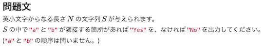

# AtCoder Clans

【非公式】競技プログラミングサイト[AtCoder](https://atcoder.jp/)がもっと楽しくなるリンク集です。有志による非公式サービス・ツール・ライブラリ・記事などをまとめています。

    
    
    
    

  

---

## 特長

* **網羅性が高い**: 初心者から上級者向けの情報まで幅広く掲載しています。
* **最新**: 最新の情報が入手できます。また、[X (旧 Twitter)](https://twitter.com/atcoderclans)で直近1週間の内容をお届けしています。
* **日本語の紹介文**: 日本語で紹介しています。
* **眺めるだけでも楽しい**: サービス・ツールのサムネイルが豊富です。
* **目的に応じて探せる**: 欲しい情報がすぐに探せるように、カテゴリ分けをしています。

## 対象ユーザとメリット

- [AtCoder](https://atcoder.jp/)ユーザ - 困ったことや不便なことが解決できるかもしれません。気になったサービス・ツールなどを使ってみましょう!

- 開発者 - 公開したサービスやツールなどの利用者が増えるだけでなく、ネタ探しや共同開発につながることも期待しています。

- [AtCoder](https://atcoder.jp/)運営チーム - 非公式サービス・ツールの全体像を踏まえ、公式として対応の有無を判断する材料の一つになると思います。また、企業向けの参考資料にもなるかもしれません。

- 企業の採用担当者 - [AtCoder](https://atcoder.jp/)ユーザの実務能力・ポテンシャルの評価材料の一つになると思います。ひいては人材発掘の効率化にも、つながるかもしれません。

---

## 最新情報を確認する

### AtCoder公式

<!-- markdown-link-check-disable -->

- [AtCoderInfo](https://info.atcoder.jp/) - [AtCoder](https://atcoder.jp/)の公式ポータルサイトです。コンテストの参加方法や取り組み方、採用担当者向け情報などが公開されています。

<!-- markdown-link-check-enable -->

### 非公式サービス・ツール・ライブラリ・記事など

直近1〜2週間の更新状況を掲載しています(ベータ版)。

=== "ホーム"

    2024-01-11

    本サービスのスポンサーを掲載(敬称略)。ご支援いただき、ありがとうございます。

    - [otsuneko](https://github.com/otsuneko)

=== "ユーザスクリプト"

    2024-01-13

    - 「[問題を解く](user_scripts/solve_problems)」ページ
        - [AtCoder-quotation-adder](https://github.com/burioden/AtCoder-quotation-adder)

    

      
    

=== "記事"

    2024-01-17

    - 「[入門者・初心者向けの内容](articles/introduction)」ページ
        - [中高生向け 学校対抗競技プログラミング「AtCoder Junior League2023」入賞校・入賞者を発表](https://prtimes.jp/main/html/rd/p/000000044.000028415.html)

    2024-01-16

    - 「[アルゴリズムを学ぶ](articles/algorithm)」ページ
        - [アニメーションでみるアルゴリズムの計算量](https://qiita.com/S4nTo/items/2fe9e41d2f1eb3e124e9)

    2024-01-14

    - 「[ヒューリスティック問題を解く](articles/heuristic)」ページ
        - [ALGO ARTIS プログラミングコンテスト2023 冬（AtCoder Heuristic Contest 028）参加メモ](https://kaede2020.hatenablog.com/entry/2024/01/14/141500)

    2024-01-12

    - 「[コードを書くための環境構築を行う](articles/development_env)」ページ
        - [AtcoderをGoで解答する環境をDevcontainerで作った話](https://horikawa.dev/p/atcoder-go-devcontainer/)

    2024-01-09

    - 「[部活・サークル・同好会・オンサイトイベントに参加する](articles/club_activities)」ページ
        - [OUPC 2023 開催記](https://kowerkoint.hatenablog.com/entry/2024/01/09/220819)

    2024-01-02

    - 「[アルゴリズムを学ぶ](articles/algorithm)」ページ
        <!-- markdown-link-check-disable -->
        - [DP高速化:累積和](https://drken1215.hatenablog.com/archive/category/DP%E9%AB%98%E9%80%9F%E5%8C%96%3A%E7%B4%AF%E7%A9%8D%E5%92%8C)
        <!-- markdown-link-check-enable -->

=== "SNS"

    2024-01-04

    - 「[SNS](sns)」ページ
        - [競プロWeb部](https://discord.com/invite/Kp5Ygvh9)

=== "色変記事"

    色変記事とは、コンテストの参加者が所定のレーティングに到達した喜びをつづった記事のことです。

    2024-01-08

    - 「[アルゴリズム部門 - レーティング400〜799(茶色)](milestones/brown)」ページ
        - [AtatakaiInTheSky](https://atcoder.jp/users/AtatakaiInTheSky)さん - [【色変記事】一般物理学徒の入茶](https://qiita.com/Ahoh/items/ca5c9fcb68eef8ffe05f)

    2024-01-07

    - 「[アルゴリズム部門 - レーティング1600〜1999(青色)](milestones/blue)」ページ
        - [nishigake](https://atcoder.jp/users/nishigake)さん - [凡人が約5年かけて青コーダーになった話 - 西懸のメモ帳](https://blog.nishigake.net/posts/irohen_blue/)

    2024-01-03

    - 「[アルゴリズム部門 - レーティング1200〜1599(水色)](milestones/cyan)」ページ
        - [fibon](https://atcoder.jp/users/fibon)さん - [AtCoderで水色になりました(入水記事)](https://fiboooo.com/atcoder-lightblue/)

=== "国内外のコンテストサイト"

    2024-01-06

    - 「[量子コンピュータ系コンテスト](related_contest_sites/quantum)」ページ
        - [QCoder](https://www.qcoder.jp/)

    

      
    

    2024-01-04

    - 「[パズル・クイズ系コンテスト](related_contest_sites/puzzle_quiz)」ページ
        - [New Year's Puzzles](https://nyp.snuke.org/) - オートマトンなどを利用したパズル形式の問題を解くことができる。

    

      
    

    2024-01-02

    - 「[量子コンピュータ系コンテスト](related_contest_sites/quantum)」ページ
        - [Qookbook](https://www.qookbook.net/)
        - [競プロ学習サービスQookbookについて](https://kotamanegi.hatenablog.com/entry/2023/12/13/182110)

    

      
    

## AtCoder公式グッズを購入する

- [SUZURI](https://suzuri.jp/AtCoder) - [AtCoder](https://atcoder.jp/)のロゴ入りグッズが購入できる。

    

        
    

## 競プロLINEスタンプ・グッズ(非公式)を購入する

- [LINE STORE](https://store.line.me/stickershop/product/22113834/en) - [burioden](https://atcoder.jp/users/burioden)さんが作成・配信している競プロLINEスタンプ(非公式)。[第2弾](https://store.line.me/stickershop/product/22810021/en)、[第3弾](https://store.line.me/stickershop/product/22851268/en)、[第4弾](https://store.line.me/stickershop/product/25256215/en)もある。
    - [kyopro-neko](https://github.com/burioden/kyopro-neko)  - 「競プロするねこ」のイラスト集。
    - [SUZURI](https://suzuri.jp/burioden) - 「競プロするねこ」のイラストが書かれたグッズを購入できる。

    

        
    

## 本サービスのスポンサー(敬称略・順不同)

本サービスの開発・運営を応援してくださり、ありがとうございます。

[GitHub Sponsors](https://github.com/sponsors/KATO-Hiro)で寄付していただいた方には、いくつかの特典をご用意しております。

### 💚 AtCoder Clans Sponsor

- [chokudai](https://github.com/chokudai)

### 🍨 Ice Cream Supporter

- ia7ck
- tomii9273
- toshi201

### 🙂 Special Supporter

- otsuneko
