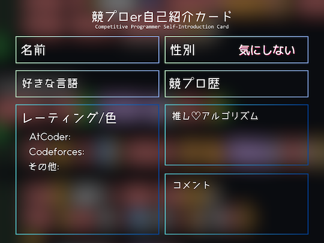
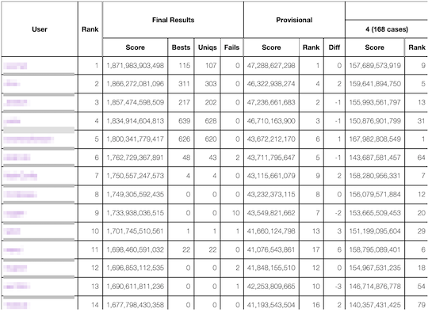
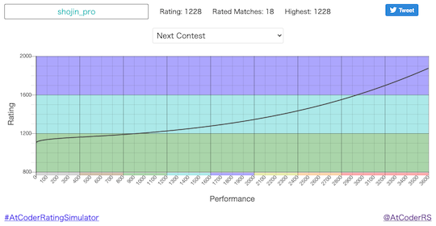

# AtCoder Clans

【非公式】競技プログラミングサイト[AtCoder](https://atcoder.jp/)がもっと楽しくなるリンク集です。有志による非公式サービス・ツール・ライブラリ・記事などをまとめています。

    
    
    
    

  

---

## 特長

* **網羅性が高い**: 初心者から上級者向けの情報まで幅広く掲載しています。
* **最新**: 最新の情報が入手できます。また、[X (旧 Twitter)](https://twitter.com/atcoderclans)で直近1週間の内容をお届けしています。
* **日本語の紹介文**: 日本語で紹介しています。
* **眺めるだけでも楽しい**: サービス・ツールのサムネイルが豊富です。
* **目的に応じて探せる**: 欲しい情報がすぐに探せるように、カテゴリ分けをしています。

## 対象ユーザとメリット

- [AtCoder](https://atcoder.jp/)ユーザ - 困ったことや不便なことが解決できるかもしれません。気になったサービス・ツールなどを使ってみましょう!

- 開発者 - 公開したサービスやツールなどの利用者が増えるだけでなく、ネタ探しや共同開発につながることも期待しています。

- [AtCoder](https://atcoder.jp/)運営チーム - 非公式サービス・ツールの全体像を踏まえ、公式として対応の有無を判断する材料の一つになると思います。また、企業向けの参考資料にもなるかもしれません。

- 企業の採用担当者 - [AtCoder](https://atcoder.jp/)ユーザの実務能力・ポテンシャルの評価材料の一つになると思います。ひいては人材発掘の効率化にも、つながるかもしれません。

---

## 最新情報を確認する

### AtCoder公式

<!-- markdown-link-check-disable -->

- [AtCoderInfo](https://info.atcoder.jp/) - [AtCoder](https://atcoder.jp/)の公式ポータルサイトです。コンテストの参加方法や取り組み方、採用担当者向け情報などが公開されています。

- [【重要なお知らせ】AtCoderを騙る偽サイトにご注意ください](https://atcoder.jp/posts/1268) - [AtCoder](https://atcoder.jp/)の偽サイトへのアクセス・ログインなどをしないように注意喚起している記事。

<!-- markdown-link-check-enable -->

### 非公式サービス・ツール・ライブラリ・記事など

直近1〜2週間の更新状況を掲載しています(ベータ版)。

=== "Webアプリ・Webサイト"

    2024-09-09

    - 「[ライバルを探す・競う](web_app/rivals)」ページ
        - [競プロer自己紹介カード](https://nauclhlt.github.io/cardmaker/)

    

      
    

    2024-09-04

    - 「[コンテストに関する統計情報](web_app/statistics)」ページ
        - [AHC statistics](https://siman-man.github.io/ahc_statistics/)

    

      
    

    2024-09-02

    - 「[コンテストの成績に関連するサービス](web_app/services_using_scores)」ページ
        - [AtCoder Rating Simulator(仮)](https://atcoder-notify.com/rating_simulator/)

    

      
    

    2024-08-31

    - 「[コンテストに関する統計情報](web_app/statistics)」ページ
        - [deviation](https://atcoder-notify.com/deviation/)

    

      
    

=== "記事"

    2024-09-07

    - 「[実装テクニックを学ぶ - Python](articles/implementation/python)」ページ
        - [PythonでbitDPを使い巡回セールスマン問題を解く](https://qiita.com/Ll_e_ki/items/fa475f5bb224ada9be97)

    2024-09-06

    - 「[アルゴリズムを学ぶ](articles/algorithm)」ページ
        - [bitDP 問題一覧](https://qiita.com/ryusuke920/items/c4c69c2b3a01a042d96a)

    2024-09-04

    - 「[ヒューリスティック問題を解く](articles/heuristic)」ページ
        - [RECRUIT 日本橋ハーフマラソン 2024夏（AtCoder Heuristic Contest 036）参加記](https://kaede2020.hatenablog.com/entry/2024/09/02/190404)

    2024-09-03

    - 「[コンテストに関する統計情報を見る](articles/view_scores)」ページ
        - [AtCoder Junior League 2024 Summer - 学校ランキング (9月2日時点)](https://x.com/atcoder/status/1830437147792613885)

    2024-09-01

    - 「[数学を学ぶ](articles/math)」ページ
        - [線形篩で遊ぼう](https://rsk0315.hatenablog.com/entry/2024/08/25/194341)

    2024-08-29

    - 「[部活・サークル・同好会・オンサイトイベントに参加する](articles/club_activities)」ページ
        - [CodeQUEEN2024で優勝しました](https://www.forcia.com/blog/002983.html)

    2024-08-26

    - 「[コンテストに関する統計情報を見る](articles/view_scores)」ページ
        - [AtCoder Junior League 2024 Summer - 学校ランキング (8月26日時点)](https://x.com/atcoder/status/1827887897418387898)

=== "ブログ"
    アルゴリズム部門・ヒューリスティック部門におけるランキング上位の日本人ユーザのブログをまとめています(順不同)。

    2024-09-07

    - 「[アルゴリズム部門 - C++](blogs/algorithm/cpp)」ページ
        - [zawatin](https://atcoder.jp/users/zawatin)さん - [はてなブログ](https://zawatin.hatenablog.com/)

    2024-09-05

    - 「[ヒューリスティック部門 - C++](blogs/heuristic/cpp)」ページ
        - [MathGorilla](https://atcoder.jp/users/MathGorilla)さん - [はてなブログ](https://math-gorilla.hatenablog.com)

    - 「[ヒューリスティック部門 - Rust](blogs/heuristic/rust)」ページ
        - [rhoo](https://atcoder.jp/users/rhoo)さん - [Qiita](https://qiita.com/rhoo)
        - [koyumeishi](https://atcoder.jp/users/koyumeishi)さん - [はてなブログ](https://koyumeishi.hatenablog.com/)

=== "動画"

    2024-08-27

    - 「[YouTube - 個別の動画](youtube/video)」ページ
        - [2本の交わらない線で点を結べるか？【ゆっくり解説】](https://www.youtube.com/watch?v=FnMgl2z86qo)

=== "ライブラリ・スニペット"

    2024-08-28

    - 「[C++](libraries/cpp)」ページ
        - [rainbou-kpr/library](https://github.com/rainbou-kpr/library) 

=== "色変記事"

    色変記事とは、コンテストの参加者が所定のレーティングに到達した喜びをつづった記事(動画も含む)のことです。

    2024-09-04

    - 「[レーティング800〜1199(緑色)](milestones/green)」ページ
        - [tomoba](https://atcoder.jp/users/tomoba)さん - [【色変】40過ぎたおっさんが 5ヶ月で Atcoder 入緑できた](https://qiita.com/omakasessan/items/51af39959ba0b54ac0af)

=== "アーカイブス"

    諸事情により提供・開発が終了した(と思われる)サービス・ツールなどに対して、感謝や敬意を表するため掲載しています。

    2024-09-02

    - AtCoder Rating Simulator

    

      
    

## AtCoder公式グッズを購入する

- [SUZURI](https://suzuri.jp/AtCoder) - [AtCoder](https://atcoder.jp/)のロゴ入りグッズが購入できる。

    

        
    

## 競プロLINEスタンプ・グッズ(非公式)を購入する

- [LINE STORE](https://store.line.me/stickershop/product/22113834/en) - [burioden](https://atcoder.jp/users/burioden)さんが作成・配信している競プロLINEスタンプ(非公式)。[第2弾](https://store.line.me/stickershop/product/22810021/en)、[第3弾](https://store.line.me/stickershop/product/22851268/en)、[第4弾](https://store.line.me/stickershop/product/25256215/en)もある。
    - [kyopro-neko](https://github.com/burioden/kyopro-neko)  - 「競プロするねこ」のイラスト集。
        - [アドバイスするねこ](https://github.com/burioden/kyopro-neko/tree/main/advice_neko) - 同キャラクターが、さまざまなアドバイスをしてくれる。
    - [SUZURI](https://suzuri.jp/burioden) - 「競プロするねこ」のイラストが書かれたグッズを購入できる。

    

        
    

## 本サービスのスポンサー(敬称略・順不同)

本サービスの開発・運営を応援してくださり、ありがとうございます。

[GitHub Sponsors](https://github.com/sponsors/KATO-Hiro)で寄付していただいた方には、いくつかの特典をご用意しております。

### 💚 AtCoder Clans Sponsor

- [chokudai](https://github.com/chokudai)

### 🌐 Domain Supporter

- [KoyanagiHitoshi](https://github.com/KoyanagiHitoshi)

### 🍨 Ice Cream Supporter

- ia7ck
- tomii9273
- toshi201

### 🙂 Special Supporter

- otsuneko
