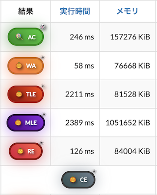
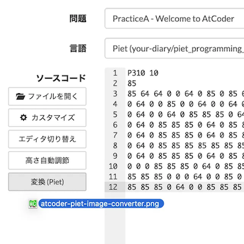

# AtCoder Clans

【非公式】競技プログラミングサイト[AtCoder](https://atcoder.jp/)がもっと楽しくなるリンク集です。有志による非公式サービス・ツール・ライブラリ・記事などをまとめています。

    
    
    
    

  

---

## 特長

* **網羅性が高い**: 初心者から上級者向けの情報まで幅広く掲載しています。
* **最新**: 最新の情報が入手できます。また、[X (旧 Twitter)](https://twitter.com/atcoderclans)で直近1週間の内容をお届けしています。
* **日本語の紹介文**: 日本語で紹介しています。
* **眺めるだけでも楽しい**: サービス・ツールのサムネイルが豊富です。
* **目的に応じて探せる**: 欲しい情報がすぐに探せるように、カテゴリ分けをしています。

## 対象ユーザとメリット

- [AtCoder](https://atcoder.jp/)ユーザ - 困ったことや不便なことが解決できるかもしれません。気になったサービス・ツールなどを使ってみましょう!

- 開発者 - 公開したサービスやツールなどの利用者が増えるだけでなく、ネタ探しや共同開発につながることも期待しています。

- [AtCoder](https://atcoder.jp/)運営チーム - 非公式サービス・ツールの全体像を踏まえ、公式として対応の有無を判断する材料の一つになると思います。また、企業向けの参考資料にもなるかもしれません。

- 企業の採用担当者 - [AtCoder](https://atcoder.jp/)ユーザの実務能力・ポテンシャルの評価材料の一つになると思います。ひいては人材発掘の効率化にも、つながるかもしれません。

---

## 最新情報を確認する

### AtCoder公式

<!-- markdown-link-check-disable -->

- [AtCoderInfo](https://info.atcoder.jp/) - [AtCoder](https://atcoder.jp/)の公式ポータルサイトです。コンテストの参加方法や取り組み方、採用担当者向け情報などが公開されています。

#### 公式コンテストの日時を確認

- [公式コンテストカレンダー運用のお知らせ](https://atcoder.jp/posts/1422) - Google カレンダーに追加すると、公式コンテストの開催日時を簡単に確認できます。
    - [ABCカレンダー](https://calendar.google.com/calendar/u/0?cid=Y180MzA3MDIxZTE0ZDhhMzNlYzgzNjI5YmM1MWQ2OTEzMWMwNjMxOGJiNGQ1ZmRjOTYwODNlZDE2ODFmMGEwZWQ2QGdyb3VwLmNhbGVuZGFyLmdvb2dsZS5jb20)
    - [ARCカレンダー](https://calendar.google.com/calendar/u/0?cid=Y185NGJiMDZmYmI0MDA2NjEzM2VmOTlkNTQ2NDhiZjIzYjI4MTEwNzdjZjU0MWE0ZGMyZDJlYjFiODI1MmU2NmZhQGdyb3VwLmNhbGVuZGFyLmdvb2dsZS5jb20)
    - [AGCカレンダー](https://calendar.google.com/calendar/u/0?cid=Y18wMTk0MDA5MTllZmYyNTI2MzNjNGIxNWE3MTA5YjUyNjhjNTkyNmFhMTFlMDQ2NWE5OWVmNTE5NDdhOTI4YmQ0QGdyb3VwLmNhbGVuZGFyLmdvb2dsZS5jb20)
    - [AHCカレンダー](https://calendar.google.com/calendar/u/0?cid=Y18yYTZiOWYxNTc3Nzg0N2E5YmNlNDhlMDI2OTkyYmY2ZGZjOWE2ZTlhMjk3Mjk4YTFjNjQ5NWMwYjE3NjQ5NjU0QGdyb3VwLmNhbGVuZGFyLmdvb2dsZS5jb20)

#### コンテストに関するルール変更

- [AtCoder生成AI対策ルール - 20251003版](https://info.atcoder.jp/entry/llm-rules-ja) - AtCoder Beginner Contest (通称 ABC)、AtCoder Regular Contest (同 ARC) および AtCoder Grand Contest (同 AGC) のコンテスト開催中を対象として、生成AIの利用における禁止事項が説明されています ([英語版](https://info.atcoder.jp/entry/llm-rules-en))。
    - [生成AIの技術向上に伴うABC,ARC,AGCにおけるルール変更について](https://atcoder.jp/posts/1567) - 2025年10月上旬時点での生成AI対策ルールの概要と、主な変更点がまとめられています。
    - [ARC Div.1 に関する生成AIルール変更について](https://atcoder.jp/posts/1513) - ARC Div.1 も上記ルールの対象となったことが告知されています。
    - [AGC073でのAI使用について](https://atcoder.jp/posts/1563) - AGC073 で生成AI単独で解答可能な問題が出題されたことや今後の対応について言及されています。
    - [AHCにおける生成AIルールの策定について](https://atcoder.jp/posts/1494) - AtCoder Heuristic Contest (通称 AHC) 049以降で適用される生成AI利用ルールのお知らせです ([詳細](https://info.atcoder.jp/entry/ahc-llm-rules-ja))。

- [初参加者の内部レートを変更いたします](https://atcoder.jp/posts/1591) - ABC430 以降、初めてコンテストに参加したユーザは、初期レーティングの計算方法が変更されます。

- [ARCのDivision制についての告知](https://atcoder.jp/posts/1364) - ARC189以降、AtCoder Regular Contest (通称 ARC) は難易度の異なる2種類のコンテストに分けられることが告知されています。
    - [ARC Div.1 の rated 上限の変更について](https://atcoder.jp/posts/1433) - ARC196 以降の ARC Div.1 の 開催形式の変更に関するお知らせです。

#### ジャッジシステム

- [AtCoderの言語アップデートに関して (2024-25年度)](https://atcoder.jp/posts/1342) - ジャッジシステムの言語アップデートの準備状況に関するお知らせです。
    - [新ジャッジ運用開始の延期について](https://atcoder.jp/posts/1585) - 運用上の問題が解決されるまで、新しいジャッジシステムの利用開始が延期されます。
    - [言語更新ADT先行運用のお知らせ](https://atcoder.jp/posts/1566) - 2025年10月7日以降の[AtCoder Daily Training](https://atcoder.jp/contests/adt_top)で、言語アップデート後の実行環境が利用できます。
    - [Language Test 202505](https://atcoder.jp/contests/language-test-202505) - ジャッジシステムに追加・更新された言語を試すためのコンテストが開催されています。
    - [Discord サーバの招待URL](https://discord.gg/NQ3PZQkq7M) - 言語アップデートの議論・ジャッジシステムの仕様に関する質問などを行うことができます。
- [ジャッジキューの処理遅延と今後の対応につきまして](https://atcoder.jp/posts/1456) - (2025年4月時点) ジャッジシステムで処理の遅延が発生している原因と今後の対応、非公式ツールへの影響が説明されています。

#### セキュリティ対策

- [AtCoderアカウントのパスワード管理について](https://atcoder.jp/posts/1366) - 不正アクセス防止のため、[AtCoder](https://atcoder.jp/)アカウントのパスワード確認・必要に応じて変更を促しています。
- [【重要なお知らせ】AtCoderを騙る偽サイトにご注意ください](https://atcoder.jp/posts/1268) - [AtCoder](https://atcoder.jp/)の偽サイトへのアクセス・ログインなどをしないように注意喚起している記事です。

<!-- markdown-link-check-enable -->

### 非公式サービス・ツール・ライブラリ・記事など

直近1〜2週間の更新状況を掲載しています(ベータ版)。

=== "ホーム"

    2025-10-19

    - [新ジャッジ運用開始の延期について](https://atcoder.jp/posts/1585)

=== "入門者・初心者向けの内容"

    2025-10-24

    - 「[Q0: アルゴリズム、競技プログラミングとは?](for_beginners/question0)」ページ
        - [元世界４位が語る「競技プログラミング」の魅力｜好き語り](https://www.youtube.com/watch?v=0EiziminwMM)

=== "ユーザスクリプト"

    2025-10-22

    - 「[ネタスクリプト](user_scripts/jokes)」ページ

    

      
    

    - 「[ソースコードの提出・確認を簡単に](user_scripts/submit_codes)」ページ

    

      
    

=== "記事"

    2025-10-30

    - 「[コンテストに関する統計情報を見る](articles/view_scores)」ページ
        - [中高生向け 学校対抗競技プログラミング「AtCoder Junior League 2025Summer」入賞校・入賞者を発表](https://prtimes.jp/main/html/rd/p/000000063.000028415.html)

    2025-10-29

    - 「[コンテストに関する統計情報を見る](articles/view_scores)」ページ
        - [AtCoder Junior League 2025 Winter - 学校ランキング (2025年10月28日時点)](https://x.com/atcoder/status/1983007334625620229)

    2025-10-28

    - 「[ヒューリスティック問題を解く](articles/heuristic)」ページ
        - [RECRUIT 日本橋ハーフマラソン 2025秋（AtCoder Heuristic Contest 055）の参加記と復習記録](https://kaede2020.hatenablog.com/entry/2025/10/27/222106)

    2025-10-26

    - 「[数学を学ぶ](articles/math)」ページ
        - [誘導部分グラフの数え上げ問題](https://ssrs.hatenablog.com/entry/2024/11/23/061141)

    2025-10-25

    - 「[コンテストに関する統計情報を見る](articles/view_scores)」ページ
        - [AtCoder Junior League 2025 Summer 結果発表会](https://www.youtube.com/watch?v=9iXi2VgF1sg)

    2025-10-20

    - 「[コンテストに関する統計情報を見る](articles/view_scores)」ページ
        - [AtCoder Junior League 2025 Winter - 学校ランキング (2025年10月20日時点)](https://x.com/atcoder/status/1980089371555758132)

    2025-10-19

    - 「[部活・サークル・同好会・オンサイトイベントに参加する](articles/club_activities)」ページ

        <!-- markdown-link-check-disable -->

        - [AtCoder のコンテストスポンサーを通して、「とにかく強い仲間を集めたい」「もっと良い仕組みを作り、世の中の豊かさを増やしたい」「本気で物事に取り組んできた人に門戸を広げたい」と、叶えたいことを全てやろうとする話](https://www.estie.jp/blog/entry/2025/10/16/122042)

        <!-- markdown-link-check-enable -->

    - 「[競技プログラミングと就転職](articles/jobs)」ページ
        - [入社3年目に思うこと](https://kaede2020.hatenablog.com/entry/2025/10/17/150443)

    2025-10-18

    - 「[実装テクニックを学ぶ - 複数の言語](articles/implementation/multiple_languages)」ページ
        - [【非公式】AtCoder 言語アップデート 2024-2025 での変更点](https://qiita.com/punirunrun/items/9bbdb33ef03e9a3a5138)
    - 「[実装テクニックを学ぶ - Rust](articles/implementation/rust)」ページ
        - [【Rust】AtCoder 2025/10 の言語アップデート対応の Cargo.toml](https://paruma184.hatenablog.com/entry/2025/10/17/234812)

=== "動画"

    2025-10-27

    - 「[YouTube - 個別の動画](youtube/video)」ページ
        - [GPT-5 Proが爆死した数学オリンピック2025の超難問](https://www.youtube.com/watch?v=SjXa3iPph3o)

    2025-10-24

    - 「[YouTube - 個別の動画](youtube/video)」ページ
        - [元世界４位が語る「競技プログラミング」の魅力｜好き語り](https://www.youtube.com/watch?v=0EiziminwMM)

    2025-10-17

    - 「[YouTube - 個別の動画](youtube/video)」ページ
        - [赤のN点と青のN点を交差なく結べるか？](https://www.youtube.com/watch?v=Uvbcn6up-rA)

    2025-10-16

    - 「[YouTube - 個別の動画](youtube/video)」ページ
        - [ケーキを5等分する公平な方法](https://www.youtube.com/watch?v=QuayL25RZj8)

=== "アーカイブス"

    諸事情により開発・提供が終了した(と思われる)サービス・ツールなどに対して、感謝や敬意を表するため掲載しています。

    2025-10-23

    - AtCoderTags
    - AtCoderTags_Helper
    - AtCoderTags_Hint

## AtCoder公式グッズを購入する

- [SUZURI](https://suzuri.jp/AtCoder) - [AtCoder](https://atcoder.jp/)のロゴ入りグッズが購入できる。

    

        
    

## 競プロLINEスタンプ・グッズ(非公式)を購入する

- [LINE STORE](https://store.line.me/stickershop/product/22113834/en) - [burioden](https://atcoder.jp/users/burioden)さんが作成・配信している競プロLINEスタンプ(非公式)。[第2弾](https://store.line.me/stickershop/product/22810021/en)、[第3弾](https://store.line.me/stickershop/product/22851268/en)、[第4弾](https://store.line.me/stickershop/product/25256215/en)もある。
    - [kyopro-neko](https://github.com/burioden/kyopro-neko)  - 「競プロするねこ」のイラスト集。
        - [アドバイスするねこ](https://github.com/burioden/kyopro-neko/tree/main/advice_neko) - 同キャラクターが、さまざまなアドバイスをしてくれる。
    - [SUZURI](https://suzuri.jp/burioden) - 「競プロするねこ」のイラストが書かれたグッズを購入できる。

    

        
    

## 本サービスのスポンサー(敬称略・順不同)

本サービスの開発・運営を応援してくださり、ありがとうございます。

[GitHub Sponsors](https://github.com/sponsors/KATO-Hiro)で寄付していただいた方には、いくつかの特典をご用意しております。

### 🏢 𝑬𝑵𝑻𝑬𝑹𝑷𝑹𝑰𝑺𝑬 Sponsor

- [AtCoder株式会社](https://github.com/atcoder)

### 🌐 Domain Supporter

- [KoyanagiHitoshi](https://github.com/KoyanagiHitoshi)

### 🍨 Ice Cream Supporter

- ia7ck
- ngtkana
- tomii9273
