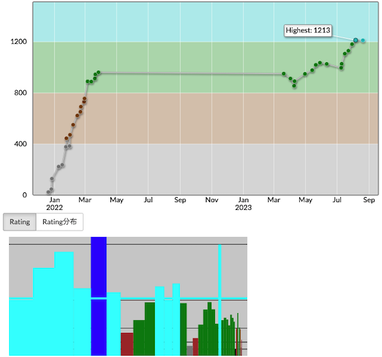

# AtCoder Clans

【非公式】競技プログラミングサイト[AtCoder](https://atcoder.jp/)がもっと楽しくなるリンク集です。有志による非公式サービス・ツール・ライブラリ・記事などをまとめています。

    
    
    
    

  

---

## 特長

* **網羅性が高い**: 初心者から上級者向けの情報まで幅広く掲載しています。
* **最新**: 最新の情報が入手できます。また、[Twitter](https://twitter.com/atcoderclans)で直近1週間の内容をお届けしています。
* **日本語の紹介文**: 日本語で紹介しています。
* **眺めるだけでも楽しい**: サービス・ツールのサムネイルが豊富です。
* **目的に応じて探せる**: 欲しい情報がすぐに探せるように、カテゴリ分けをしています。

## 対象ユーザとメリット

- [AtCoder](https://atcoder.jp/)ユーザ - 困ったことや不便なことが解決できるかもしれません。気になったサービス・ツールなどを使ってみましょう!

- 開発者 - 公開したサービスやツールなどの利用者が増えるだけでなく、ネタ探しや共同開発につながることも期待しています。

- [AtCoder](https://atcoder.jp/)運営チーム - 非公式サービス・ツールの全体像を踏まえ、公式として対応の有無を判断する材料の一つになると思います。また、企業向けの参考資料にもなるかもしれません。

- 企業の採用担当者 - [AtCoder](https://atcoder.jp/)ユーザの実務能力・ポテンシャルの評価材料の一つになると思います。ひいては人材発掘の効率化にも、つながるかもしれません。

---

## 最新情報を確認する

直近1〜2週間の更新状況を掲載しています(ベータ版)。

=== "入門者・初心者向けの内容"

    2023-08-27

    - 「[Q2: プログラムの実行環境を用意するには?](for_beginners/question2)」ページ
        - [エディタのカスタマイズ方法 - AtCoder](https://atcoder.jp/posts/1089)

=== "ユーザスクリプト"

    2023-08-25

    - 「[コンテストの成績や関連する統計情報を見る](user_scripts/view_scores)」ページ
        - [AJL Join Count](https://greasyfork.org/ja/scripts/472659-ajl-join-count)

    

        
    

    2023-08-20

    - 「[コンテストの成績や関連する統計情報を見る](user_scripts/view_scores)」ページ
        - [AtCoder Performace Graph](https://greasyfork.org/ja/scripts/473409-atcoder-performace-graph)

    

        
    

=== "記事"

    2023-08-31

    - 「[コンテストに向けた練習方法を知る](articles/how_to_practice)」ページ
        - [ChatGPT3.5&4.0で競技プログラミングAtCoderの問題のスキル推定を検証しました](https://note.com/chatgpt_nobdata/n/n2d5769ebb622)

    2023-08-30

    - 「[実装テクニックを学ぶ - Python](articles/implementation/python)」ページ
        - [非再帰Euler TourをPythonでやる](https://qiita.com/Kiri8128/items/2b0023bed9af642c751c)

    2023-08-29

    - 「[コンテストに関する統計情報を見る](articles/view_scores)」ページ
        - [AtCoder Junior League 2023 - 学校ランキング (8月28日時点)](https://twitter.com/atcoder/status/1696009837765919013)
        - [AJL 学校スコア(上位5校)、個人スコア(上位5人)の推移(2023年8月28日時点)](https://twitter.com/gojira_kyopro/status/1696083230800433478)

    2023-08-28

    - 「[数学を学ぶ](articles/math)」ページ
        - [月刊組合せ論 Natori](https://combinatorics-fun.vercel.app/natori/)

    2023-08-27

    - 「[数学を学ぶ](articles/math)」ページ
        - [「積の和」典型の、最も典型的な問題](https://drken1215.hatenablog.com/entry/2023/08/26/160600)

    2023-08-26

    - 「[部活・サークル・同好会・オンサイトイベントに参加する](articles/club_activities)」ページ

        <!-- markdown-link-check-disable -->

        - [「CodeQUEEN 2023」にスポンサーとしておじゃましてきました！](https://note.e-seikatsu.info/n/n423fde3ccf32)

        <!-- markdown-link-check-enable -->

        - [実装力底上げを目指して、社内で「バーチャルコンテスト」を開催している話](https://note.com/dev_onecareer/n/n5f486629806d)

    - 「[ヒューリスティック問題を解く](articles/heuristic)」ページ
        - [【AHC022】 AHC初参加記 〜入茶しました](https://note.com/likaf/n/n81fc35c58550)

    2023-08-25

    - 「[実装テクニックを学ぶ - Others](articles/implementation/others)」ページ
        - ジャッジシステムの修正(2023年8月25日)に伴い、C言語で標準ライブラリの数学関数が利用できるようになった([出典](https://atcoder.jp/contests/editor-update-test))。

    2023-08-24

    - 「[実装テクニックを学ぶ - Rust](articles/implementation/rust)」ページ
        - [AtCoder 言語アップデート クレート個人的感想](https://zeronosu77108.hatenablog.com/entry/2023/08/20/125325)

    2023-08-23

    - 「[ヒューリスティック問題を解く](articles/heuristic)」ページ
        - [メタヒューリスティクスで広がる「解けた！」の世界](https://speakerdeck.com/terryu16/metahiyurisuteikusudeguang-garu-jie-keta-noshi-jie)

    2023-08-22

    - 「[コンテストに関する統計情報を見る](articles/view_scores)」ページ
        - [AtCoder Junior League 2023 - 学校ランキング (8月21日時点)](https://twitter.com/atcoder/status/1693462573507571886)
        - [AJL 学校スコア(上位5校)、個人スコア(上位5人)の推移(2023年8月21日時点)](https://twitter.com/gojira_kyopro/status/1693470716627423446)

    2023-08-21

    - 「[ヒューリスティック問題を解く](articles/heuristic)」ページ
        - [RECRUIT 日本橋ハーフマラソン 2023夏（AtCoder Heuristic Contest 022）参加記](https://kaede2020.hatenablog.com/entry/2023/08/20/190031)

    2023-08-19

    - 「[コンテストに関する統計情報を見る](articles/view_scores)」ページ
        - [AtCoderで使用可能なプログラミング言語が3年振りにアップデートされたので、どの言語が選ばれているか調べてみた](https://qiita.com/nabata/items/789a01effaceeeb570a7)

=== "ブログ"
    アルゴリズム部門・ヒューリスティック部門におけるランキング上位の日本人ユーザのブログをまとめています(順不同)。

    2023-08-28

    - 「[ヒューリスティック部門 - C++](blogs/heuristic/cpp)」ページ
        - [milkcoffee](https://atcoder.jp/users/milkcoffee)さん - [はてなブログ](https://milkcoffee.hatenablog.jp/)

    2023-08-22

    - 「[ヒューリスティック部門 - C++](blogs/heuristic/cpp)」ページ
        - [eijirou](https://atcoder.jp/users/eijirou)さん - [はてなブログ](https://eijirou-kyopro.hatenablog.com/)
        - [hitonanode](https://atcoder.jp/users/hitonanode)さん - [はてなブログ](https://rsm9.hatenablog.com/)
        - [Jirotech](https://atcoder.jp/users/Jirotech)さん - [はてなブログ](https://shuu0914.hatenablog.com/)
        - [risujiroh](https://atcoder.jp/users/risujiroh)さん - [はてなブログ](https://risujiroh.hatenablog.com/)
        - [YamagenSakam](https://atcoder.jp/users/YamagenSakam)さん - [はてなブログ](https://yamagensakam.hatenablog.com/)

    - 「[ヒューリスティック部門 - Python](blogs/heuristic/python)」ページ
        - [yuusanlondon](https://atcoder.jp/users/yuusanlondon)さん - [はてなブログ](https://yuusanlondon.hatenablog.com/)

=== "書籍"

    2023-08-24

    - 「[書籍](books)」ページ

        - [ゲームで学ぶ探索アルゴリズム実践入門～木探索とメタヒューリスティクス](https://www.amazon.co.jp/dp/4297133601/)に以下のリンクを追加。
            - [数字集め迷路](https://thun-c.github.io/one_player_maze/one_player_maze.html)

=== "コマンドラインツール"

    2023-08-21

    - 「[ソースコードにバグがないか確認](cli/test_tools)」ページ
        - [psytester](https://github.com/FakePsyho/psytester) 

=== "色変記事"

    色変記事とは、コンテストの参加者が所定のレーティングに到達した喜びをつづった記事のことです。

    2023-08-31

    - 「[レーティング1200〜1599(水色)](milestones/cyan)」ページ
        - [hassy_](https://atcoder.jp/users/hassy_)さん - [【色編記事】AtCoder水色になりました 〜4年間の挑戦を振り返る〜](https://qiita.com/_ken_/items/c32d4b2e680058abd77a)

    2023-08-30

    - 「[レーティング1600〜1999(青色)](milestones/blue)」ページ
        - [Kirishima](https://atcoder.jp/users/Kirishima)さん - [【入青】AtCoder青色になりました！【色変】](https://note.com/kiri_comp/n/n02225d77a988)

    2023-08-19

    - 「[レーティング1200〜1599(水色)](milestones/cyan)」ページ
        - [ZOIZOI](https://atcoder.jp/users/ZOIZOI)さん - [【色変記事】なんやかんやでAtCoder水コーダーになりました](https://qiita.com/ZOI_dayo/items/7f3b5e0dc0c6ba8c3d2d)

    - 「[レーティング800〜1199(緑色)](milestones/green)」ページ
        - [Zoi2](https://atcoder.jp/users/Zoi2)さん - [【色変記事】AtCoderで入緑した話 by ZOI2](https://qiita.com/ZOI2/items/6dd677775270eb65aae9)

=== "アーカイブス"

    2023-08-20

    - 「[開発・提供終了](archived/no_longer_available.md)」ページ
        - Colorful TL

## AtCoder公式グッズを購入する

- [SUZURI](https://suzuri.jp/AtCoder) - [AtCoder](https://atcoder.jp/)のロゴ入りグッズが購入できる。

    

        
    

## 競プロLINEスタンプ・グッズ(非公式)を購入する

- [LINE STORE](https://store.line.me/stickershop/product/22113834/en) - [burioden](https://atcoder.jp/users/burioden)さんが作成・配信している競プロLINEスタンプ(非公式)。[第2弾](https://store.line.me/stickershop/product/22810021/en)、[第3弾](https://store.line.me/stickershop/product/22851268/en)もある。
    - [kyopro-neko](https://github.com/burioden/kyopro-neko)  - 「競プロするねこ」のイラスト集。
    - [SUZURI](https://suzuri.jp/burioden) - 「競プロするねこ」のイラストが書かれたグッズを購入できる。

    

        
    

## 本サービスのスポンサー(敬称略・順不同)

本サービスの開発・運営を応援してくださり、ありがとうございます。

[GitHub Sponsors](https://github.com/sponsors/KATO-Hiro)で寄付していただいた方には、いくつかの特典をご用意しております。

### 🍨 Ice Cream Supporter

- ia7ck
- tomii9273
