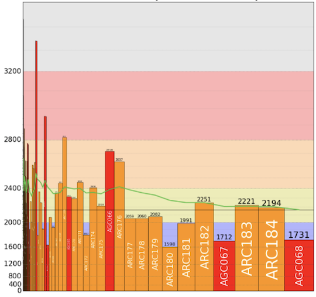
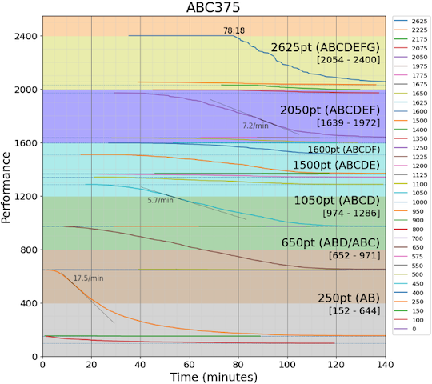
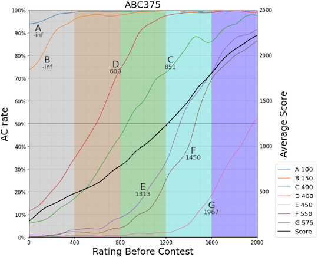
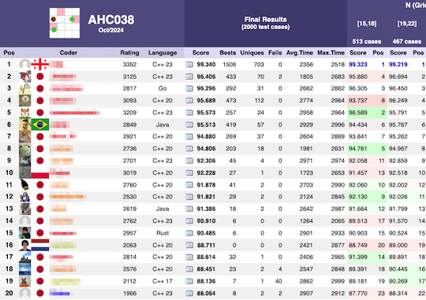
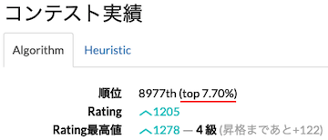

# AtCoder Clans

【非公式】競技プログラミングサイト[AtCoder](https://atcoder.jp/)がもっと楽しくなるリンク集です。有志による非公式サービス・ツール・ライブラリ・記事などをまとめています。

    
    
    
    

  

---

## 特長

* **網羅性が高い**: 初心者から上級者向けの情報まで幅広く掲載しています。
* **最新**: 最新の情報が入手できます。また、[X (旧 Twitter)](https://twitter.com/atcoderclans)で直近1週間の内容をお届けしています。
* **日本語の紹介文**: 日本語で紹介しています。
* **眺めるだけでも楽しい**: サービス・ツールのサムネイルが豊富です。
* **目的に応じて探せる**: 欲しい情報がすぐに探せるように、カテゴリ分けをしています。

## 対象ユーザとメリット

- [AtCoder](https://atcoder.jp/)ユーザ - 困ったことや不便なことが解決できるかもしれません。気になったサービス・ツールなどを使ってみましょう!

- 開発者 - 公開したサービスやツールなどの利用者が増えるだけでなく、ネタ探しや共同開発につながることも期待しています。

- [AtCoder](https://atcoder.jp/)運営チーム - 非公式サービス・ツールの全体像を踏まえ、公式として対応の有無を判断する材料の一つになると思います。また、企業向けの参考資料にもなるかもしれません。

- 企業の採用担当者 - [AtCoder](https://atcoder.jp/)ユーザの実務能力・ポテンシャルの評価材料の一つになると思います。ひいては人材発掘の効率化にも、つながるかもしれません。

---

## 最新情報を確認する

### AtCoder公式

<!-- markdown-link-check-disable -->

- [AtCoderInfo](https://info.atcoder.jp/) - [AtCoder](https://atcoder.jp/)の公式ポータルサイトです。コンテストの参加方法や取り組み方、採用担当者向け情報などが公開されています。

- [【重要なお知らせ】AtCoderを騙る偽サイトにご注意ください](https://atcoder.jp/posts/1268) - [AtCoder](https://atcoder.jp/)の偽サイトへのアクセス・ログインなどをしないように注意喚起している記事。

<!-- markdown-link-check-enable -->

### 非公式サービス・ツール・ライブラリ・記事など

直近1〜2週間の更新状況を掲載しています(ベータ版)。

=== "Webアプリ・Webサイト"

    2024-10-18

    - 「[コンテストの成績を見る](web_app/view_and_compare_scores)」ページ
        - [AtCoder Graphs](https://atcoder-graphs.vercel.app/)

    

      
    

    

      
    

    

      
    

    2024-10-16

    - 「[コンテストに関する統計情報](web_app/statistics)」ページ

        - [wladimirleite.github.io](https://github.com/wladimirleite/wladimirleite.github.io) 
            - [AHC 038](https://wladimirleite.github.io/ahc038.html)

    

      
    

=== "ユーザスクリプト"

    2024-10-19

    - 「[ネタスクリプト](user_scripts/jokes)」ページ
        - [AtCoder♡♡](https://greasyfork.org/ja/scripts/512956-atcoder)

    2024-10-09

    - 「[コンテストに参加する](user_scripts/participate_in_contests)」ページ
        - [AtCoder Customize Panel Fix](https://greasyfork.org/ja/scripts/511359-atcoder-customize-panel-fix)

    2024-10-07

    - 「[コンテストの成績や関連する統計情報を見る](user_scripts/view_scores)」ページ
        - [AtCoder - You're top X%](https://greasyfork.org/ja/scripts/511580-atcoder-you-re-top-x-only-for-algorithm-ranking)

    

      
    

=== "記事"

    2024-10-21

    - 「[ヒューリスティック問題を解く](articles/heuristic)」ページ
        - [AHC038でビームサーチをしてみよう！](https://montplusa.hatenablog.com/entry/2024/10/17/174500)

    2024-10-17

    - 「[コンテストに関する統計情報を見る](articles/view_scores)」ページ
        - [AtCoder Junior League 2024 Winter - 学校ランキング (10月16日時点)](https://x.com/atcoder/status/1846352329563410495)

    2024-10-16

    - 「[アルゴリズムを学ぶ](articles/algorithm)」ページ
        - [1 辺を除いたときの最短路長](https://noshi91.hatenablog.com/entry/2024/10/14/164225)

    - 「[コンテストに関する統計情報を見る](articles/view_scores)」ページ
        - [AtCoder Junior League 2024 Winter - 学校ランキング (10月15日時点)](https://x.com/atcoder/status/1846023207230616014)

    2024-10-15

    - 「[ヒューリスティック問題を解く](articles/heuristic)」ページ
        - [トヨタ自動車プログラミングコンテスト2024#10（AtCoder Heuristic Contest 038）参加記](https://kaede2020.hatenablog.com/entry/2024/10/14/190050)

    2024-10-08

    - 「[コンテストに関する統計情報を見る](articles/view_scores)」ページ
        - [AtCoder Junior League 2024 Winter - 学校ランキング (10月7日時点)](https://x.com/atcoder/status/1843137096841875936)

=== "ブログ"
    アルゴリズム部門・ヒューリスティック部門におけるランキング上位の日本人ユーザのブログをまとめています(順不同)。

    2024-10-19

    - 「[ヒューリスティック部門 - Go](blogs/heuristic/go)」ページ
        - [montplusa](https://atcoder.jp/users/montplusa)さん - [はてなブログ](https://montplusa.hatenablog.com/archive)

    - 「[ヒューリスティック部門 - Python](blogs/heuristic/python)」ページ
        - [nishigake](https://atcoder.jp/users/nishigake)さん - [はてなブログ](https://blog.nishigake.net/posts)

=== "動画"

    2024-10-20

    - 「[YouTube - 個別の動画](youtube/video)」ページ
        - [7分で入試数学史上最難問【ゆっくり解説】](https://www.youtube.com/watch?v=paYeCZuBhhA)

    2024-10-11

    - 「[YouTube - 個別の動画](youtube/video)」ページ
        - [どんな数も「114514」で表すツール【ゆっくり解説】](https://www.youtube.com/watch?v=Sl64oiwG0yE)

=== "ライブラリ・スニペット"

    2024-10-12

    - 「[C++](libraries/cpp)」ページ
        - [hos-lyric/libra](https://github.com/hos-lyric/libra) 

=== "色変記事"

    色変記事とは、コンテストの参加者が所定のレーティングに到達した喜びをつづった記事(動画も含む)のことです。

    2024-10-13

    - 「[レーティング1600〜1999(青色)](milestones/blue)」ページ
        - [Eunha](https://atcoder.jp/users/Eunha)さん - [AtCoder 入青しました！(+ユリ漫画のおすすめ)](https://riyuna.hatenablog.com/entry/2024/02/07/003642)

    2024-10-10

    - 「[レーティング800〜1199(緑色)](milestones/green)」ページ
        - [Rin_statistics](https://atcoder.jp/users/Rin_statistics)さん - [【AtCoder】非ITエンジニアですが入緑しました](https://qiita.com/Rin_statistics/items/b0555784eb8725a57833)

=== "国内外のコンテストサイト"

    2024-10-14

    - 「[BOJ (Baekjoon Online Judge)](related_contest_sites/boj)」ページ
        - [韓国最大のオンラインジャッジサイトBOJとは？あと、solved.acとは？](https://riyuna.hatenablog.com/entry/2023/12/20/084520)
        - [Baekjoon Online Judge について](https://kkt89.hatenablog.com/entry/2022/12/04/Baekjoon_Online_Judge_%E3%81%AB%E3%81%A4%E3%81%84%E3%81%A6)

=== "アーカイブス"

    諸事情により提供・開発が終了した(と思われる)サービス・ツールなどに対して、感謝や敬意を表するため掲載しています。

    2024-10-19

    - AtCoder Rating Contributor Graph

## AtCoder公式グッズを購入する

- [SUZURI](https://suzuri.jp/AtCoder) - [AtCoder](https://atcoder.jp/)のロゴ入りグッズが購入できる。

    

        
    

## 競プロLINEスタンプ・グッズ(非公式)を購入する

- [LINE STORE](https://store.line.me/stickershop/product/22113834/en) - [burioden](https://atcoder.jp/users/burioden)さんが作成・配信している競プロLINEスタンプ(非公式)。[第2弾](https://store.line.me/stickershop/product/22810021/en)、[第3弾](https://store.line.me/stickershop/product/22851268/en)、[第4弾](https://store.line.me/stickershop/product/25256215/en)もある。
    - [kyopro-neko](https://github.com/burioden/kyopro-neko)  - 「競プロするねこ」のイラスト集。
        - [アドバイスするねこ](https://github.com/burioden/kyopro-neko/tree/main/advice_neko) - 同キャラクターが、さまざまなアドバイスをしてくれる。
    - [SUZURI](https://suzuri.jp/burioden) - 「競プロするねこ」のイラストが書かれたグッズを購入できる。

    

        
    

## 本サービスのスポンサー(敬称略・順不同)

本サービスの開発・運営を応援してくださり、ありがとうございます。

[GitHub Sponsors](https://github.com/sponsors/KATO-Hiro)で寄付していただいた方には、いくつかの特典をご用意しております。

### 💚 AtCoder Clans Sponsor

- [chokudai](https://github.com/chokudai)

### 🌐 Domain Supporter

- [KoyanagiHitoshi](https://github.com/KoyanagiHitoshi)

### 🍨 Ice Cream Supporter

- ia7ck
- tomii9273
- toshi201

### 🙂 Special Supporter

- otsuneko
- yunix-kyopro
