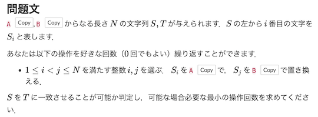

# AtCoder Clans

【非公式】競技プログラミングサイト[AtCoder](https://atcoder.jp/)がもっと楽しくなるリンク集です。有志による非公式サービス・ツール・ライブラリ・記事などをまとめています。

    
    
    
    

  

---

## 特長

* **網羅性が高い**: 初心者から上級者向けの情報まで幅広く掲載しています。
* **最新**: 最新の情報が入手できます。また、[X (旧 Twitter)](https://twitter.com/atcoderclans)で直近1週間の内容をお届けしています。
* **日本語の紹介文**: 日本語で紹介しています。
* **眺めるだけでも楽しい**: サービス・ツールのサムネイルが豊富です。
* **目的に応じて探せる**: 欲しい情報がすぐに探せるように、カテゴリ分けをしています。

## 対象ユーザとメリット

- [AtCoder](https://atcoder.jp/)ユーザ - 困ったことや不便なことが解決できるかもしれません。気になったサービス・ツールなどを使ってみましょう!

- 開発者 - 公開したサービスやツールなどの利用者が増えるだけでなく、ネタ探しや共同開発につながることも期待しています。

- [AtCoder](https://atcoder.jp/)運営チーム - 非公式サービス・ツールの全体像を踏まえ、公式として対応の有無を判断する材料の一つになると思います。また、企業向けの参考資料にもなるかもしれません。

- 企業の採用担当者 - [AtCoder](https://atcoder.jp/)ユーザの実務能力・ポテンシャルの評価材料の一つになると思います。ひいては人材発掘の効率化にも、つながるかもしれません。

---

## 最新情報を確認する

### AtCoder公式

<!-- markdown-link-check-disable -->

- [AtCoderInfo](https://info.atcoder.jp/) - [AtCoder](https://atcoder.jp/)の公式ポータルサイトです。コンテストの参加方法や取り組み方、採用担当者向け情報などが公開されています。

<!-- markdown-link-check-enable -->

### 非公式サービス・ツール・ライブラリ・記事など

直近1〜2週間の更新状況を掲載しています(ベータ版)。

=== "ユーザスクリプト"

    2024-01-23

    - 「[問題を解く](user_scripts/solve_problems)」ページ
        - [AtCoder copy button adder](https://greasyfork.org/ja/scripts/485389-atcoder-copy-button-adder)

    

      
    

=== "記事"

    2024-01-31

    - 「[ヒューリスティック問題を解く](articles/heuristic)」ページ
        - [トヨタ自動車プログラミングコンテスト2023#6（AtCoder Heuristic Contest 026）至高のアルゴリズム解説](https://speakerdeck.com/bowwowforeach/toyotazi-dong-che-puroguramingukontesuto2023-number-6-atcoder-heuristic-contest-026-zhi-gao-noarugorizumujie-shuo)

    2024-01-30

    - 「[実装テクニックを学ぶ - Python](articles/implementation/python)」ページ
        - [AtCoder2023年言語アップデートでPythonに入るライブラリ](https://ikatakos.com/pot/programming_algorithm/python_tips/language_update_2023)

    2024-01-29

    - 「[部活・サークル・同好会・オンサイトイベントに参加する](articles/club_activities)」ページ
        - [CodeQUEEN 2023 決勝 参加記](https://abvi.hatenablog.com/entry/2024012600)

    2024-01-28

    - 「[ヒューリスティック問題を解く](articles/heuristic)」ページ
        - [TOYOTA AHC 至高のアルゴリズム解説会 AHC015](https://speakerdeck.com/thunderc/toyota-ahc-zhi-gao-noarugorizumujie-shuo-hui-ahc015)

    2024-01-27

    - 「[入門者・初心者向けの内容](articles/introduction)」ページ
        - [Let’s 競技プログラミング! E8さんが教える アルゴリズム発想のキホン](https://news.mynavi.jp/techplus/series/algorithm/)

    2024-01-25

    - 「[アルゴリズムを学ぶ](articles/algorithm)」ページ
        - [知名度がいまいち分かってないNextDPというテクニックについて](https://qiita.com/H20/items/922cc0a17ba5817f26d7)

    2024-01-18

    - 「[数学を学ぶ](articles/math)」ページ
        - [競プロのための算数・数学](https://twitter.com/hashtag/%E7%AB%B6%E3%83%97%E3%83%AD%E7%AE%97%E6%95%B0?src=hashtag_click&f=live)

    2024-01-17

    - 「[入門者・初心者向けの内容](articles/introduction)」ページ
        - [中高生向け 学校対抗競技プログラミング「AtCoder Junior League2023」入賞校・入賞者を発表](https://prtimes.jp/main/html/rd/p/000000044.000028415.html)

    2024-01-16

    - 「[アルゴリズムを学ぶ](articles/algorithm)」ページ
        - [アニメーションでみるアルゴリズムの計算量](https://qiita.com/S4nTo/items/2fe9e41d2f1eb3e124e9)

=== "色変記事"

    色変記事とは、コンテストの参加者が所定のレーティングに到達した喜びをつづった記事のことです。

    2024-01-30

    - 「[アルゴリズム部門 - レーティング400〜799(茶色)](milestones/brown)」ページ
        - [aro](https://atcoder.jp/users/aro)さん - [色変記事&半年間競技プログラミングをやってみて良かったこと](https://qiita.com/kanekanekaneko/items/a86d7497d9dffd91fd7f)

    2024-01-24

    - 「[アルゴリズム部門 - レーティング2800〜(赤色、銅・銀・金王冠)](milestones/red)」ページ
        - [kobae964](https://atcoder.jp/users/kobae964)さん - [AtCoderで赤になるまでにやったこと - koba-e964の日記](https://koba-e964.hatenablog.com/entry/2019/06/30/020339)

    2024-01-21

    - 「[アルゴリズム部門 - レーティング400〜799(茶色)](milestones/brown)」ページ
        - [kana_nu00](https://atcoder.jp/users/kana_nu00)さん - [基本情報を持ってれば入茶できるからみんなAtCoder始めようぜ](https://note.com/empty845/n/n7117f2c317bc)

    2024-01-18

    - 「[アルゴリズム部門 - レーティング400〜799(茶色)](milestones/brown)」ページ
        - [mizuho0613](https://atcoder.jp/users/mizuho0613)さん - [14歳がAtCoderで入茶しました](https://note.com/mizzpika/n/n6b1714aa2ad1)

## AtCoder公式グッズを購入する

- [SUZURI](https://suzuri.jp/AtCoder) - [AtCoder](https://atcoder.jp/)のロゴ入りグッズが購入できる。

    

        
    

## 競プロLINEスタンプ・グッズ(非公式)を購入する

- [LINE STORE](https://store.line.me/stickershop/product/22113834/en) - [burioden](https://atcoder.jp/users/burioden)さんが作成・配信している競プロLINEスタンプ(非公式)。[第2弾](https://store.line.me/stickershop/product/22810021/en)、[第3弾](https://store.line.me/stickershop/product/22851268/en)、[第4弾](https://store.line.me/stickershop/product/25256215/en)もある。
    - [kyopro-neko](https://github.com/burioden/kyopro-neko)  - 「競プロするねこ」のイラスト集。
    - [SUZURI](https://suzuri.jp/burioden) - 「競プロするねこ」のイラストが書かれたグッズを購入できる。

    

        
    

## 本サービスのスポンサー(敬称略・順不同)

本サービスの開発・運営を応援してくださり、ありがとうございます。

[GitHub Sponsors](https://github.com/sponsors/KATO-Hiro)で寄付していただいた方には、いくつかの特典をご用意しております。

### 💚 AtCoder Clans Sponsor

- [chokudai](https://github.com/chokudai)

### 🍨 Ice Cream Supporter

- ia7ck
- tomii9273
- toshi201

### 🙂 Special Supporter

- otsuneko
