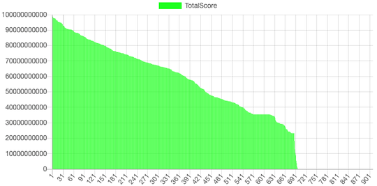
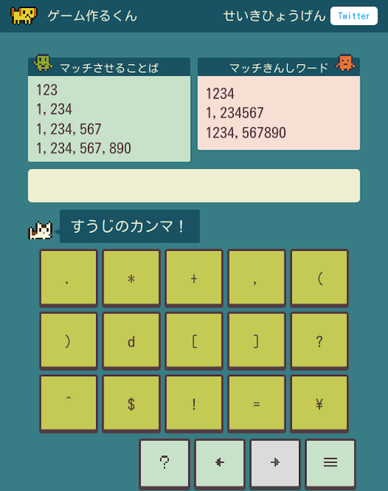

# AtCoder Clans

【非公式】競技プログラミングサイト[AtCoder](https://atcoder.jp/)がもっと楽しくなるリンク集です。有志による非公式サービス・ツール・ライブラリ・記事などをまとめています。

    
    
    
    

  

---

## 特長

* **網羅性が高い**: 初心者から上級者向けの情報まで幅広く掲載しています。
* **最新**: 最新の情報が入手できます。また、[Twitter](https://twitter.com/atcoderclans)で直近1週間の内容をお届けしています。
* **日本語の紹介文**: 日本語で紹介しています。
* **眺めるだけでも楽しい**: サービス・ツールのサムネイルが豊富です。
* **目的に応じて探せる**: 欲しい情報がすぐに探せるように、カテゴリ分けをしています。

## 対象ユーザとメリット

- [AtCoder](https://atcoder.jp/)ユーザ - 困ったことや不便なことが解決できるかもしれません。気になったサービス・ツールなどを使ってみましょう!

- 開発者 - 公開したサービスやツールなどの利用者が増えるだけでなく、ネタ探しや共同開発につながることも期待しています。

- [AtCoder](https://atcoder.jp/)運営チーム - 非公式サービス・ツールの全体像を踏まえ、公式として対応の有無を判断する材料の一つになると思います。また、企業向けの参考資料にもなるかもしれません。

- 企業の採用担当者 - [AtCoder](https://atcoder.jp/)ユーザの実務能力・ポテンシャルの評価材料の一つになると思います。ひいては人材発掘の効率化にも、つながるかもしれません。

---

## 最新情報を確認する

直近1〜2週間の更新状況を掲載しています(ベータ版)。

=== "入門者・初心者向けの内容"

    2023-10-14

    - 「[Q1: アルゴリズムや競技プログラミングに興味はありますが、何から始めたらいいですか?](for_beginners/question1)」ページ
        - [AtCoder Daily Training](https://atcoder.jp/contests/adt_top)

=== "ユーザスクリプト"

    2023-10-22

    - 「[ソースコードの提出・確認を簡単に](user_scripts/submit_codes)」ページ
        - [AtCoder Easy Test v2 のPythonでデフォルトをWandboxにする方法！](https://achapi.hatenablog.jp/entry/2023/10/18/182455)

    2023-10-18

    - 「[コンテストの成績や関連する統計情報を見る](user_scripts/view_scores)」ページ
        - [AtCoderHeuristicContestBarChart](https://greasyfork.org/ja/scripts/477377-atcoderheuristiccontestbarchart)

    

      
    

=== "記事"

    2023-10-25

    - 「[部活・サークル・同好会・オンサイトイベントに参加する](articles/club_activities)」ページ
        - [CodeQUEEN2023決勝に出場しました！](https://ayuna-stpyko.github.io/my_blog/archive/20231023.html)
        - [女性オンリーオンサイトイベント【CodeQUEEN 2023】に参加した話](https://d-burioden.hateblo.jp/entry/2023/10/23/220439)

    2023-10-24

    - 「[コンテストに関する統計情報を見る](articles/view_scores)」ページ
        - [AtCoder Junior League 2023 - 学校ランキング (10月23日時点)](https://twitter.com/atcoder/status/1716318742169477574)
        - [AJL 高校部門上位40校 (10月23日時点)](https://twitter.com/kiri8128/status/1716453617291690065)

    2023-10-18

    - 「[ヒューリスティック問題を解く](articles/heuristic)」ページ
        - [AHC(AtCoder Heuristic Contest)のテスト用スクリプト](https://tayu0110.hatenablog.com/entry/2022/08/14/031726)

    2023-10-17

    - 「[コンテストに関する統計情報を見る](articles/view_scores)」ページ
        - [AJL 学校スコア(上位5校)、個人スコア(上位5人)の推移(10月16日時点)](https://twitter.com/gojira_kyopro/status/1713809087987667255)

    2023-10-16

    - 「[コンテストに関する統計情報を見る](articles/view_scores)」ページ
        - [AtCoder Junior League 2023 - 学校ランキング (10月16日時点)](https://twitter.com/atcoder/status/1713793122206175428)

    2023-10-14

    - 「[入門者・初心者向けの内容](articles/introduction)」ページ
        - [AtCoder Daily Training](https://atcoder.jp/contests/adt_top)

    - 「[アルゴリズムを学ぶ](articles/algorithm)」ページ
        - [ソースコードを見て計算量を下から抑えるのは怪しいという話](https://rsk0315.hatenablog.com/entry/2023/09/17/193635)

    2023-10-13

    - 「[実装テクニックを学ぶ - Others](articles/implementation/others)」ページ
        - [Go言語による各種データ構造の扱い方(やや競プロer向け)](https://zenn.dev/smartshopping/articles/5feb3666ba40b2)

=== "ライブラリ・スニペット"

    2023-10-21

    - 「[C++](libraries/cpp)」ページ
        - [achapi/CppLibrary](https://github.com/achapi/CppLibrary) 

=== "色変記事"

    色変記事とは、コンテストの参加者が所定のレーティングに到達した喜びをつづった記事のことです。

    2023-10-23

    - 「[レーティング1600〜1999(青色)](milestones/blue)」ページ
        - [Thinkingpegasus](https://atcoder.jp/users/Thinkingpegasus)さん - [【入青】 中3がAtCoder青色になるまでにやったこと](https://qiita.com/nouka28/items/447d3d213db78c76268e)

    - 「[レーティング1200〜1599(水色)](milestones/cyan)」ページ
        - [MrTired](https://atcoder.jp/users/MrTired)さん - [Fortran vs AtCoder 〜みずいろになれたよ〜](https://qiita.com/osada-yum/items/fdc6ec8ff1436258ed01)

    2023-10-20

    - 「[レーティング2000〜2399(黄色)](milestones/yellow)」ページ
        - [hirayuu_At](https://atcoder.jp/users/hirayuu_At)さん - [【色変記事】黄色くなったからいろいろ書く - halcの競プロ精進ブログ](https://halc-kyopro.hatenablog.com/entry/2023/10/19/140719)

    2023-10-19

    - 「[レーティング1600〜1999(青色)](milestones/blue)」ページ
        - [okaponta](https://atcoder.jp/users/okaponta)さん - [【色変記事】非情報系エンジニアが青色になりました](https://qiita.com/okaponta_/items/5667dfd9cc232eb3bd65)

=== "国内外のコンテストサイト"

    2023-10-15

    - 「[パズル・クイズ系コンテスト](related_contest_sites/puzzle_quiz)」ページ
        - [正規表現パズル](https://gametsukurukun.com/regexp-puzzle/)

    

      
    

## AtCoder公式グッズを購入する

- [SUZURI](https://suzuri.jp/AtCoder) - [AtCoder](https://atcoder.jp/)のロゴ入りグッズが購入できる。

    

        
    

## 競プロLINEスタンプ・グッズ(非公式)を購入する

- [LINE STORE](https://store.line.me/stickershop/product/22113834/en) - [burioden](https://atcoder.jp/users/burioden)さんが作成・配信している競プロLINEスタンプ(非公式)。[第2弾](https://store.line.me/stickershop/product/22810021/en)、[第3弾](https://store.line.me/stickershop/product/22851268/en)もある。
    - [kyopro-neko](https://github.com/burioden/kyopro-neko)  - 「競プロするねこ」のイラスト集。
    - [SUZURI](https://suzuri.jp/burioden) - 「競プロするねこ」のイラストが書かれたグッズを購入できる。

    

        
    

## 本サービスのスポンサー(敬称略・順不同)

本サービスの開発・運営を応援してくださり、ありがとうございます。

[GitHub Sponsors](https://github.com/sponsors/KATO-Hiro)で寄付していただいた方には、いくつかの特典をご用意しております。

### 🍨 Ice Cream Supporter

- ia7ck
- tomii9273
- toshi201
