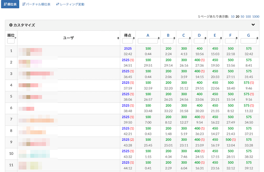
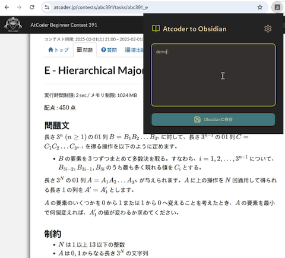
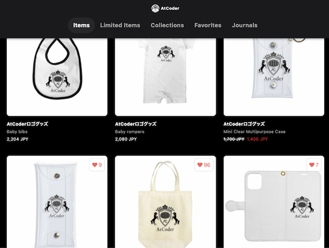
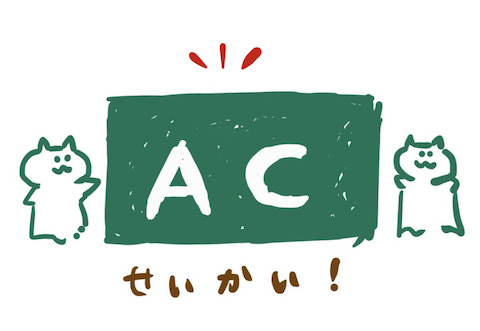

# AtCoder Clans

【非公式】競技プログラミングサイト[AtCoder](https://atcoder.jp/)がもっと楽しくなるリンク集です。有志による非公式サービス・ツール・ライブラリ・記事などをまとめています。

    
    
    
    

  

---

## 特長

* **網羅性が高い**: 初心者から上級者向けの情報まで幅広く掲載しています。
* **最新**: 最新の情報が入手できます。また、[X (旧 Twitter)](https://twitter.com/atcoderclans)で直近1週間の内容をお届けしています。
* **日本語の紹介文**: 日本語で紹介しています。
* **眺めるだけでも楽しい**: サービス・ツールのサムネイルが豊富です。
* **目的に応じて探せる**: 欲しい情報がすぐに探せるように、カテゴリ分けをしています。

## 対象ユーザとメリット

- [AtCoder](https://atcoder.jp/)ユーザ - 困ったことや不便なことが解決できるかもしれません。気になったサービス・ツールなどを使ってみましょう!

- 開発者 - 公開したサービスやツールなどの利用者が増えるだけでなく、ネタ探しや共同開発につながることも期待しています。

- [AtCoder](https://atcoder.jp/)運営チーム - 非公式サービス・ツールの全体像を踏まえ、公式として対応の有無を判断する材料の一つになると思います。また、企業向けの参考資料にもなるかもしれません。

- 企業の採用担当者 - [AtCoder](https://atcoder.jp/)ユーザの実務能力・ポテンシャルの評価材料の一つになると思います。ひいては人材発掘の効率化にも、つながるかもしれません。

---

## 最新情報を確認する

### AtCoder公式

<!-- markdown-link-check-disable -->

- [AtCoderInfo](https://info.atcoder.jp/) - [AtCoder](https://atcoder.jp/)の公式ポータルサイトです。コンテストの参加方法や取り組み方、採用担当者向け情報などが公開されています。

#### 公式コンテストの日時を確認

- [公式コンテストカレンダー運用のお知らせ](https://atcoder.jp/posts/1422) - Google カレンダーに追加すると、公式コンテストの開催日時を簡単に確認できます。
    - [ABCカレンダー](https://calendar.google.com/calendar/u/0?cid=Y180MzA3MDIxZTE0ZDhhMzNlYzgzNjI5YmM1MWQ2OTEzMWMwNjMxOGJiNGQ1ZmRjOTYwODNlZDE2ODFmMGEwZWQ2QGdyb3VwLmNhbGVuZGFyLmdvb2dsZS5jb20)
    - [ARCカレンダー](https://calendar.google.com/calendar/u/0?cid=Y185NGJiMDZmYmI0MDA2NjEzM2VmOTlkNTQ2NDhiZjIzYjI4MTEwNzdjZjU0MWE0ZGMyZDJlYjFiODI1MmU2NmZhQGdyb3VwLmNhbGVuZGFyLmdvb2dsZS5jb20)
    - [AGCカレンダー](https://calendar.google.com/calendar/u/0?cid=Y18wMTk0MDA5MTllZmYyNTI2MzNjNGIxNWE3MTA5YjUyNjhjNTkyNmFhMTFlMDQ2NWE5OWVmNTE5NDdhOTI4YmQ0QGdyb3VwLmNhbGVuZGFyLmdvb2dsZS5jb20)
    - [AHCカレンダー](https://calendar.google.com/calendar/u/0?cid=Y18yYTZiOWYxNTc3Nzg0N2E5YmNlNDhlMDI2OTkyYmY2ZGZjOWE2ZTlhMjk3Mjk4YTFjNjQ5NWMwYjE3NjQ5NjU0QGdyb3VwLmNhbGVuZGFyLmdvb2dsZS5jb20)

#### コンテストに関するルール変更

- [AtCoder生成AI対策ルール - 20241206版](https://info.atcoder.jp/entry/llm-rules-ja) - AtCoder Beginner Contest (通称 ABC) および AtCoder Regular Contest (同 ARC)のコンテスト開催中を対象として、生成AIの利用における禁止事項が説明されています ([英語版](https://info.atcoder.jp/entry/llm-rules-en))。
    - [生成AIの技術向上に伴うABCおよびARCにおけるルール変更について](https://atcoder.jp/posts/1347) - 上記のルール変更の背景、作成方針、概要、今後の変更の可能性について言及されています ([英語版](https://atcoder.jp/posts/1350))。
    - [ARCのDivision制に伴うルール変更について](https://atcoder.jp/posts/1368) - ARC の Division制の導入に伴うルールの変更点が紹介されています。

- [ARCのDivision制についての告知](https://atcoder.jp/posts/1364) - ARC189以降、AtCoder Regular Contest (通称 ARC) は難易度の異なる2種類のコンテストに分けられることが告知されています。
    - [ARC Div.1 の rated 上限の変更について](https://atcoder.jp/posts/1433) - ARC196 以降の ARC Div.1 の 開催形式の変更に関するお知らせです。

#### ジャッジシステムの処理状況

- [ジャッジキューの処理遅延と今後の対応につきまして](https://atcoder.jp/posts/1456) - ジャッジシステムで処理の遅延が発生している原因と今後の対応、非公式ツールへの影響が説明されています。

#### セキュリティ対策

- [AtCoderアカウントのパスワード管理について](https://atcoder.jp/posts/1366) - 不正アクセス防止のため、[AtCoder](https://atcoder.jp/)アカウントのパスワード確認・必要に応じて変更を促しています。
- [【重要なお知らせ】AtCoderを騙る偽サイトにご注意ください](https://atcoder.jp/posts/1268) - [AtCoder](https://atcoder.jp/)の偽サイトへのアクセス・ログインなどをしないように注意喚起している記事です。

#### 中学生・高校生向け

- [競技プログラミング教室](https://atcoder.jp/contests/atcoder_programming_class) - [AtCoder](https://atcoder.jp/)が開催を予定している中学生・高校生向けの教室です。競技プログラミングに興味があり、国内トップクラスの実力を身につけたいユーザが対象です。

<!-- markdown-link-check-enable -->

### 非公式サービス・ツール・ライブラリ・記事など

直近1〜2週間の更新状況を掲載しています(ベータ版)。

=== "ホーム"

    2025-04-17

    - [ジャッジキューの処理遅延と今後の対応につきまして](https://atcoder.jp/posts/1456)

    2025-04-12

    本サービスのスポンサーを掲載(敬称略)。ご支援いただき、ありがとうございます。

    - [AtCoder株式会社](https://github.com/atcoder)

=== "Webアプリ・Webサイト"

    2025-04-10

    - 「[コンテストに関する統計情報](web_app/statistics)」ページ
        - [wladimirleite.github.io](https://github.com/wladimirleite/wladimirleite.github.io) 
            - [AHC 045](https://wladimirleite.github.io/ahc045.html)

=== "ユーザスクリプト"

    2025-04-22

    - 「[コンテストに参加する](user_scripts/participate_in_contests)」ページ
        - [Atcoder Easy Accordion](https://greasyfork.org/ja/scripts/532617-atcoder-easy-accordion)

    2025-04-13

    - 「[コンテストに参加する](user_scripts/participate_in_contests)」ページ
        - [AtCoder の順位表を広げるやつ](https://greasyfork.org/ja/scripts/532077-atcoder-%E3%81%AE%E9%A0%86%E4%BD%8D%E8%A1%A8%E3%82%92%E5%BA%83%E3%81%92%E3%82%8B%E3%82%84%E3%81%A4)

    

      
    

=== "FireFox拡張機能"

    2025-04-12

    - 「[復習の効果をより高める](firefox_extensions/review)」ページ
        - [Atcoder to Obsidian](https://github.com/1m-N00b/Atcoder-to-Obsidian) 

    

    
    

=== "記事"

    2025-04-23

    - 「[ヒューリスティック問題を解く](articles/heuristic)」ページ
        - [THIRD プログラミングコンテスト2025（AtCoder Heuristic Contest 045）の復習](https://kaede2020.hatenablog.com/entry/2025/04/22/215515)

    2025-04-21

    - 「[コンテストに関する統計情報を見る](articles/view_scores)」ページ
        - [AtCoder Junior League 2025 Summer - 学校ランキング (2025年4月21日時点)](https://x.com/atcoder/status/1914167916003725624)

    2025-04-19

    - 「[アルゴリズムを学ぶ](articles/algorithm)」ページ
        - [非再帰DFSに思いを馳せる記事](https://www.tellpro.net/harurun/articles/xuxYbrhlCwuvwkYlaVuxFXaNOhkgCyfk)

    2025-04-18

    - 「[コードを書くための環境構築を行う](articles/development_env)」ページ
        - [AtCoder 環境構築 Python編](https://zenn.dev/fro25zen/articles/atcoder_setup_article)

    2025-04-15

    - 「[ヒューリスティック問題を解く](articles/heuristic)」ページ
        - [【ネタバレ注意】AHCの焼きなまし・ビームサーチ練習にオススメの問題まとめ](https://www.terry-u16.net/entry/ahc-practice-problem)

    2025-04-14

    - 「[コンテストに関する統計情報を見る](articles/view_scores)」ページ
        - [AtCoder Junior League 2025 Summer - 学校ランキング (2025年4月14日時点)](https://x.com/atcoder/status/1911607012141777336)

    2025-04-11

    - 「[入門者・初心者向けの内容](articles/introduction)」ページ
        - [中高生向け学校対抗競技プログラミング「AtCoder Junior League 2025 Summer」](https://reseed.resemom.jp/article/2025/04/10/10675.html)

    2025-04-09

    - 「[コンテストに関する統計情報を見る](articles/view_scores)」ページ
        - [AtCoder Junior League 2025 Summer - 学校ランキング (2025年4月7日時点)](https://x.com/atcoder/status/1909173426184675597)

    - 「[ヒューリスティック問題を解く](articles/heuristic)」ページ
        - [THIRD プログラミングコンテスト2025（AtCoder Heuristic Contest 045）参加記](https://kaede2020.hatenablog.com/entry/2025/04/07/190047)

=== "ブログ"
    アルゴリズム部門・ヒューリスティック部門におけるランキング上位の日本人ユーザのブログをまとめています(順不同)。

    2025-04-12

     - 「[ヒューリスティック部門 - C++](blogs/heuristic/cpp)」ページ
        - [MathGorilla](https://atcoder.jp/users/MathGorilla)さん - [はてなブログ](https://math-gorilla.hatenablog.com)
        - [bo9chan](https://atcoder.jp/users/bo9chan)さん - [Qiita](https://qiita.com/bo9chan)

=== "動画"

    2025-04-16

    - 「[YouTube - チャンネル](youtube/channel)」ページ
        - [鵺宮ミヤ(やみやみや)](https://www.youtube.com/playlist?list=PLfDk7e-j_wHFSc2F_EZ_7CyGXIrMx0gup)

=== "ライブラリ・スニペット"

    2025-04-21

    - 「[AtCoder Library (ACL)の各言語への移植](libraries/porting_of_acl)」ページ
        - [e6nlaq/ac-library-js](https://github.com/e6nlaq/ac-library-js) 

    2025-04-15

    - 「[ライブラリチェッカー](libraries/library_checker)」ページ
        - [library-checker-testcases-2](https://github.com/hotman78/library-checker-testcases-2) 

=== "アーカイブス"

    諸事情により開発・提供が終了した(と思われる)サービス・ツールなどに対して、感謝や敬意を表するため掲載しています。

    2025-04-19

    - AtCoder Search

## AtCoder公式グッズを購入する

- [SUZURI](https://suzuri.jp/AtCoder) - [AtCoder](https://atcoder.jp/)のロゴ入りグッズが購入できる。

    

        
    

## 競プロLINEスタンプ・グッズ(非公式)を購入する

- [LINE STORE](https://store.line.me/stickershop/product/22113834/en) - [burioden](https://atcoder.jp/users/burioden)さんが作成・配信している競プロLINEスタンプ(非公式)。[第2弾](https://store.line.me/stickershop/product/22810021/en)、[第3弾](https://store.line.me/stickershop/product/22851268/en)、[第4弾](https://store.line.me/stickershop/product/25256215/en)もある。
    - [kyopro-neko](https://github.com/burioden/kyopro-neko)  - 「競プロするねこ」のイラスト集。
        - [アドバイスするねこ](https://github.com/burioden/kyopro-neko/tree/main/advice_neko) - 同キャラクターが、さまざまなアドバイスをしてくれる。
    - [SUZURI](https://suzuri.jp/burioden) - 「競プロするねこ」のイラストが書かれたグッズを購入できる。

    

        
    

## 本サービスのスポンサー(敬称略・順不同)

本サービスの開発・運営を応援してくださり、ありがとうございます。

[GitHub Sponsors](https://github.com/sponsors/KATO-Hiro)で寄付していただいた方には、いくつかの特典をご用意しております。

### 🏢 𝑬𝑵𝑻𝑬𝑹𝑷𝑹𝑰𝑺𝑬 Sponsor

- [AtCoder株式会社](https://github.com/atcoder)

### 🌐 Domain Supporter

- [KoyanagiHitoshi](https://github.com/KoyanagiHitoshi)

### 🍨 Ice Cream Supporter

- ia7ck
- ngtkana
- tomii9273
