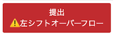

# AtCoder Clans

【非公式】競技プログラミングサイト[AtCoder](https://atcoder.jp/)がもっと楽しくなるリンク集です。有志による非公式サービス・ツール・ライブラリ・記事などをまとめています。

    
    
    
    

  

---

## 特長

* **網羅性が高い**: 初心者から上級者向けの情報まで幅広く掲載しています。
* **最新**: 最新の情報が入手できます。また、[X (旧 Twitter)](https://twitter.com/atcoderclans)で直近1週間の内容をお届けしています。
* **日本語の紹介文**: 日本語で紹介しています。
* **眺めるだけでも楽しい**: サービス・ツールのサムネイルが豊富です。
* **目的に応じて探せる**: 欲しい情報がすぐに探せるように、カテゴリ分けをしています。

## 対象ユーザとメリット

- [AtCoder](https://atcoder.jp/)ユーザ - 困ったことや不便なことが解決できるかもしれません。気になったサービス・ツールなどを使ってみましょう!

- 開発者 - 公開したサービスやツールなどの利用者が増えるだけでなく、ネタ探しや共同開発につながることも期待しています。

- [AtCoder](https://atcoder.jp/)運営チーム - 非公式サービス・ツールの全体像を踏まえ、公式として対応の有無を判断する材料の一つになると思います。また、企業向けの参考資料にもなるかもしれません。

- 企業の採用担当者 - [AtCoder](https://atcoder.jp/)ユーザの実務能力・ポテンシャルの評価材料の一つになると思います。ひいては人材発掘の効率化にも、つながるかもしれません。

---

## 最新情報を確認する

### AtCoder公式

<!-- markdown-link-check-disable -->

- [AtCoderInfo](https://info.atcoder.jp/) - [AtCoder](https://atcoder.jp/)の公式ポータルサイトです。コンテストの参加方法や取り組み方、採用担当者向け情報などが公開されています。

#### 公式コンテストの日時を確認

- [公式コンテストカレンダー運用のお知らせ](https://atcoder.jp/posts/1422) - Google カレンダーに追加すると、公式コンテストの開催日時を簡単に確認できます。
    - [ABCカレンダー](https://calendar.google.com/calendar/u/0?cid=Y180MzA3MDIxZTE0ZDhhMzNlYzgzNjI5YmM1MWQ2OTEzMWMwNjMxOGJiNGQ1ZmRjOTYwODNlZDE2ODFmMGEwZWQ2QGdyb3VwLmNhbGVuZGFyLmdvb2dsZS5jb20)
    - [ARCカレンダー](https://calendar.google.com/calendar/u/0?cid=Y185NGJiMDZmYmI0MDA2NjEzM2VmOTlkNTQ2NDhiZjIzYjI4MTEwNzdjZjU0MWE0ZGMyZDJlYjFiODI1MmU2NmZhQGdyb3VwLmNhbGVuZGFyLmdvb2dsZS5jb20)
    - [AGCカレンダー](https://calendar.google.com/calendar/u/0?cid=Y18wMTk0MDA5MTllZmYyNTI2MzNjNGIxNWE3MTA5YjUyNjhjNTkyNmFhMTFlMDQ2NWE5OWVmNTE5NDdhOTI4YmQ0QGdyb3VwLmNhbGVuZGFyLmdvb2dsZS5jb20)
    - [AHCカレンダー](https://calendar.google.com/calendar/u/0?cid=Y18yYTZiOWYxNTc3Nzg0N2E5YmNlNDhlMDI2OTkyYmY2ZGZjOWE2ZTlhMjk3Mjk4YTFjNjQ5NWMwYjE3NjQ5NjU0QGdyb3VwLmNhbGVuZGFyLmdvb2dsZS5jb20)

#### コンテストに関するルール変更

- [AtCoder生成AI対策ルール - 20241206版](https://info.atcoder.jp/entry/llm-rules-ja) - AtCoder Beginner Contest (通称 ABC) および AtCoder Regular Contest (同 ARC)のコンテスト開催中を対象として、生成AIの利用における禁止事項が説明されています ([英語版](https://info.atcoder.jp/entry/llm-rules-en))。
    - [生成AIの技術向上に伴うABCおよびARCにおけるルール変更について](https://atcoder.jp/posts/1347) - 上記のルール変更の背景、作成方針、概要、今後の変更の可能性について言及されています ([英語版](https://atcoder.jp/posts/1350))。
    - [ARCのDivision制に伴うルール変更について](https://atcoder.jp/posts/1368) - ARC の Division制の導入に伴うルールの変更点が紹介されています。

- [ARCのDivision制についての告知](https://atcoder.jp/posts/1364) - ARC189以降、AtCoder Regular Contest (通称 ARC) は難易度の異なる2種類のコンテストに分けられることが告知されています。
    - [ARC Div.1 の rated 上限の変更について](https://atcoder.jp/posts/1433) - ARC196 以降の ARC Div.1 の 開催形式の変更に関するお知らせです。

#### ジャッジシステム

- [AtCoderの言語アップデートに関して (2024-25年度)](https://atcoder.jp/posts/1342) - ジャッジシステムの言語アップデートの準備状況に関するお知らせです。
    - [Language Test 202505](https://atcoder.jp/contests/language-test-202505) - ジャッジシステムに追加・更新された言語を試すためのコンテストが開催されています。
    - [Discord サーバの招待URL](https://discord.gg/NQ3PZQkq7M) - 言語アップデートの議論・ジャッジシステムの仕様に関する質問などを行うことができます。
- [ジャッジキューの処理遅延と今後の対応につきまして](https://atcoder.jp/posts/1456) - (2025年4月時点) ジャッジシステムで処理の遅延が発生している原因と今後の対応、非公式ツールへの影響が説明されています。

#### セキュリティ対策

- [AtCoderアカウントのパスワード管理について](https://atcoder.jp/posts/1366) - 不正アクセス防止のため、[AtCoder](https://atcoder.jp/)アカウントのパスワード確認・必要に応じて変更を促しています。
- [【重要なお知らせ】AtCoderを騙る偽サイトにご注意ください](https://atcoder.jp/posts/1268) - [AtCoder](https://atcoder.jp/)の偽サイトへのアクセス・ログインなどをしないように注意喚起している記事です。

<!-- markdown-link-check-enable -->

### 非公式サービス・ツール・ライブラリ・記事など

直近1〜2週間の更新状況を掲載しています(ベータ版)。

=== "ユーザスクリプト"

    2025-05-24

    - 「[ソースコードの提出・確認を簡単に](user_scripts/submit_codes)」ページ
        - [AtCoderFavSubmissionFilter](https://greasyfork.org/ja/scripts/536911-atcoderfavsubmissionfilter)

    2025-05-21

    - 「[ソースコードの提出・確認を簡単に](user_scripts/submit_codes)」ページ
        - [AtCoderLeftShiftOverflowWarning](https://greasyfork.org/ja/scripts/536353-atcoderleftshiftoverflowwarning)

    

      
    

    2025-05-14

    - 「[コンテストに参加する](user_scripts/participate_in_contests)」ページ
        - [AtCoder Scroll Page Top Hider](https://greasyfork.org/ja/scripts/535017-atcoder-scroll-page-top-hider)

=== "記事"

    2025-05-26

    - 「[コンテストに関する統計情報を見る](articles/view_scores)」ページ
        - [AtCoder Junior League 2025 Summer - 学校ランキング (2025年5月26日時点)](https://x.com/atcoder/status/1926854143085252791)

    2025-05-25

    - 「[実装テクニックを学ぶ - Rust](articles/implementation/rust)」ページ
        - [個人的に嬉しい、AtCoder の Rust 言語アップデートで変わるもの一覧（Rust 1.70 → Rust 1.86)](https://ngtkana.hatenablog.com/entry/2025/05/24/115236)

    2025-05-23

    - 「[ヒューリスティック問題を解く](articles/heuristic)」ページ
        - [トヨタ自動車プログラミングコンテスト2025#2 (AHC047) 解説](https://www.terry-u16.net/entry/ahc047)

    2025-05-22

    - 「[コンテストに関する統計情報を見る](articles/view_scores)」ページ
        - [中高生向け 学校対抗競技プログラミング「AtCoder Junior League 2024 Winter」入賞校・入賞者を発表](https://prtimes.jp/main/html/rd/p/000000057.000028415.html)

    2025-05-21

    - 「[アルゴリズムを学ぶ](articles/algorithm)」ページ
        - [【競プロ】括弧列の性質・知識をまとめてみる](https://qiita.com/Nauclhlt/items/b700cf31f524214a0735)

    2025-05-21

    - 「[ヒューリスティック問題を解く](articles/heuristic)」ページ
        - [ChatGPT×Codexの競技プログラミング（ヒューリスティック）での活用](https://qiita.com/keroru/items/66fcd6fed26bf2f6f0ae)
        - [あえて考えなかった4時間：AIにすべてを任せたAHC047参戦記](https://note.com/tak_nakamori/n/n847bf483d44c)

    2025-05-19

    - 「[コンテストに関する統計情報を見る](articles/view_scores)」ページ
        - [AtCoder Junior League 2025 Summer - 学校ランキング (2025年5月19日時点)](https://x.com/atcoder/status/1924291835029336527)

    2025-05-18

    - 「[アルゴリズムを学ぶ](articles/algorithm)」ページ
        - [「DFSが苦手」がなくなる！BFSと合わせて体系的に再解釈する話](https://zenn.dev/torikara/articles/0e4e4b6c71c371)

    2025-05-16

    - 「[数学を学ぶ](articles/math)」ページ
        - [競プロにおける約数の個数の見積もり](https://noshi91.hatenablog.com/entry/2022/07/05/021040)

    2025-05-13

    - 「[実装テクニックを学ぶ - Others](articles/implementation/others)」ページ
        - [Nim言語の良さを伝えたい](https://utac.hateblo.jp/entry/2025/04/25/230241)

    2025-05-12

    - 「[コンテストに関する統計情報を見る](articles/view_scores)」ページ
        - [AtCoder Junior League 2025 Summer - 学校ランキング (2025年5月12日時点)](https://x.com/atcoder/status/1921742776863162817)

=== "ブログ"
    アルゴリズム部門・ヒューリスティック部門におけるランキング上位の日本人ユーザのブログをまとめています(順不同)。

    2025-05-25

    - 「[アルゴリズム部門 - C++](blogs/algorithm/cpp)」ページ
        - [momohara](https://atcoder.jp/users/momohara)さん - [はてなブログ](https://momoharahara.hatenadiary.com/)
        - [m1une](https://atcoder.jp/users/m1une)さん - [Qiita](https://qiita.com/m1une/)

    2025-05-19

     - 「[ヒューリスティック部門 - C++](blogs/heuristic/cpp)」ページ
        - [yunix](https://atcoder.jp/users/yunix)さん - [はてなブログ](https://yunix-kyopro.hatenablog.com/)
        - [miiitomi](https://atcoder.jp/users/miiitomi)さん - [GitHub Pages](https://miiitomi.github.io/categories/%E7%AB%B6%E3%83%97%E3%83%AD/)

=== "書籍"

    2025-05-24

    - 「[書籍](books)」ページ
        - [なっとく！アルゴリズム 第2版](https://www.amazon.co.jp/dp/4798186899)

    2025-05-18

    - 「[書籍](books)」ページ
        - [Haskellで競プロ鉄則本を解いていく](https://zenn.dev/ppdx999/books/65e882010be891)

=== "SNS"

    2025-05-15

    - 「[SNS](sns)」ページ
        - [高専競プロ鯖](https://discord.com/invite/nhMReq9nMz)

=== "ライブラリ・スニペット"

    2025-05-20

    - 「[AtCoder Library (ACL)の各言語への移植](libraries/porting_of_acl)」ページ
        - [toyboot4e/ac-library-hs](https://github.com/toyboot4e/ac-library-hs) - 

=== "コマンドラインツール"

    2025-05-25

    - 「[ソースコードにバグがないか確認](cli/test_tools)」ページ
        - [WSL への online-judge-tools (oj) 導入メモ 2025年5月時点](https://qiita.com/hamamu/items/243e2d82fe6316fef6c3)

    2025-05-18

    - 「[ソースコードにバグがないか確認](cli/test_tools)」ページ
        - [ppdx999/atcoder-cli](https://github.com/ppdx999/atcoder-cli) 

=== "色変記事"

    色変記事とは、コンテストの参加者が所定のレーティングに到達した喜びをつづった記事(動画も含む)のことです。

    2025-05-26

    - 「[レーティング2000〜2399(黄色)](milestones/yellow)」ページ
        - [miiitomi](https://atcoder.jp/users/miiitomi)さん - [【色変記事】AtCoderヒューリスティックレートで黄色になりました！](https://miiitomi.github.io/p/heuristic_yellow/)

    - 「[レーティング1600〜1999(青色)](milestones/blue)」ページ
        - [mackerel38](https://atcoder.jp/users/mackerel38)さん - [AtCoder 入青しました【色変記事】](https://qiita.com/poe4294967296/items/0fdb4547eee65d9e751a)

    - 「[レーティング1200〜1599(水色)](milestones/cyan)」ページ
        - [ryuiso](https://atcoder.jp/users/ryuiso)さん - [生成AI時代にAtCoderをやる理由: 水色データサイエンティストが得た4つの学び](https://zenn.dev/green_tea/articles/1963db5bc27a1d)

    - 「[レーティング800〜1199(緑色)](milestones/green)」ページ
        - [tyokousagi](https://atcoder.jp/users/tyokousagi)さん - [入緑しました！！](https://qiita.com/tyokousagi/items/a7c1c84062e270de0e27)

    2025-05-25

    - 「[レーティング1600〜1999(青色)](milestones/blue)」ページ
        - [satoyuki](https://atcoder.jp/users/satoyuki)さん - [【競技プログラミング】社会人が青色コーダーになったので競プロを始めるきっかけになった恋愛を振り返る](https://tomatokiraida52.hatenablog.com/entry/2025/05/25/035247)

    2025-05-19

    - 「[レーティング800〜1199(緑色)](milestones/green)」ページ
        - [pond6814](https://atcoder.jp/users/pond6814)さん - [【色変記事】AtCoderで入緑しました！](https://qiita.com/pond-e/items/863e8f49447f1d10bda0)

    2025-05-17

    - 「[レーティング1200〜1599(水色)](milestones/cyan)」ページ
        - [mattsunkun](https://atcoder.jp/users/mattsunkun)さん - [ジャイロ「ジョジョ７部もアニメ化されるし、入水記事でも書くか...」](https://qiita.com/mattsunkun/items/96241a3c39282cbca1f5)

    2025-05-11

    - 「[レーティング800〜1199(緑色)](milestones/green)」ページ
        - [Nom8](https://atcoder.jp/users/Nom8)さん - [【AtCoder】高校2年の入緑記事と、競プロを始め、続けている理由](https://qiita.com/Nom8/items/d47207f5f1ff73cd36eb)

## AtCoder公式グッズを購入する

- [SUZURI](https://suzuri.jp/AtCoder) - [AtCoder](https://atcoder.jp/)のロゴ入りグッズが購入できる。

    

        
    

## 競プロLINEスタンプ・グッズ(非公式)を購入する

- [LINE STORE](https://store.line.me/stickershop/product/22113834/en) - [burioden](https://atcoder.jp/users/burioden)さんが作成・配信している競プロLINEスタンプ(非公式)。[第2弾](https://store.line.me/stickershop/product/22810021/en)、[第3弾](https://store.line.me/stickershop/product/22851268/en)、[第4弾](https://store.line.me/stickershop/product/25256215/en)もある。
    - [kyopro-neko](https://github.com/burioden/kyopro-neko)  - 「競プロするねこ」のイラスト集。
        - [アドバイスするねこ](https://github.com/burioden/kyopro-neko/tree/main/advice_neko) - 同キャラクターが、さまざまなアドバイスをしてくれる。
    - [SUZURI](https://suzuri.jp/burioden) - 「競プロするねこ」のイラストが書かれたグッズを購入できる。

    

        
    

## 本サービスのスポンサー(敬称略・順不同)

本サービスの開発・運営を応援してくださり、ありがとうございます。

[GitHub Sponsors](https://github.com/sponsors/KATO-Hiro)で寄付していただいた方には、いくつかの特典をご用意しております。

### 🏢 𝑬𝑵𝑻𝑬𝑹𝑷𝑹𝑰𝑺𝑬 Sponsor

- [AtCoder株式会社](https://github.com/atcoder)

### 🌐 Domain Supporter

- [KoyanagiHitoshi](https://github.com/KoyanagiHitoshi)

### 🍨 Ice Cream Supporter

- ia7ck
- ngtkana
- tomii9273
