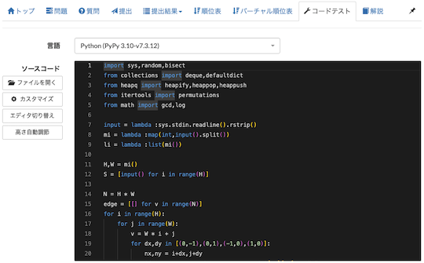

# AtCoder Clans

【非公式】競技プログラミングサイト[AtCoder](https://atcoder.jp/)がもっと楽しくなるリンク集です。有志による非公式サービス・ツール・ライブラリ・記事などをまとめています。

    
    
    
    

  

---

## 特長

* **網羅性が高い**: 初心者から上級者向けの情報まで幅広く掲載しています。
* **最新**: 最新の情報が入手できます。また、[X (旧 Twitter)](https://twitter.com/atcoderclans)で直近1週間の内容をお届けしています。
* **日本語の紹介文**: 日本語で紹介しています。
* **眺めるだけでも楽しい**: サービス・ツールのサムネイルが豊富です。
* **目的に応じて探せる**: 欲しい情報がすぐに探せるように、カテゴリ分けをしています。

## 対象ユーザとメリット

- [AtCoder](https://atcoder.jp/)ユーザ - 困ったことや不便なことが解決できるかもしれません。気になったサービス・ツールなどを使ってみましょう!

- 開発者 - 公開したサービスやツールなどの利用者が増えるだけでなく、ネタ探しや共同開発につながることも期待しています。

- [AtCoder](https://atcoder.jp/)運営チーム - 非公式サービス・ツールの全体像を踏まえ、公式として対応の有無を判断する材料の一つになると思います。また、企業向けの参考資料にもなるかもしれません。

- 企業の採用担当者 - [AtCoder](https://atcoder.jp/)ユーザの実務能力・ポテンシャルの評価材料の一つになると思います。ひいては人材発掘の効率化にも、つながるかもしれません。

---

## 最新情報を確認する

### AtCoder公式

<!-- markdown-link-check-disable -->

- [AtCoderInfo](https://info.atcoder.jp/) - [AtCoder](https://atcoder.jp/)の公式ポータルサイトです。コンテストの参加方法や取り組み方、採用担当者向け情報などが公開されています。

<!-- markdown-link-check-enable -->

### 非公式サービス・ツール・ライブラリ・記事など

直近1〜2週間の更新状況を掲載しています(ベータ版)。

=== "ユーザスクリプト"

    2023-12-24

    - 「[Webページに色付けする](user_scripts/colors)」ページ
        - [Ace to Monaco for AtCoder](https://greasyfork.org/ja/scripts/482276-ace-to-monaco-for-atcoder)

    

      
    

=== "記事"

    2023-12-26

    - 「[ヒューリスティック問題を解く](articles/heuristic)」ページ
        - [RECRUIT 日本橋ハーフマラソン 2024冬（AtCoder Heuristic Contest 029）参加記](https://kaede2020.hatenablog.com/entry/2023/12/26/210009)

    2023-12-25

    - 「[コンテストに関する統計情報を見る](articles/view_scores)」ページ
        - [AtCoder Junior League 2023 - 学校ランキング (12月25日時点)](https://twitter.com/atcoder/status/1739135398625100112)

    2023-12-23

    - 「[競技プログラミングと就転職](articles/jobs)」ページ
        - [競技プログラマがIT企業に就職した、その後](https://kitanomx.hatenablog.com/entry/2023/12/17/004435)

    2023-12-22

    - 「[ヒューリスティック問題を解く](articles/heuristic)」ページ
        - [AHCのローカルテスト環境構築](https://zenn.dev/ikoma_3/articles/5c04ab03935f71)

    2023-12-20

    - 「[ヒューリスティック問題を解く](articles/heuristic)」ページ
        - [ヒューリスティックコンテストでビジュアライザを開発する方法に関するメモ](https://yunix-kyopro.hatenablog.com/entry/2023/12/17/150534)

    2023-12-18

    - 「[コンテストに関する統計情報を見る](articles/view_scores)」ページ
        - [AtCoder Junior League 2023 - 学校ランキング (12月18日時点)](https://twitter.com/atcoder/status/1736592889067774166)

    2023-12-17

    - 「[アルゴリズムを学ぶ](articles/algorithm)」ページ
        - [セグメント木に変なものを乗せる](https://zenn.dev/magurofly/articles/0b3805b3614126)

    - 「[競技プログラミングと就転職](articles/jobs)」ページ
        - [【INTERVIEW / SWE】競技プログラミングから始まった、開発の力で追求し続けるよりよい学習体験](https://note.com/monoxer/n/n4ed05521d8d2)

    2023-12-13

    - 「[実装テクニックを学ぶ - Others](articles/implementation/others)」ページ
        - [AtCoderのFortranでfortran-stdlibが使えるようになったので何が楽になるかを考える](https://qiita.com/osada-yum/items/3674eb515fc25c891ecf)

    - 「[数学を学ぶ](articles/math)」ページ
        - [有理数 mod 998244353 の徹底解説！](https://drken1215.hatenablog.com/entry/2023/12/06/020241)

=== "ブログ"
    アルゴリズム部門・ヒューリスティック部門におけるランキング上位の日本人ユーザのブログをまとめています(順不同)。

    2023-12-28

    - 「[ヒューリスティック部門 - C++](blogs/heuristic/cpp)」ページ
        - [ebicochineal](https://atcoder.jp/users/ebicochineal)さん - [自作ブログ](http://ebicochineal.blogspot.com/)
        - [tempura0224](https://atcoder.jp/users/tempura0224)さん - [はてなブログ](https://tempura0224.hatenablog.com/)

    - 「[ヒューリスティック部門 - Python](blogs/heuristic/python)」ページ
        - [uta_ccc](https://atcoder.jp/users/uta_ccc)さん - [はてなブログ](https://utac.hateblo.jp/)

    2023-12-21

    - 「[アルゴリズム部門 - C++](blogs/algorithm/cpp)」ページ
        - [tofudra](https://atcoder.jp/users/tofudra)さん - [note](https://note.com/tofu_dra)

=== "SNS"

    2023-12-19

    - 「[SNS](sns)」ページ
        - [misskey競プロ部](https://misskey.io/channels/9b1va5xjkr)

=== "ライブラリ・スニペット"

    2023-12-20

    - 「[ライブラリチェッカー](libraries/library_checker)」ページ
        - [【競プロ】ライブラリの verify を GitHub Actions で並列に走らせたい (oj-verify)](https://qiita.com/KakurenboUni/items/b47d9e6e3582e2149d63)

=== "色変記事"

    色変記事とは、コンテストの参加者が所定のレーティングに到達した喜びをつづった記事のことです。

    2023-12-27

    - 「[アルゴリズム部門 - レーティング800〜1199(緑色)](milestones/green)」ページ
        - [Ang107](https://atcoder.jp/users/Ang107)さん - [【色変記事】一般情報系大学生がAtCoder入茶＆入緑した話](https://qiita.com/Ang107/items/0ee28c41896cbcf11bbc)

    2023-12-25

    - 「[アルゴリズム部門 - レーティング1200〜1599(水色)](milestones/cyan)」ページ
        - [Jikky1618](https://atcoder.jp/users/Jikky1618)さん - [競プロ未経験から1年でAtCoder水色になった話。](https://note.com/jikky1618/n/n3298c09633dc)

    2023-12-23

    - 「[アルゴリズム部門 - レーティング1200〜1599(水色)](milestones/cyan)」ページ
        - [shin3110](https://atcoder.jp/users/shin3110)さん - [入水しました！！！！！！！！ - Shin_pppのブログ](https://shin-ppp.hatenablog.com/entry/2023/12/21/204232)

    2023-12-21

    - 「[アルゴリズム部門 - レーティング2400〜2799(橙色)](milestones/orange)」ページ
        - [tofudra](https://atcoder.jp/users/tofudra)さん - [【日記】Atcoder橙になりました・競技プログラミングは謎解きやペンシルパズルの役に立つのか](https://note.com/tofu_dra/n/n3d580cb31495)

    - 「[アルゴリズム部門 - レーティング1600〜1999(青色)](milestones/blue)」ページ
        - [Not_Leonian](https://atcoder.jp/users/Not_Leonian)さん - [1年前、入水とともに停滞した人間のAtCoder入青記事 - 獅子座じゃない人のブログ](https://not-leonian.hatenablog.com/entry/2023/12/19/180622)

    2023-12-19

    - 「[アルゴリズム部門 - レーティング400〜799(茶色)](milestones/brown)」ページ
        - [itojunpei](https://atcoder.jp/users/itojunpei)さん - [【色変記事】TypeScriptで入茶した話](https://qiita.com/itojun-1230/items/b5b139d9a5a7d6487f5c)

    2023-12-18

    - 「[アルゴリズム部門 - レーティング800〜1199(緑色)](milestones/green)」ページ
        - [fujikawahiroaki](https://atcoder.jp/users/fujikawahiroaki)さん - [遠回り入緑記　〜この道、寄り道、廻り道〜 - 脳筋ぱそこんおゆうぎ！](https://fujikawa.hatenablog.com/entry/2023/12/17/150911)

    2023-12-16

     - 「[ヒューリスティック部門 - レーティング2000〜2399(黄色)](milestones/yellow)」ページ
        - [G4NP0N](https://atcoder.jp/users/G4NP0N)さん - [Heuristic黄色になれたので今までのAHCを全て振り返ってみる - G4NP0Nのブログ](https://g4np0n-kyopro.hatenablog.com/entry/2023/12/15/183152)

    - 「[アルゴリズム部門 - レーティング800〜1199(緑色)](milestones/green)」ページ
        - [uruzunyaa](https://atcoder.jp/users/uruzunyaa)さん - [緑コーダーになるのに、精進はいらないという話。](https://note.com/uruzunyaa/n/ne6f52956a928)

    2023-12-15

    - 「[アルゴリズム部門 - レーティング800〜1199(緑色)](milestones/green)」ページ
        - [shunta](https://atcoder.jp/users/shunta)さん - [AtCoderで入茶&入緑しました！！　～競プロに取り組んだ4年間を振り返る～](https://qiita.com/NAVYSHUNTA/items/cd6cee9c4bdb0f82d87f)

    2023-12-14

    - 「[アルゴリズム部門 - レーティング1600〜1999(青色)](milestones/blue)」ページ
        - [Rillaboom2020](https://atcoder.jp/users/Rillaboom2020)さん - [AtCoderで入青しました](https://note.com/chemmath1023/n/n60b94393f733)

## AtCoder公式グッズを購入する

- [SUZURI](https://suzuri.jp/AtCoder) - [AtCoder](https://atcoder.jp/)のロゴ入りグッズが購入できる。

    

        
    

## 競プロLINEスタンプ・グッズ(非公式)を購入する

- [LINE STORE](https://store.line.me/stickershop/product/22113834/en) - [burioden](https://atcoder.jp/users/burioden)さんが作成・配信している競プロLINEスタンプ(非公式)。[第2弾](https://store.line.me/stickershop/product/22810021/en)、[第3弾](https://store.line.me/stickershop/product/22851268/en)、[第4弾](https://store.line.me/stickershop/product/25256215/en)もある。
    - [kyopro-neko](https://github.com/burioden/kyopro-neko)  - 「競プロするねこ」のイラスト集。
    - [SUZURI](https://suzuri.jp/burioden) - 「競プロするねこ」のイラストが書かれたグッズを購入できる。

    

        
    

## 本サービスのスポンサー(敬称略・順不同)

本サービスの開発・運営を応援してくださり、ありがとうございます。

[GitHub Sponsors](https://github.com/sponsors/KATO-Hiro)で寄付していただいた方には、いくつかの特典をご用意しております。

### 💚 AtCoder Clans Sponsor

- [chokudai](https://github.com/chokudai)

### 🍨 Ice Cream Supporter

- ia7ck
- tomii9273
- toshi201
