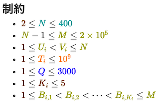

# AtCoder Clans

【非公式】競技プログラミングサイト[AtCoder](https://atcoder.jp/)がもっと楽しくなるリンク集です。有志による非公式サービス・ツール・ライブラリ・記事などをまとめています。

    
    
    
    

  

---

## 特長

* **網羅性が高い**: 初心者から上級者向けの情報まで幅広く掲載しています。
* **最新**: 最新の情報が入手できます。また、[X (旧 Twitter)](https://twitter.com/atcoderclans)で直近1週間の内容をお届けしています。
* **日本語の紹介文**: 日本語で紹介しています。
* **眺めるだけでも楽しい**: サービス・ツールのサムネイルが豊富です。
* **目的に応じて探せる**: 欲しい情報がすぐに探せるように、カテゴリ分けをしています。

## 対象ユーザとメリット

- [AtCoder](https://atcoder.jp/)ユーザ - 困ったことや不便なことが解決できるかもしれません。気になったサービス・ツールなどを使ってみましょう!

- 開発者 - 公開したサービスやツールなどの利用者が増えるだけでなく、ネタ探しや共同開発につながることも期待しています。

- [AtCoder](https://atcoder.jp/)運営チーム - 非公式サービス・ツールの全体像を踏まえ、公式として対応の有無を判断する材料の一つになると思います。また、企業向けの参考資料にもなるかもしれません。

- 企業の採用担当者 - [AtCoder](https://atcoder.jp/)ユーザの実務能力・ポテンシャルの評価材料の一つになると思います。ひいては人材発掘の効率化にも、つながるかもしれません。

---

## 最新情報を確認する

### AtCoder公式

<!-- markdown-link-check-disable -->

- [AtCoderInfo](https://info.atcoder.jp/) - [AtCoder](https://atcoder.jp/)の公式ポータルサイトです。コンテストの参加方法や取り組み方、採用担当者向け情報などが公開されています。

- [【重要なお知らせ】AtCoderを騙る偽サイトにご注意ください](https://atcoder.jp/posts/1268) - [AtCoder](https://atcoder.jp/)の偽サイトへのアクセス・ログインなどをしないように注意喚起している記事。

<!-- markdown-link-check-enable -->

### 非公式サービス・ツール・ライブラリ・記事など

直近1〜2週間の更新状況を掲載しています(ベータ版)。

=== "ユーザスクリプト"

    2024-10-09

    - 「[コンテストに参加する](user_scripts/participate_in_contests)」ページ
        - [AtCoder Customize Panel Fix](https://greasyfork.org/ja/scripts/511359-atcoder-customize-panel-fix)

    2024-10-07

    - 「[コンテストの成績や関連する統計情報を見る](user_scripts/view_scores)」ページ
        - [AtCoder - You're top X%](https://greasyfork.org/ja/scripts/511580-atcoder-you-re-top-x-only-for-algorithm-ranking)

    

      
    

    2024-09-29

    - 「[Webページに色付けする](user_scripts/colors)」ページ
        - [AtCoder Limit Colorizer](https://github.com/sevenc-nanashi/atcoder-limit-colorizer)

    

      
    

    2024-09-26

    - 「[ソースコードの提出・確認を簡単に](user_scripts/submit_codes)」ページ
        - [Atcoder Submission Shortcut](https://greasyfork.org/ja/scripts/509606-atcoder-submission-shortcut)

=== "記事"

    2024-10-08

    - 「[コンテストに関する統計情報を見る](articles/view_scores)」ページ
        - [AtCoder Junior League 2024 Winter - 学校ランキング (10月7日時点)](https://x.com/atcoder/status/1843137096841875936)

    2024-10-04

    - 「[実装テクニックを学ぶ - Python](articles/implementation/python)」ページ
        - [PythonでO(1)ランダムアクセス可能なdequeの新規提案](https://qiita.com/alumite14/items/e4fb361474eb2bebfbff)

    2024-10-02

    - 「[競技プログラミングと就転職](articles/jobs)」ページ
        - [「AtCoder 競技プログラマー就職企業人気ランキング2024」を発表](https://prtimes.jp/main/html/rd/p/000000049.000028415.html)

    - 「[コンテストに関する統計情報を見る](articles/view_scores)」ページ
        - [AtCoder Junior League 2024 Summer - 学校ランキング (9月30日時点)](https://x.com/atcoder/status/1840602893814276144)

    2024-09-30

    - 「[ヒューリスティック問題を解く](articles/heuristic)」ページ
        - [第11回 Asprova プログラミングコンテスト（AtCoder Heuristic Contest 037）の復習](https://kaede2020.hatenablog.com/entry/2024/09/29/165627)

=== "ブログ"
    アルゴリズム部門・ヒューリスティック部門におけるランキング上位の日本人ユーザのブログをまとめています(順不同)。

    2024-10-02

    - 「[アルゴリズム部門 - C++](blogs/algorithm/cpp)」ページ
        - [keisuke6](https://atcoder.jp/users/keisuke6)さん - [note](https://note.com/keisuke6)

    2024-09-30

    - 「[アルゴリズム部門 - C++](blogs/algorithm/cpp)」ページ
        - [Series_205](https://atcoder.jp/users/Series_205)さん - [Qiita](https://qiita.com/Series_205)

    2024-09-29

    - 「[アルゴリズム部門 - Python](blogs/algorithm/python)」ページ
        - [mutualns](https://atcoder.jp/users/mutualns)さん - [はてなブログ](https://mutualns.hatenablog.com/)

=== "ライブラリ・スニペット"

    2024-10-06

    - 「[Rust](libraries/rust)」ページ
        - [magurofly/shed](https://github.com/magurofly/shed) 

=== "色変記事"

    色変記事とは、コンテストの参加者が所定のレーティングに到達した喜びをつづった記事(動画も含む)のことです。

    2024-10-02

     - 「[レーティング2400〜2799(橙色)](milestones/orange)」ページ
        - [keisuke6](https://atcoder.jp/users/keisuke6)さん - [AtCoder 橙になりました！](https://note.com/keisuke6/n/n20f37585d93b)

    2024-10-01

    - 「[レーティング800〜1199(緑色)](milestones/green)」ページ
        - [MNoNamer](https://atcoder.jp/users/MNoNamer)さん - [色変記事：実質2.5ヶ月でRubyとRustを使って入緑した話](https://zenn.dev/mnonamer/articles/atcoder-green)

=== "国内外のコンテストサイト"

    2024-10-02

    - 「[セキュリティ系コンテスト](related_contest_sites/security)」ページ
        - [CTF-pwn-tip](https://github.com/Naetw/CTF-pwn-tips) 

    2024-09-28

    - 「[セキュリティ系コンテスト](related_contest_sites/security)」ページ
        <!-- markdown-link-check-disable -->

        - [HackAll v3](https://hackall.tech/)

        <!-- markdown-link-check-enable -->

    

      
    

=== "アーカイブス"

    諸事情により提供・開発が終了した(と思われる)サービス・ツールなどに対して、感謝や敬意を表するため掲載しています。

    2024-09-28

    - Hisui

## AtCoder公式グッズを購入する

- [SUZURI](https://suzuri.jp/AtCoder) - [AtCoder](https://atcoder.jp/)のロゴ入りグッズが購入できる。

    

        
    

## 競プロLINEスタンプ・グッズ(非公式)を購入する

- [LINE STORE](https://store.line.me/stickershop/product/22113834/en) - [burioden](https://atcoder.jp/users/burioden)さんが作成・配信している競プロLINEスタンプ(非公式)。[第2弾](https://store.line.me/stickershop/product/22810021/en)、[第3弾](https://store.line.me/stickershop/product/22851268/en)、[第4弾](https://store.line.me/stickershop/product/25256215/en)もある。
    - [kyopro-neko](https://github.com/burioden/kyopro-neko)  - 「競プロするねこ」のイラスト集。
        - [アドバイスするねこ](https://github.com/burioden/kyopro-neko/tree/main/advice_neko) - 同キャラクターが、さまざまなアドバイスをしてくれる。
    - [SUZURI](https://suzuri.jp/burioden) - 「競プロするねこ」のイラストが書かれたグッズを購入できる。

    

        
    

## 本サービスのスポンサー(敬称略・順不同)

本サービスの開発・運営を応援してくださり、ありがとうございます。

[GitHub Sponsors](https://github.com/sponsors/KATO-Hiro)で寄付していただいた方には、いくつかの特典をご用意しております。

### 💚 AtCoder Clans Sponsor

- [chokudai](https://github.com/chokudai)

### 🌐 Domain Supporter

- [KoyanagiHitoshi](https://github.com/KoyanagiHitoshi)

### 🍨 Ice Cream Supporter

- ia7ck
- tomii9273
- toshi201

### 🙂 Special Supporter

- otsuneko
