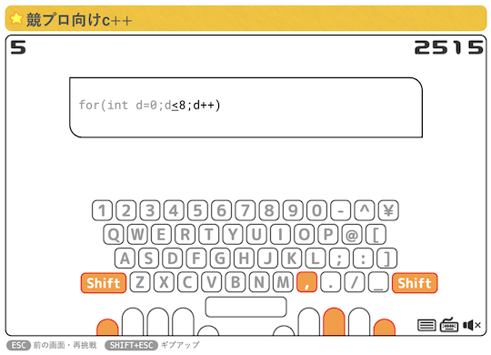
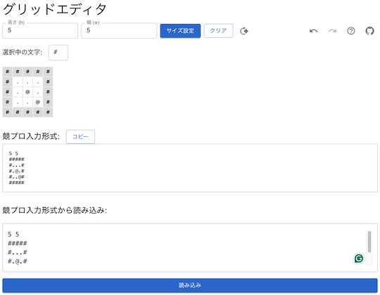
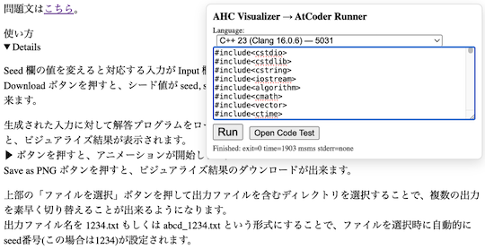

# AtCoder Clans

【非公式】競技プログラミングサイト[AtCoder](https://atcoder.jp/)がもっと楽しくなるリンク集です。有志による非公式サービス・ツール・ライブラリ・記事などをまとめています。

    
    
    
    

  

---

## 特長

* **網羅性が高い**: 初心者から上級者向けの情報まで幅広く掲載しています。
* **最新**: 最新の情報が入手できます。また、[X (旧 Twitter)](https://twitter.com/atcoderclans)で直近1週間の内容をお届けしています。
* **日本語の紹介文**: 日本語で紹介しています。
* **眺めるだけでも楽しい**: サービス・ツールのサムネイルが豊富です。
* **目的に応じて探せる**: 欲しい情報がすぐに探せるように、カテゴリ分けをしています。

## 対象ユーザとメリット

- [AtCoder](https://atcoder.jp/)ユーザ - 困ったことや不便なことが解決できるかもしれません。気になったサービス・ツールなどを使ってみましょう!

- 開発者 - 公開したサービスやツールなどの利用者が増えるだけでなく、ネタ探しや共同開発につながることも期待しています。

- [AtCoder](https://atcoder.jp/)運営チーム - 非公式サービス・ツールの全体像を踏まえ、公式として対応の有無を判断する材料の一つになると思います。また、企業向けの参考資料にもなるかもしれません。

- 企業の採用担当者 - [AtCoder](https://atcoder.jp/)ユーザの実務能力・ポテンシャルの評価材料の一つになると思います。ひいては人材発掘の効率化にも、つながるかもしれません。

---

## 最新情報を確認する

### AtCoder公式

<!-- markdown-link-check-disable -->

- [AtCoderInfo](https://info.atcoder.jp/) - [AtCoder](https://atcoder.jp/)の公式ポータルサイトです。コンテストの参加方法や取り組み方、採用担当者向け情報などが公開されています。

#### 公式コンテストの日時を確認

- [公式コンテストカレンダー運用のお知らせ](https://atcoder.jp/posts/1422) - Google カレンダーに追加すると、公式コンテストの開催日時を簡単に確認できます。
    - [ABCカレンダー](https://calendar.google.com/calendar/u/0?cid=Y180MzA3MDIxZTE0ZDhhMzNlYzgzNjI5YmM1MWQ2OTEzMWMwNjMxOGJiNGQ1ZmRjOTYwODNlZDE2ODFmMGEwZWQ2QGdyb3VwLmNhbGVuZGFyLmdvb2dsZS5jb20)
    - [ARCカレンダー](https://calendar.google.com/calendar/u/0?cid=Y185NGJiMDZmYmI0MDA2NjEzM2VmOTlkNTQ2NDhiZjIzYjI4MTEwNzdjZjU0MWE0ZGMyZDJlYjFiODI1MmU2NmZhQGdyb3VwLmNhbGVuZGFyLmdvb2dsZS5jb20)
    - [AGCカレンダー](https://calendar.google.com/calendar/u/0?cid=Y18wMTk0MDA5MTllZmYyNTI2MzNjNGIxNWE3MTA5YjUyNjhjNTkyNmFhMTFlMDQ2NWE5OWVmNTE5NDdhOTI4YmQ0QGdyb3VwLmNhbGVuZGFyLmdvb2dsZS5jb20)
    - [AHCカレンダー](https://calendar.google.com/calendar/u/0?cid=Y18yYTZiOWYxNTc3Nzg0N2E5YmNlNDhlMDI2OTkyYmY2ZGZjOWE2ZTlhMjk3Mjk4YTFjNjQ5NWMwYjE3NjQ5NjU0QGdyb3VwLmNhbGVuZGFyLmdvb2dsZS5jb20)

#### コンテストに関するルール変更

- [AtCoder生成AI対策ルール - 20250718版](https://info.atcoder.jp/entry/llm-rules-ja) - AtCoder Beginner Contest (通称 ABC) および AtCoder Regular Contest (同 ARC)のコンテスト開催中を対象として、生成AIの利用における禁止事項が説明されています ([英語版](https://info.atcoder.jp/entry/llm-rules-en))。
    - [ARC Div.1 に関する生成AIルール変更について](https://atcoder.jp/posts/1513) - ARC Div.1 も上記ルールの対象となったことが告知されています。
    - [AHCにおける生成AIルールの策定について](https://atcoder.jp/posts/1494) - AtCoder Heuristic Contest (通称 AHC) 049以降で適用される生成AI利用ルールのお知らせです ([詳細](https://info.atcoder.jp/entry/ahc-llm-rules-ja))。

- [ARCのDivision制についての告知](https://atcoder.jp/posts/1364) - ARC189以降、AtCoder Regular Contest (通称 ARC) は難易度の異なる2種類のコンテストに分けられることが告知されています。
    - [ARC Div.1 の rated 上限の変更について](https://atcoder.jp/posts/1433) - ARC196 以降の ARC Div.1 の 開催形式の変更に関するお知らせです。

#### ジャッジシステム

- [AtCoderの言語アップデートに関して (2024-25年度)](https://atcoder.jp/posts/1342) - ジャッジシステムの言語アップデートの準備状況に関するお知らせです。
    - [Language Test 202505](https://atcoder.jp/contests/language-test-202505) - ジャッジシステムに追加・更新された言語を試すためのコンテストが開催されています。
    - [Discord サーバの招待URL](https://discord.gg/NQ3PZQkq7M) - 言語アップデートの議論・ジャッジシステムの仕様に関する質問などを行うことができます。
- [ジャッジキューの処理遅延と今後の対応につきまして](https://atcoder.jp/posts/1456) - (2025年4月時点) ジャッジシステムで処理の遅延が発生している原因と今後の対応、非公式ツールへの影響が説明されています。

#### セキュリティ対策

- [AtCoderアカウントのパスワード管理について](https://atcoder.jp/posts/1366) - 不正アクセス防止のため、[AtCoder](https://atcoder.jp/)アカウントのパスワード確認・必要に応じて変更を促しています。
- [【重要なお知らせ】AtCoderを騙る偽サイトにご注意ください](https://atcoder.jp/posts/1268) - [AtCoder](https://atcoder.jp/)の偽サイトへのアクセス・ログインなどをしないように注意喚起している記事です。

<!-- markdown-link-check-enable -->

### 非公式サービス・ツール・ライブラリ・記事など

直近1〜2週間の更新状況を掲載しています(ベータ版)。

=== "Webアプリ・Webサイト"

    2025-08-15

    - 「[クイズ・ゲーム・ネタアプリ](web_app/quiz_and_game)」ページ
        - [競プロ向けC++](https://typing.twi1.me/game/368871)

    

      
    

    2025-08-06

    - 「[問題を解くときの補助ツール](web_app/support_tools)」ページ
        - [グリッドエディタ](https://paruma.github.io/grid-editor/)

    

      
    

=== "ユーザスクリプト"

    2025-08-14

    - 「[ソースコードの提出・確認を簡単に](user_scripts/submit_codes)」ページ
        - [AHC Visualizer → AtCoder CustomTest Runner](https://greasyfork.org/ja/scripts/545397-ahc-visualizer-atcoder-customtest-runner-fixed-responsetext-guards)

    

      
    

    2025-08-02

    - 「[コンテストに参加する](user_scripts/participate_in_contests)」ページ
        - [AtCoder Title Changer](https://greasyfork.org/ja/scripts/544199-atcoder-title-changer)

    

      
    

=== "記事"

    2025-08-12

    - 「[ヒューリスティック問題を解く](articles/heuristic)」ページ
        - [THIRD プログラミングコンテスト 2025 夏（AtCoder Heuristic Contest 051）参加記](https://kaede2020.hatenablog.com/entry/2025/08/11/190035)

    2025-08-09

    - 「[ヒューリスティック問題を解く](articles/heuristic)」ページ
        - [AHC050勉強会レポート](https://zenn.dev/algoartis/articles/report_ahc050)

    2025-08-07

    - 「[部活・サークル・同好会・オンサイトイベントに参加する](articles/club_activities)」ページ
        - [CodeQUEEN2025決勝に出場しました！【4位！】](https://ayuna-stpyko.github.io/my_blog/archive/20250806.html)

    2025-08-06

    - 「[部活・サークル・同好会・オンサイトイベントに参加する](articles/club_activities)」ページ

        - [CodeQUEEN2025の決勝に行った話](https://note.com/rieul/n/nc12ca268c87c)

        <!-- markdown-link-check-disable -->

        - [CodeQUEEN 2025 に協賛しました！弊社メンバーが入賞しました！](https://www.estie.jp/blog/entry/2025/08/06/101041)

        <!-- markdown-link-check-enable -->

    2025-08-05

    - 「[コンテストに関する統計情報を見る](articles/view_scores)」ページ
        - [AtCoder Junior League 2025 Summer - 学校ランキング (2025年8月5日時点)](https://x.com/atcoder/status/1952544472220487798)

    2025-08-03

    - 「[部活・サークル・同好会・オンサイトイベントに参加する](articles/club_activities)」ページ
        - [CodeQUEEN 2025 参加記](https://momoharahara.hatenadiary.com/entry/2025/08/03/003143)

=== "ブログ"
    アルゴリズム部門・ヒューリスティック部門におけるランキング上位の日本人ユーザのブログをまとめています(順不同)。

    2025-08-13

    - 「[ヒューリスティック部門 - Python](blogs/heuristic/python)」ページ
        - [Koi51](https://atcoder.jp/users/Koi51)さん - [Qiita](https://qiita.com/koi51)

    - 「[ヒューリスティック部門 - C++](blogs/heuristic/cpp)」ページ
        - [satoyuki](https://atcoder.jp/users/satoyuki)さん - [はてなブログ](https://tomatokiraida52.hatenablog.com)

    2025-08-03

    - 「[アルゴリズム部門 - Python](blogs/algorithm/python)」ページ
        - [AwashAmityOak](https://atcoder.jp/users/AwashAmityOak)さん - [Qiita](https://qiita.com/AwashAmityOak)

=== "動画"

    2025-08-13

    - 「[YouTube - チャンネル](youtube/channel)」ページ
        - [電たくT](https://www.youtube.com/playlist?list=PLRBtCO0gM_wnUp-bYxogXEF611rgCB6Ev)

    2025-08-12

    - 「[YouTube - 個別の動画](youtube/video)」ページ
        - [「8」を重ねずに平面に非可算無限個描けるか？](https://www.youtube.com/watch?v=zWvufLP7_Ao)

    2025-08-08

    - 「[YouTube - 個別の動画](youtube/video)」ページ
        - [累積和（基本編）競技プログラミングのテクニック](https://www.youtube.com/live/Rtn64a2eitk)

    2025-08-02

    - 「[YouTube - 個別の動画](youtube/video)」ページ
        - [[情報I][プログラミング入門] アルゴリズムの思いつき方](https://www.youtube.com/watch?v=Ow3MFqVVYQA)

=== "コマンドラインツール"

    2025-08-01

    - 「[ソースコードにバグがないか確認](cli/test_tools)」ページ
        - [AHCテストケース実行ツールpahcerの使い方](https://www.terry-u16.net/entry/how-to-use-pahcer)

=== "色変記事"

    色変記事とは、コンテストの参加者が所定のレーティングに到達した喜びをつづった記事(動画も含む)のことです。

    2025-08-12

    - 「[レーティング400から799まで(茶色)](milestones/brown)」ページ
        - [kanikama0926](https://atcoder.jp/users/kanikama0926)さん - [入茶したよ！！！](https://qiita.com/hekiboko/items/a859d84c11fdd6e87d4d)

    2025-08-11

    - 「[レーティング400から799まで(茶色)](milestones/brown)」ページ
        - [watacco](https://atcoder.jp/users/watacco)さん - [AtCoder 入茶 / 2025.08.09](https://sizu.me/natsukawa723/posts/0b65vvsm1h22)

    2025-08-10

    - 「[レーティング400から799まで(茶色)](milestones/brown)」ページ
        - [miso253oudon](https://atcoder.jp/users/miso253oudon)さん - [[AtCoder] 入茶しました記事](https://zenn.dev/miso253udon/articles/00aa0baa78aa40)

    2025-08-04

    - 「[レーティング800〜1199(緑色)](milestones/green)」ページ
        - [satomshr](https://atcoder.jp/users/satomshr)さん - [【色変記事】AtCoder で緑になりました](https://qiita.com/satomshr/items/35b5024c7aab2ce9f820)

## AtCoder公式グッズを購入する

- [SUZURI](https://suzuri.jp/AtCoder) - [AtCoder](https://atcoder.jp/)のロゴ入りグッズが購入できる。

    

        
    

## 競プロLINEスタンプ・グッズ(非公式)を購入する

- [LINE STORE](https://store.line.me/stickershop/product/22113834/en) - [burioden](https://atcoder.jp/users/burioden)さんが作成・配信している競プロLINEスタンプ(非公式)。[第2弾](https://store.line.me/stickershop/product/22810021/en)、[第3弾](https://store.line.me/stickershop/product/22851268/en)、[第4弾](https://store.line.me/stickershop/product/25256215/en)もある。
    - [kyopro-neko](https://github.com/burioden/kyopro-neko)  - 「競プロするねこ」のイラスト集。
        - [アドバイスするねこ](https://github.com/burioden/kyopro-neko/tree/main/advice_neko) - 同キャラクターが、さまざまなアドバイスをしてくれる。
    - [SUZURI](https://suzuri.jp/burioden) - 「競プロするねこ」のイラストが書かれたグッズを購入できる。

    

        
    

## 本サービスのスポンサー(敬称略・順不同)

本サービスの開発・運営を応援してくださり、ありがとうございます。

[GitHub Sponsors](https://github.com/sponsors/KATO-Hiro)で寄付していただいた方には、いくつかの特典をご用意しております。

### 🏢 𝑬𝑵𝑻𝑬𝑹𝑷𝑹𝑰𝑺𝑬 Sponsor

- [AtCoder株式会社](https://github.com/atcoder)

### 🌐 Domain Supporter

- [KoyanagiHitoshi](https://github.com/KoyanagiHitoshi)

### 🍨 Ice Cream Supporter

- ia7ck
- ngtkana
- tomii9273
