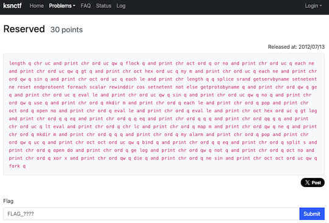

# AtCoder Clans

【非公式】競技プログラミングサイト[AtCoder](https://atcoder.jp/)がもっと楽しくなるリンク集です。有志による非公式サービス・ツール・ライブラリ・記事などをまとめています。

    
    
    
    

  

---

## 特長

* **網羅性が高い**: 初心者から上級者向けの情報まで幅広く掲載しています。
* **最新**: 最新の情報が入手できます。また、[X (旧 Twitter)](https://twitter.com/atcoderclans)で直近1週間の内容をお届けしています。
* **日本語の紹介文**: 日本語で紹介しています。
* **眺めるだけでも楽しい**: サービス・ツールのサムネイルが豊富です。
* **目的に応じて探せる**: 欲しい情報がすぐに探せるように、カテゴリ分けをしています。

## 対象ユーザとメリット

- [AtCoder](https://atcoder.jp/)ユーザ - 困ったことや不便なことが解決できるかもしれません。気になったサービス・ツールなどを使ってみましょう!

- 開発者 - 公開したサービスやツールなどの利用者が増えるだけでなく、ネタ探しや共同開発につながることも期待しています。

- [AtCoder](https://atcoder.jp/)運営チーム - 非公式サービス・ツールの全体像を踏まえ、公式として対応の有無を判断する材料の一つになると思います。また、企業向けの参考資料にもなるかもしれません。

- 企業の採用担当者 - [AtCoder](https://atcoder.jp/)ユーザの実務能力・ポテンシャルの評価材料の一つになると思います。ひいては人材発掘の効率化にも、つながるかもしれません。

---

## 最新情報を確認する

### AtCoder公式

<!-- markdown-link-check-disable -->

- [AtCoderInfo](https://info.atcoder.jp/) - [AtCoder](https://atcoder.jp/)の公式ポータルサイトです。コンテストの参加方法や取り組み方、採用担当者向け情報などが公開されています。

<!-- markdown-link-check-enable -->

### 非公式サービス・ツール・ライブラリ・記事など

直近1〜2週間の更新状況を掲載しています(ベータ版)。

=== "ユーザスクリプト"

    2024-06-29

    - 「[ソースコードの提出・確認を簡単に](user_scripts/submit_codes)」ページ
        - [AtCoder quickly check fastest codes](https://greasyfork.org/ja/scripts/499102-atcoder-quickly-check-fastest-codes)

    

      
    

    2024-06-27

    - 「[コンテストに参加する](user_scripts/participate_in_contests)」ページ
        - [auto click AtCoder clock once on page load](https://greasyfork.org/ja/scripts/499009-auto-click-atcoder-clock-once-on-page-load)

=== "記事"

    2024-07-01

    - 「[コンテストに関する統計情報を見る](articles/view_scores)」ページ
        - [AtCoder Junior League 2024 Summer - 学校ランキング (7月1日時点)](https://x.com/atcoder/status/1807644173765656817)

    2024-06-24

    - 「[コンテストに関する統計情報を見る](articles/view_scores)」ページ
        - [AtCoder Junior League 2024 Summer - 学校ランキング (6月24日時点)](https://x.com/atcoder/status/1805057388875305367)

    2024-06-21

    - 「[コードを書くための環境構築を行う](articles/development_env)」ページ
        - [Dockerを利用したローカルのAtCoder環境（C++）](https://zenn.dev/kinakomochi5250/articles/atcoder-cpp-docker)

    2024-06-20

    - 「[数学を学ぶ](articles/math)」ページ
        - [ミラー・ラビン素数判定法](https://drive.google.com/file/d/1ytqMuPhmxhE2loMZL1HOJ3l2iaLCv4tz/view)

    2024-06-17

    - 「[コンテストに関する統計情報を見る](articles/view_scores)」ページ
        - [AtCoder Junior League 2024 Summer - 学校ランキング (6月17日時点)](https://x.com/atcoder/status/1802534399533252647)

=== "ブログ"
    アルゴリズム部門・ヒューリスティック部門におけるランキング上位の日本人ユーザのブログをまとめています(順不同)。

    2024-06-30

    - 「[アルゴリズム部門 - C++](blogs/algorithm/cpp)」ページ
        - [ripity](https://atcoder.jp/users/ripity)さん - [はてなブログ](https://ripity.hatenablog.com/)

    2024-06-19

    - 「[ヒューリスティック部門 - C](blogs/heuristic/c)」ページ
        - [ygussany](https://atcoder.jp/users/ygussany)さん - [はてなブログ](https://ygussany.hatenablog.com/)

    - 「[ヒューリスティック部門 - C++](blogs/heuristic/cpp)」ページ
        - [yosupo](https://atcoder.jp/users/yosupo)さん - [はてなブログ](https://yosupo.hatenablog.com/)
        - [physics0523](https://atcoder.jp/users/physics0523)さん - [はてなブログ](https://physics0523.hatenablog.com/)
        - [dsytk7](https://atcoder.jp/users/dsytk7)さん - [はてなブログ](https://dsytk7.hateblo.jp)

=== "ライブラリ・スニペット"

    2024-06-18

    - 「[C++](libraries/cpp)」ページ
        - [halc-git/Halc-Library](https://github.com/halc-git/Halc-Library) 

=== "色変記事"

    色変記事とは、コンテストの参加者が所定のレーティングに到達した喜びをつづった記事(動画も含む)のことです。

    2024-06-30

     - 「[アルゴリズム部門 - レーティング2000〜2399(黄色)](milestones/yellow)」ページ
        - [ripity](https://atcoder.jp/users/ripity)さん - [AtCoder 入黄](https://ripity.hatenablog.com/entry/2024/06/30/003553)

=== "国内外のコンテストサイト"

    2024-06-26

    - 「[セキュリティ系コンテスト](related_contest_sites/security)」ページ
        - [SadServers](https://sadservers.com/)

    

      
    

    2024-06-22

    - 「[セキュリティ系コンテスト](related_contest_sites/security)」ページ
        - [ksnctf](https://ksnctf.sweetduet.info/)

    

      
    

## AtCoder公式グッズを購入する

- [SUZURI](https://suzuri.jp/AtCoder) - [AtCoder](https://atcoder.jp/)のロゴ入りグッズが購入できる。

    

        
    

## 競プロLINEスタンプ・グッズ(非公式)を購入する

- [LINE STORE](https://store.line.me/stickershop/product/22113834/en) - [burioden](https://atcoder.jp/users/burioden)さんが作成・配信している競プロLINEスタンプ(非公式)。[第2弾](https://store.line.me/stickershop/product/22810021/en)、[第3弾](https://store.line.me/stickershop/product/22851268/en)、[第4弾](https://store.line.me/stickershop/product/25256215/en)もある。
    - [kyopro-neko](https://github.com/burioden/kyopro-neko)  - 「競プロするねこ」のイラスト集。
    - [SUZURI](https://suzuri.jp/burioden) - 「競プロするねこ」のイラストが書かれたグッズを購入できる。

    

        
    

## 本サービスのスポンサー(敬称略・順不同)

本サービスの開発・運営を応援してくださり、ありがとうございます。

[GitHub Sponsors](https://github.com/sponsors/KATO-Hiro)で寄付していただいた方には、いくつかの特典をご用意しております。

### 💚 AtCoder Clans Sponsor

- [chokudai](https://github.com/chokudai)

### 🌐 Domain Supporter

- [KoyanagiHitoshi](https://github.com/KoyanagiHitoshi)

### 🍨 Ice Cream Supporter

- ia7ck
- tomii9273
- toshi201

### 🙂 Special Supporter

- otsuneko
