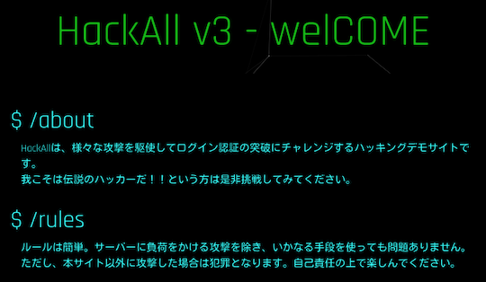
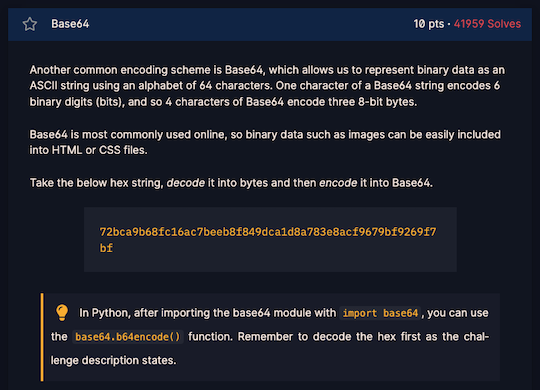

# AtCoder Clans

【非公式】競技プログラミングサイト[AtCoder](https://atcoder.jp/)がもっと楽しくなるリンク集です。有志による非公式サービス・ツール・ライブラリ・記事などをまとめています。

    
    
    
    

  

---

## 特長

* **網羅性が高い**: 初心者から上級者向けの情報まで幅広く掲載しています。
* **最新**: 最新の情報が入手できます。また、[X (旧 Twitter)](https://twitter.com/atcoderclans)で直近1週間の内容をお届けしています。
* **日本語の紹介文**: 日本語で紹介しています。
* **眺めるだけでも楽しい**: サービス・ツールのサムネイルが豊富です。
* **目的に応じて探せる**: 欲しい情報がすぐに探せるように、カテゴリ分けをしています。

## 対象ユーザとメリット

- [AtCoder](https://atcoder.jp/)ユーザ - 困ったことや不便なことが解決できるかもしれません。気になったサービス・ツールなどを使ってみましょう!

- 開発者 - 公開したサービスやツールなどの利用者が増えるだけでなく、ネタ探しや共同開発につながることも期待しています。

- [AtCoder](https://atcoder.jp/)運営チーム - 非公式サービス・ツールの全体像を踏まえ、公式として対応の有無を判断する材料の一つになると思います。また、企業向けの参考資料にもなるかもしれません。

- 企業の採用担当者 - [AtCoder](https://atcoder.jp/)ユーザの実務能力・ポテンシャルの評価材料の一つになると思います。ひいては人材発掘の効率化にも、つながるかもしれません。

---

## 最新情報を確認する

### AtCoder公式

<!-- markdown-link-check-disable -->

- [AtCoderInfo](https://info.atcoder.jp/) - [AtCoder](https://atcoder.jp/)の公式ポータルサイトです。コンテストの参加方法や取り組み方、採用担当者向け情報などが公開されています。

- [【重要なお知らせ】AtCoderを騙る偽サイトにご注意ください](https://atcoder.jp/posts/1268) - [AtCoder](https://atcoder.jp/)の偽サイトへのアクセス・ログインなどをしないように注意喚起している記事。

<!-- markdown-link-check-enable -->

### 非公式サービス・ツール・ライブラリ・記事など

直近1〜2週間の更新状況を掲載しています(ベータ版)。

=== "ユーザスクリプト"

    2024-09-26

    - 「[ソースコードの提出・確認を簡単に](user_scripts/submit_codes)」ページ
        - [Atcoder Submission Shortcut](https://greasyfork.org/ja/scripts/509606-atcoder-submission-shortcut)

    2024-09-20

    - 「[コンテストに参加する](user_scripts/participate_in_contests)」ページ
        - [AtCoder-RedirectRecentABC](https://greasyfork.org/ja/scripts/508772-atcoder-redirectrecentabc)

=== "記事"

    2024-09-18

    - 「[コンテストに関する統計情報を見る](articles/view_scores)」ページ
        - [AtCoder Junior League 2024 Summer - 学校ランキング (9月17日時点)](https://x.com/atcoder/status/1835861099616645324)

=== "ブログ"
    アルゴリズム部門・ヒューリスティック部門におけるランキング上位の日本人ユーザのブログをまとめています(順不同)。

    2024-09-18

    - 「[ヒューリスティック部門 - C++](blogs/heuristic/cpp)」ページ
        - [LayCurse](https://atcoder.jp/users/LayCurse)さん - [自作ブログ](http://rsujskf.s602.xrea.com/)
        - [tempura0224](https://atcoder.jp/users/tempura0224)さん - [はてなブログ](https://tempura0224.hatenablog.com/)

    - 「[ヒューリスティック部門 - Java](blogs/heuristic/java)」ページ
        - [uwi](https://atcoder.jp/users/uwi)さん - [はてなブログ](https://uwitenpen.hatenadiary.org/)

    2024-09-15

    - 「[アルゴリズム部門 - C++](blogs/algorithm/cpp)」ページ
        - [askr_58](https://atcoder.jp/users/askr_58)さん - [はてなブログ](https://askr-58.hatenablog.com/)
        - [blueberry1001](https://atcoder.jp/users/blueberry1001)さん - [Qiita](https://qiita.com/bluebery1001)

=== "動画"

    2024-09-16

    - 「[YouTube - 個別の動画](youtube/video)」ページ
        - [五色定理・改【ゆっくり解説】](https://www.youtube.com/watch?v=uBy2Vghh--8)

    2024-09-14

    - 「[YouTube - 個別の動画](youtube/video)」ページ
        - [もし時計の時針と分針が区別できなかったら【ゆっくり解説】](https://www.youtube.com/watch?v=G5qF3c_ac9M)

=== "ライブラリ・スニペット"

    2024-09-24

    - 「[Rust](libraries/rust)」ページ
        - [tayu0110/tayu-procon](https://github.com/tayu0110/tayu-procon) 

=== "色変記事"

    色変記事とは、コンテストの参加者が所定のレーティングに到達した喜びをつづった記事(動画も含む)のことです。

    2024-09-23

    - 「[レーティング1600〜1999(青色)](milestones/blue)」ページ
        - [2bit](https://atcoder.jp/users/2bit)さん - [AtCoder青になったので記録をメモ - nibitのブログ](https://2bitpng.hatenablog.com/entry/2024/09/22/085912)

    2024-09-19

    - 「[レーティング2000〜2399(黄色)](milestones/yellow)」ページ
        - [zawatin](https://atcoder.jp/users/zawatin)さん - [AtCoderで入黄しました 【雑談】 - zawatinはてなブログ](https://zawatin.hatenablog.com/entry/2024/09/18/171103)

    2024-09-17

    - 「[レーティング1200〜1599(水色)](milestones/cyan)」ページ
        - [ZUkA_](https://atcoder.jp/users/ZUkA_)さん - [数学が苦手な大学生の AtCoder 入水記事](https://note.com/yindolsa/n/n61b2b4f17e78)

=== "国内外のコンテストサイト"

    2024-09-28

    - 「[セキュリティ系コンテスト](related_contest_sites/security)」ページ
        <!-- markdown-link-check-disable -->

        - [HackAll v3](https://hackall.tech/)

        <!-- markdown-link-check-enable -->

    

      
    

    2024-09-22

    - 「[セキュリティ系コンテスト](related_contest_sites/security)」ページ
        - [picoCTF](https://play.picoctf.org/practice)

    

      
    

    - 「[セキュリティ系コンテスト](related_contest_sites/security)」ページ
        - [CryptoHack](https://cryptohack.org/)

    

      
    

    2024-09-21

    - 「[セキュリティ系コンテスト](related_contest_sites/security)」ページ
        - [Dreamhack](https://dreamhack.io/ctf)

=== "アーカイブス"

    諸事情により提供・開発が終了した(と思われる)サービス・ツールなどに対して、感謝や敬意を表するため掲載しています。

    2024-09-28

    - Hisui

## AtCoder公式グッズを購入する

- [SUZURI](https://suzuri.jp/AtCoder) - [AtCoder](https://atcoder.jp/)のロゴ入りグッズが購入できる。

    

        
    

## 競プロLINEスタンプ・グッズ(非公式)を購入する

- [LINE STORE](https://store.line.me/stickershop/product/22113834/en) - [burioden](https://atcoder.jp/users/burioden)さんが作成・配信している競プロLINEスタンプ(非公式)。[第2弾](https://store.line.me/stickershop/product/22810021/en)、[第3弾](https://store.line.me/stickershop/product/22851268/en)、[第4弾](https://store.line.me/stickershop/product/25256215/en)もある。
    - [kyopro-neko](https://github.com/burioden/kyopro-neko)  - 「競プロするねこ」のイラスト集。
        - [アドバイスするねこ](https://github.com/burioden/kyopro-neko/tree/main/advice_neko) - 同キャラクターが、さまざまなアドバイスをしてくれる。
    - [SUZURI](https://suzuri.jp/burioden) - 「競プロするねこ」のイラストが書かれたグッズを購入できる。

    

        
    

## 本サービスのスポンサー(敬称略・順不同)

本サービスの開発・運営を応援してくださり、ありがとうございます。

[GitHub Sponsors](https://github.com/sponsors/KATO-Hiro)で寄付していただいた方には、いくつかの特典をご用意しております。

### 💚 AtCoder Clans Sponsor

- [chokudai](https://github.com/chokudai)

### 🌐 Domain Supporter

- [KoyanagiHitoshi](https://github.com/KoyanagiHitoshi)

### 🍨 Ice Cream Supporter

- ia7ck
- tomii9273
- toshi201

### 🙂 Special Supporter

- otsuneko
