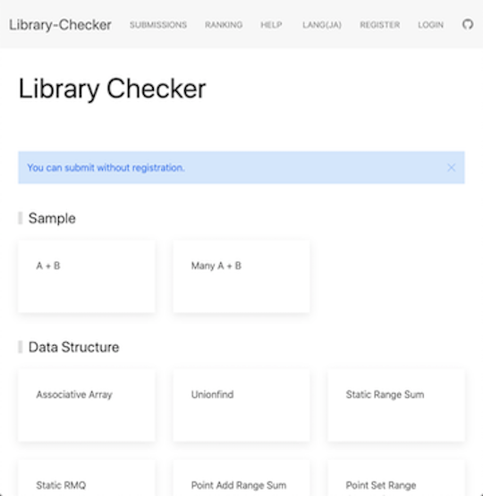

- [Library Checker Problems](https://judge.yosupo.jp/)  - オンラインジャッジシステムにより、ライブラリが正しく実装されているか確認できる。初心者向けに[有志による解説記事のまとめ](https://qiita.com/hotman78/items/b8986a23b8fdfe25c9fb)も公開されている。サービスで使用されている技術に関心がある方は、[作者による紹介記事](https://yosupo.hatenablog.com/entry/2020/01/02/001617)を参照されたい。
    - [library-checker-testcases-2](https://github.com/hotman78/library-checker-testcases-2)  - 有志によりテストケースのリストが公開されている。

  

    
  

- [competitive-verifier](https://github.com/competitive-verifier/competitive-verifier) -  - 既出の典型的な問題を活用して、ライブラリのテストを自動化するツール。また、ライブラリのドキュメント生成や[Online Judge Verification Helper](https://github.com/online-judge-tools/verification-helper)からの移行コマンドなどもサポートされている。
- [libtest](https://github.com/pachicobue/libtest)  - C++ライブラリのテストのために使う問題集。CIでの利用を想定しており、入出力の自動生成と自動テストを行うことができる。
