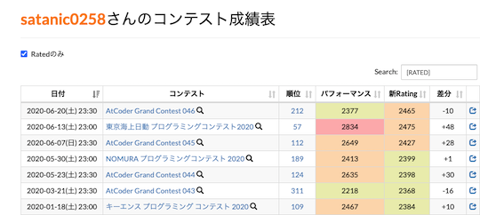

!!! info "参考"

    ユーザスクリプト(⭐️印が付いたサービス)を初めて利用される場合は、最初に[スクリプトマネージャ](https://greasyfork.org/ja)を導入する必要があります。

## 問題を解くときに便利な拡張機能を導入

- [Comfortable Atcoder](https://chrome.google.com/webstore/detail/comfortable-atcoder/ipmmkccdccnephfilbjdnmnfcbopbpaj?hl=ja&gl=UA) - 提出結果の通知、問題をドロップダウンリストで表示、などを設定できるChrome拡張機能です。

    

      
    

## 問題の提出、正誤状況を確認

- [⭐ atcoder-tasks-page-colorizer](https://greasyfork.org/ja/scripts/380404-atcoder-tasks-page-colorizer) - 「問題」ページで、提出した問題に色付けします。「AC(正解)」が緑色で、「WA(不正解)」が赤色でそれぞれ表示されます。

    

      
    

## コンテストの成績に応じて色付け

- [⭐ AtCoderPerformanceColorizer](https://greasyfork.org/ja/scripts/371693-atcoderperformancecolorizer) - ユーザの「コンテスト成績表」のパフォーマンス値、レーティング値に色付けします。

    

      
    

## 問題の難易度から解答するか判断

- [⭐ AtCoder Difficulty Display](https://greasyfork.org/ja/scripts/397185-atcoder-difficulty-display) - 「問題」ページに[AtCoder Problems](https://kenkoooo.com/atcoder/)の難易度を表示します。

    

      
    

## ユーザの実力から提出コードを見るか判断

- [⭐ AtCoder Submission User Colorizer](https://greasyfork.org/ja/scripts/397710-atcoder-submission-user-colorizer) - 「提出結果」ページのユーザ名を、レーティング帯に応じて色付けします。

    

      
    

---

  

    <a href="../../scripts">もっと見る</a>
  

