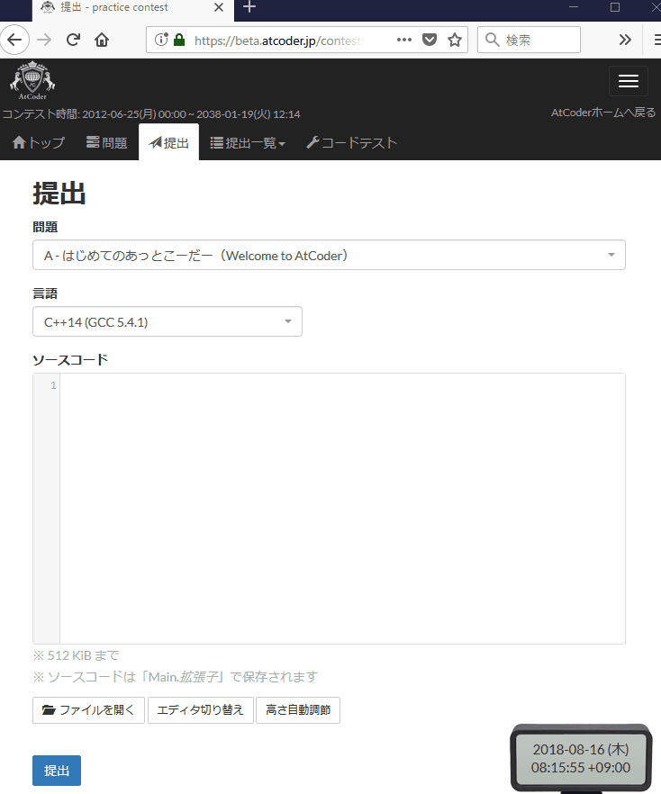
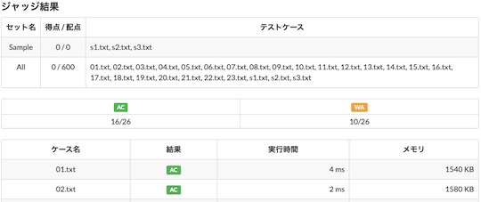

!!! info "参考"

    ユーザスクリプト(⭐️印が付いたサービス)を初めて利用される場合は、最初に[スクリプトマネージャ](https://greasyfork.org/ja)を導入する必要があります。

## バグがないか事前に確認

- [⭐ AtCoder Easy Test v2](https://greasyfork.org/ja/scripts/433152-atcoder-easy-test-v2) - 「問題」ページで、入出力サンプルを使って素早くテストを実行できます。スクリプトの基本的な使用方法に関しては、[作者による解説記事](https://qiita.com/magurofly/items/4b60dc02283e70230f71)を参照してください。

    

      
    

    ---

    

      <a href="../../cli">もっと見る</a>
    

## ショートカットで素早く提出

- [⭐ AtCoder_submit_keyboard_shortcut](https://greasyfork.org/ja/scripts/378760-atcoder-submit-keyboard-shortcut) - Ctrl+Enterを押すだけでソースコードが提出できます。

## 解答の判定結果を自動で通知

- [⭐ AtCoderResultNotifier](https://greasyfork.org/ja/scripts/371225-atcoderresultnotifier) - 提出したソースコードの正誤判定の結果を自動的に通知します。

    

      
    

## 解答の判定結果(一覧)を見る

- [⭐ AtCoder Submission Status](https://greasyfork.org/ja/scripts/383817-atcoder-submission-status) - 提出した解答について、テストケースの結果(AC、WA、…)が一目でわかるように表示できます。

    

      
    

    ??? info "テストケースの結果の略称と意味"

        AC: 正解、WA: 不正解、TLE: 実行時間制限超過、MLE: メモリ制限超過、RE: 実行時エラー、CE: コンパイルエラー
