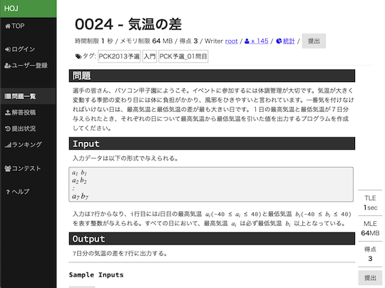

## DOJ

- [DOJ](https://doj.kr/ja) - 韓国のコンテストサイト。
    - [【競プロ】DOJっていうサイトがあるよ、という話](https://note.com/halc_flipper/n/n3aff5f6ba2ee) - [hirayuu_At](https://atcoder.jp/users/hirayuu_At)さんが、同サイトの特徴やアカウントの登録・活用方法などを紹介している記事。

    

      
    

## HOJ (Hamako Online Judge)

- [Hamako Online Judge](https://hoj.hamako-ths.ed.jp/onlinejudge/) - 不定期にコンテストが開催されている。

    

      
    

## MOFE

- [MOFE](https://mofecoder.com/) - (ベータ版) CafeCoderと[MojaCoder](https://mojacoder.app/)の統合・リニューアルによって開始予定のコンテストサイト([出典](https://twitter.com/CafeCoder_/status/1689280921835335680))。
    - [公式アカウント](https://twitter.com/CafeCoder_)

## Xmas Contest

- [Xmas Contest](http://hos.ac/contest/xmas2025/) - Xmasに開催されるコンテスト。「一風変わった問題」が出題されることが多い。
