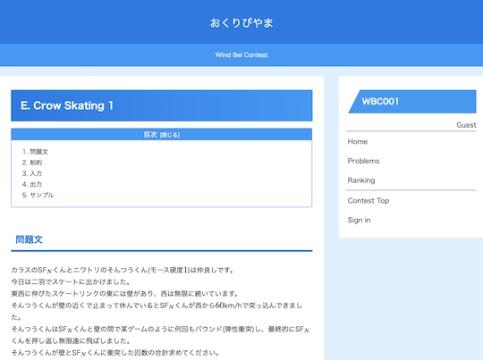

## CafeCoder

- [CafeCoder](https://cafecoder.top/) - 有志によって、不定期にコンテストが開催されている。

    

      
    

## HOJ (Hamako Online Judge)

- [Hamako Online Judge](https://hoj.hamako-ths.ed.jp/onlinejudge/) - 不定期にコンテストが開催されている。

    

      
    

## LeetCode

- [LeetCode Stats Card](https://github.com/JacobLinCool/LeetCode-Stats-Card) - ユーザの統計情報をGitHubのREADMEやWebサイトなどに表示することができる。

    

      
    

## Wind Bel Contest

- [Wind Bel Contest](https://mario.exout.net/contests/) - テーマ別のコンテストが不定期に開催されている。

    !!! warning "注意"

        [AtCoder](https://atcoder.jp/)とは、提出方法やSNSへの書き込みのルールが異なるため、事前の確認を推奨。

    

      
    

## Xmas Contest

- [Xmas Contest 2021](http://hos.ac/contest/xmas2021/) - Xmasに開催されるコンテスト。「一風変わった問題」が出題されることが多い。
