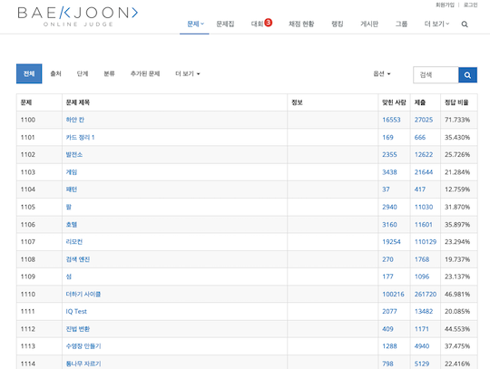
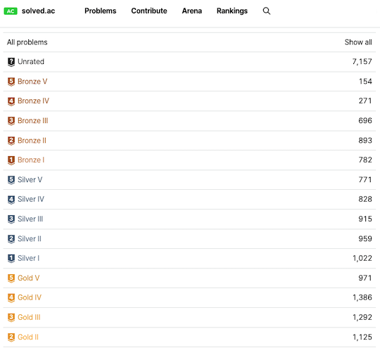

## 記事

- [韓国最大のオンラインジャッジサイトBOJとは？あと、solved.acとは？](https://riyuna.hatenablog.com/entry/2023/12/20/084520) - オンラインジャッジ、および、問題を難易度・ジャンルで分類したサイト（投票可）について紹介されている。
    - [Baekjoon Online Judge について](https://kkt89.hatenablog.com/entry/2022/12/04/Baekjoon_Online_Judge_%E3%81%AB%E3%81%A4%E3%81%84%E3%81%A6)

## Webアプリ・Webサイト

### 問題を解く

- [Baekjoon Online Judge](https://www.acmicpc.net/) - 各種コンテストサイトの問題が多数収録されている。

    

      
    

- [solved.ac](https://solved.ac/en) - タグや難易度から問題を選ぶことができる。

    

      
    

