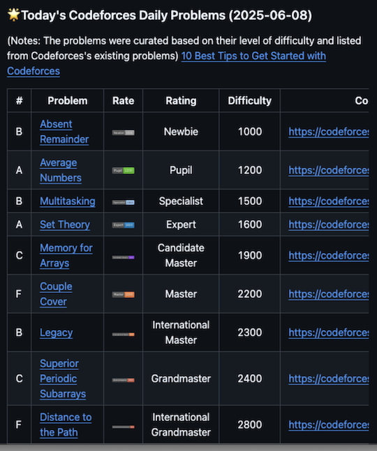
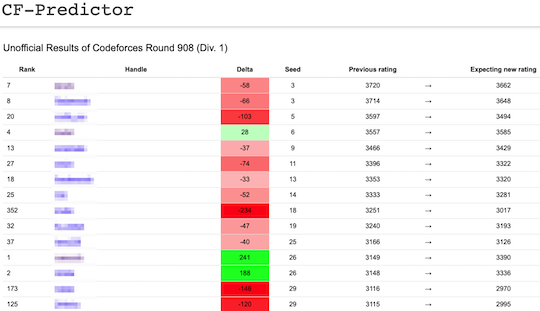
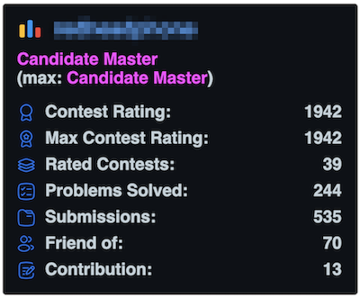
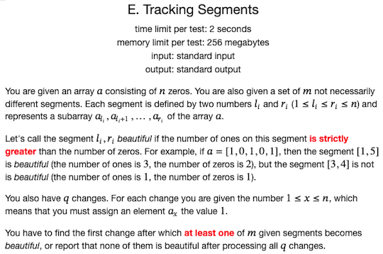

## 記事

### コンテストに参加する

- [AtCoderだけじゃない！こどふぉ(Codeforces) にも参加しよう🔥](https://qiita.com/Jessica_nao_/items/a7b621ee90856041d25d) - [Codeforces](https://codeforces.com/)のバーチャルコンテスト参加を勧めている記事。提出コードのテンプレート(Python)だけでなく、同コンテストで不便な点について解決方法も紹介されている。
- [AtCoderユーザがCodeforcesに参戦した話](https://qiita.com/tosh55/items/7703e9f1306ca7e00d10) - [AtCoder](https://atcoder.jp/)ユーザが[Codeforces](https://codeforces.com/)に参加する上で調査・試行錯誤した内容がまとめられている(2023年11月末時点)。コンテスト間の違いやAtCoderとほぼ同等の環境を実現するためのツールの導入・設定例が紹介されている。
    - [別の著者によるツールの導入・設定例](https://atug.tokyo/?p=598)
- [Codeforcesのすすめ for AtCoderユーザー](https://ywmt.hatenablog.com/entry/2019/10/17/120914) - [AtCoder](https://atcoder.jp/)ユーザに向けて、[Codeforces](https://codeforces.com/)の特徴・おすすめポイントを解説した記事。
- [はじめてのCodeforces 前編 (参加登録〜コンテスト本番)](https://noimin.hatenablog.com/entry/2019/10/18/162521) - [Codeforces](https://codeforces.com/)に関心があるユーザに向けて、コンテストに出場登録するところから参加するまでの流れを日本語でわかりやすく解説した記事。[後編](https://noimin.hatenablog.com/entry/2019/10/19/152633)では、レーティングの変化をプロフィールページで確認する方法やコンテストの復習方法などについて解説されている。

## Webアプリ・Webサイト

### 問題を解く

- [CF-Problems](https://tom0727.github.io/cf-problems/) - 開催されたコンテストの問題、ユーザの正誤状況を一覧できるWebアプリ。また、類似したサービスとして、[Codeforces Problems](https://cf.kira924age.com/#/table/)や[CONTEST MANIA](https://contestmania.web.app/)がある。

    

      
    

- [Codeforces Problems](https://cf.kira924age.com/#/table/) - 開催されたコンテストの問題、ユーザの正誤状況などを一覧できるWebアプリ。作者による使用技術の[解説記事](https://kira000.hatenadiary.jp/entry/2021/03/06/123556)もある。

    

      
    

- [CONTEST MANIA](https://contestmania.web.app/) - 開催されたコンテストの問題を一覧できるWebアプリ。ユーザ名を入力することで、正誤状況を把握できる。

    

      
    

- [Codeforces Daily Problems](https://github.com/ika9810/Codeforces-Daily-Problems) -  - 日替わりで問題を解くことができる。[Codeforces](https://codeforces.com/)の過去問から、入門者〜超上級者向けの問題セットが出題される。

    

      
    

### コンテストの成績を見る

#### レーティングを見る・比較する

- [CF-Predictor](https://cf-predictor.wasylf.xyz/contestSelector.html) - コンテストの結果に基づいて、レーティングの変化を推定するWebサイト。また、複数のブラウザに対応した[拡張機能](https://cf-predictor.wasylf.xyz/)も利用できる。

    

      
    

#### 仮想的なレーティングを計算

- [Codeforces Anytime](https://codeforces-anytime.firebaseapp.com/) - バーチャルコンテストの結果を利用して、レーティングの変動を表示するWebアプリ。同一の作者により[AtCoder版](https://atcoder-anytime.sonoapp.page/)も公開されている。

    

      
    

#### 統計情報を見る

- [Codeforces Readme Stats](https://codeforces-readme-stats.vercel.app/) - 任意のユーザのレーティング（現在・最高）、提出数、コントリビューション数、フレンド数などをREADMEに表示できる。

    

      
    

- [Codeforces Stats](https://github.com/SiriusKoan/codeforces-stats) - ユーザのレーティング（現在・最高）、コントリビューション数、フレンド数をREADMEなどに表示することができる。

    

      
    

- [Codeforces Visualizer](https://cfviz.netlify.app/) - 指定したユーザの解答状況について、各種統計情報(正誤・使用言語・問題の種類や難易度など)を視覚的に表示できる。

    

      
    

## ユーザスクリプト

### ソースコードを提出する

- [cf-fast-submit](https://greasyfork.org/ja/scripts/371117-cf-fast-submit) - コンテストの問題ページに提出用のフォームを設置し、直接submitすることができる。

    

      
    

### コンテストの成績を見る

- [Codeforces Performance](https://greasyfork.org/ja/scripts/402180-codeforces-performance) - コンテストでのパフォーマンスの推定値をコンテスト履歴に表示する。また、レーティングやパフォーマンスの色付けも可能。

    

      
    

### Webページに色付けする

- [Codeforces Bold Emphasizer](https://greasyfork.org/ja/scripts/427926-codeforces-bold-emphasizer) - 問題文の重要な情報(黒太字)を赤太字で強調する。

    

      
    

## Google Chromeの拡張機能

### コンテストの成績を見る

- [CF-Predictor](https://cf-predictor.wasylf.xyz/) - コンテストの結果に基づいて、レーティングの予測値を表示する。MozillaやOperaにも対応している。

## コマンドラインツール・GUIツール

### ソースコードにバグがないか確認

- [Codeforces Tool](https://github.com/xalanq/cf-tool)  - サンプルの入出力の取得、テスト、解答コードの提出などができるCLIツール。

    

      
    

- [CP Editor](https://cpeditor.org/)  - サンプルの入出力の取得、テスト、文法チェック、解答コードの提出などができる競技プログラミング専用のIDE。

    

      
    

- [Hightail](https://github.com/dj3500/hightail)  - サンプルの入出力を取得し、ローカル環境でテストするGUIツール。

    

      
    

