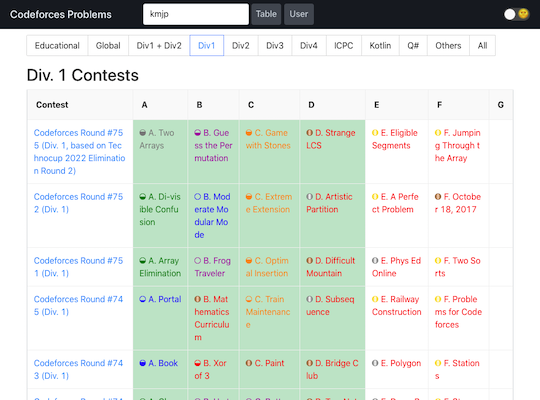
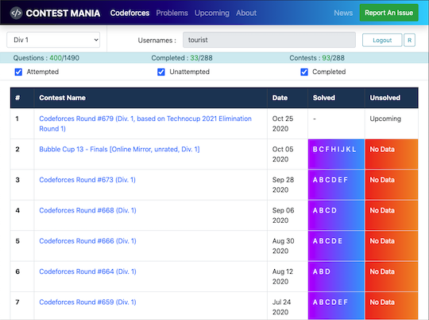
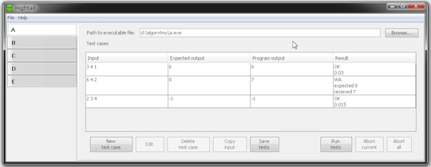

## 記事

- [AtCoderだけじゃない！こどふぉ(Codeforces) にも参加しよう🔥](https://qiita.com/Jessica_nao_/items/a7b621ee90856041d25d) - [Codeforces](https://codeforces.com/)のバーチャルコンテスト参加を勧めている記事。提出コードのテンプレート(Python)だけでなく、同コンテストで不便な点について解決方法も紹介されている。
- [Codeforcesのすすめ for AtCoderユーザー](https://ywmt.hatenablog.com/entry/2019/10/17/120914) - [AtCoder](https://atcoder.jp/)ユーザに向けて、[Codeforces](https://codeforces.com/)の特徴・おすすめポイントを解説した記事。
- [はじめてのCodeforces 前編 (参加登録〜コンテスト本番)](https://noimin.hatenablog.com/entry/2019/10/18/162521) - [Codeforces](https://codeforces.com/)に関心があるユーザに向けて、コンテストに出場登録するところから参加するまでの流れを日本語でわかりやすく解説した記事。[後編](https://noimin.hatenablog.com/entry/2019/10/19/152633)では、レーティングの変化をプロフィールページで確認する方法やコンテストの復習方法などについて解説されている。

## Webアプリ、Webサイト

### 過去問を解く

- [CF-Problems](https://tom0727.github.io/cf-problems/) - 開催されたコンテストの問題、ユーザの正誤状況を一覧できるWebアプリ。また、類似したサービスとして、[Codeforces Problems](https://cf.kira924age.com/#/table/)や[CONTEST MANIA](https://contestmania.web.app/)がある。

    

      
    

- [Codeforces Problems](https://cf.kira924age.com/#/table/) - 開催されたコンテストの問題、ユーザの正誤状況などを一覧できるWebアプリ。作者による使用技術の[解説記事](https://kira000.hatenadiary.jp/entry/2021/03/06/123556)もある。

    

      
    

- [CONTEST MANIA](https://contestmania.web.app/) - 開催されたコンテストの問題を一覧できるWebアプリ。ユーザ名を入力することで、正誤状況を把握できる。

    

      
    

### レーティングの表示、比較

- [CF-Predictor](https://cf-predictor-frontend.herokuapp.com/) - コンテストの結果に基づいて、レーティングの変化を推定するWebアプリ。また、複数のブラウザに対応した拡張機能をダウンロードして利用することもできる。

    

      
    

- [Codeforces Rating Comparison](https://rika0384.github.io/codeforces_rating_comparison/) - 指定した2人以上のレーティングの比較ができる。[AtCoder版](https://atcoder-rating-comparison.herokuapp.com/)も公開されている。

    

      
    

### 仮想的なレーティングを表示

- [Arugo](https://arugo.herokuapp.com/) - 任意の1問が80分以内に解けたかどうかに応じて、仮想的なレーティングの推移が表示されるWebサイト。作者による[紹介記事](https://codeforces.com/blog/entry/96830)もある。

    

      
    

- [Codeforces Anytime](https://codeforces-anytime.firebaseapp.com/) - バーチャルコンテストの結果を利用して、レーティングの変動を表示するWebアプリ。同一の作者により[AtCoder版](https://atcoder-anytime.sonoapp.page/)も公開されている。

    

      
    

### 統計情報を表示

- [Codeforces Stats](https://github.com/SiriusKoan/codeforces-stats) - ユーザの統計情報をREADMEなどに表示することができる。

    

      
    

- [Codeforces Visualizer](https://cfviz.netlify.app/) - 指定したユーザの解答状況について、各種統計情報(正誤・使用言語・問題の種類や難易度など)を視覚的に表示できる。

    

      
    

## ユーザスクリプト

- [cf-fast-submit](https://greasyfork.org/ja/scripts/371117-cf-fast-submit) - コンテストの問題ページに提出用のフォームを設置し、直接submitすることができる。

    

      
    

- [Codeforces Performance](https://greasyfork.org/ja/scripts/402180-codeforces-performance) - コンテストでのパフォーマンスの推定値をコンテスト履歴に表示する。また、レーティングやパフォーマンスの色付けも可能。

    

      
    

## コマンドラインツール、GUIツール

- [Codeforces Tool](https://github.com/xalanq/cf-tool)  - サンプルの入出力の取得、テスト、解答コードの提出などができるCLIツール。

    

      
    

- [CP Editor](https://cpeditor.org/)  - サンプルの入出力の取得、テスト、文法チェック、解答コードの提出などができる競技プログラミング専用のIDE。

    

      
    

- [Hightail](https://github.com/dj3500/hightail)  - サンプルの入出力を取得し、ローカル環境でテストするGUIツール。

    

      
    

