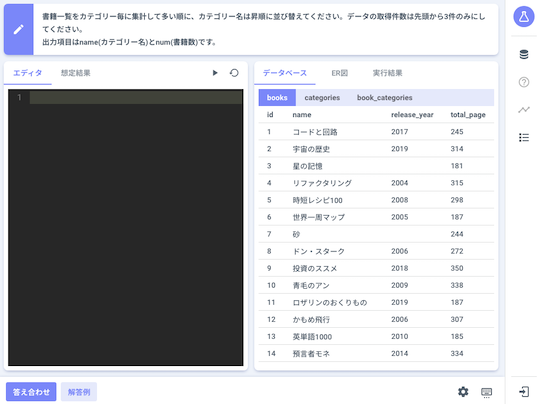

## SQLab

- [SQLab](https://sqlab.net/) - SQLの練習ができる学習サービス。
    - [作者による紹介記事](https://qiita.com/take_paolo/items/6b69767d8efbd013bf64)

    

      
    

## TOPSIC SQL Contest

- [TOPSIC SQL Contest](https://topsic-contest.jp/home) - SQLを利用して問題を解くことができるコンテストが開催されている。

    !!! warning "注意"
        使用できるのはSQLiteのみ。
