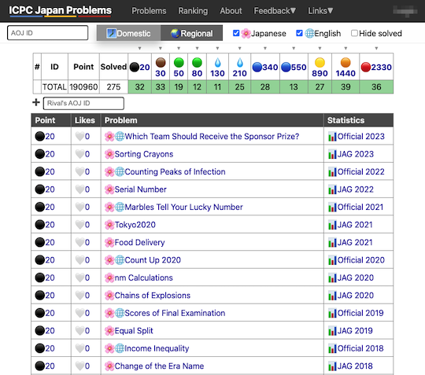
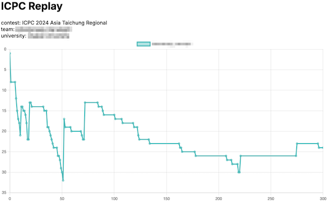

## Webアプリ・Webサイト

### 問題を解く

- [ICPC Japan Problems](https://icpc-japan-problems.irrrrr.cc/) - [ICPC 日本地区](https://icpc.iisf.or.jp/)の本選および[ICPC OB/OG の会](https://jag-icpc.org/)の練習コンテストで出題された問題の一覧(難易度付き)を見ることができる。

    

      
    

### コンテストの成績を見る

- [ICPC Replay](https://icpc-replay.vercel.app/) - [AtCoder Replay](https://atcoder-replay.kakira.dev/)のICPC版。2022年以降の国内予選・アジア地区予選を対象として、参加チームのコンテスト開始〜終了までの順位変化を表示する。

    

      
    

## 記事

### 問題を解く

- [【ICPC国内予選】テストケース並列化でなぐろう](https://hackmd.io/@tatyam-prime/SyfzRuBwR) - テストケースの並列化の方法と[ライブラリ](https://gist.github.com/tatyam-prime/1161da013a31632690d616016d51d743)、使用例が紹介されている。

### 参加記を読む

- [ICPC 2023 世界大会参加記](https://e869120.hatenablog.com/entry/2024/05/01/165143) - [E869120](https://atcoder.jp/users/E869120)さんによる The 46th & 47th Annual World Finals の参加記。世界大会出場までの練習方法とコンテスト当日の戦略が詳細に書かれている。
    - [ICPC 世界大会で準優勝しました](https://e869120.hatenablog.com/entry/2025/09/29/164622)
    - [ICPC 2024 横浜大会参加記](https://e869120.hatenablog.com/entry/2024/12/25/124746)
