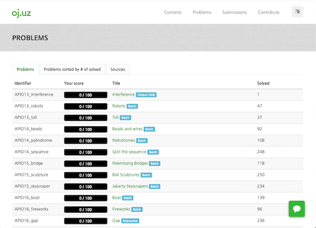

## JOI (Japanese Olympiad in Informatics)

### Webアプリ、Webサイト

- [日本情報オリンピック](https://www.ioi-jp.org/) - 情報オリンピック日本委員会のWebページ。[予選・本選で出題された問題と解説](https://www.ioi-jp.org/problem_archive.php)や[春季トレーニング合宿の過去問](https://www.ioi-jp.org/camp/index.html)などが掲載されている。

    

      
    

- [AOJ/Atcoder-JOI](https://joi.goodbaton.com/) - [AOJ](http://judge.u-aizu.ac.jp/onlinejudge/)や[AtCoder](https://atcoder.jp/)のユーザIDを利用して、難易度別の回答状況や個別の問題の正誤状況を把握できるWebサイト。

    

      
    

- [JOI非公式難易度表](https://docs.google.com/spreadsheets/d/1zXDtkFmskO5NSxkqck8uDbcJtAhTVZtzPh2hLw64Sw4/edit#gid=0) - JOIで出題された問題に関する非公式の難易度表。有志の投票に基づいて決められている。

    

      
    

### 記事

- [Introducion to JOI](https://pro-ktmr.github.io/joig-course/text/index.html) - C++の基礎文法について、JOIの過去問を通して学ぶことができる。
- [JOI春合宿2020 参加記](https://drive.google.com/file/d/1iW2sTAz9VyhzWbO0ByVHiha0jG0aIJ7H/view) - [E869120](https://atcoder.jp/users/E869120)さんによる2020年日本情報オリンピック春季トレーニング合宿の参加記。情報オリンピック日本代表の選考までの練習過程と選考会での立ち回りについて詳細に書かれている。
- [JOI夏季セミナーに代わる輪読会の開催について](https://kaage.hatenablog.com/entry/2022/03/25/210000) - JOI夏季セミナー(ハイレベルコース)の開催見送りに伴い、代替イベントとなる輪読会の参加者を募集している記事。

## IOI (International Olympiad in Informatics)

### Webアプリ、Webサイト

- [IOI Syllabus クイズ①](https://quiz-maker.site/quiz/play/x4Qzf820220330074405) - [IOI Syllabus 2020](https://ioinformatics.org/files/ioi-syllabus-2020.pdf)の出題範囲に関するクイズを解くことができる。

    

      
    

- [oj.uz](https://oj.uz/) - 海外の情報オリンピックの問題を閲覧・回答できるWebサイト。

    

      
    

- [OI Checklist](https://oichecklist.pythonanywhere.com/) - [oj.uz](https://oj.uz/)の回答状況を把握するためのWebサイト。

    !!! warning "注意"

        回答状況の更新は自動で行われず、利用者が手動で行う必要がある。

    

      
    

- [OI Public Library](https://github.com/enkerewpo/OI-Public-Library) - アルゴリズムに関する資料集。中国語と英語で提供されている。

### 記事

- [IOI2020 参加記](https://drive.google.com/file/d/1UOFW6Vtxz5S5hWBK78swQg368F6L15kp/view) - [E869120](https://atcoder.jp/users/E869120)さんによる第32回国際情報オリンピック(IOI2020)の参加記。「金メダルを確実に取る」という観点から、本番での立ち回りが詳細に解説されている。また、筆者が5年間の競技生活を通して得た経験は、後進に勇気と希望を与えてくれる内容だと思われる。
- [国際情報オリンピック (IOI 2020) 参加記 ~ 情報オリンピックへの感謝の気持ちを込めて ~](https://drive.google.com/file/d/1NGhlPCmRadq8j2oNeFmH4LfPiooI7H_1/view) - [square1001](https://atcoder.jp/users/square1001)さんによる第32回国際情報オリンピック(IOI2020)の参加記。部分点を確実に取りながら、満点を目指す戦略が詳しく解説されている。また、筆者が大会に参加するまでの過程や競技プログラミングを通して得られた経験には、後進にとって有益な情報が多く含まれていると思われる。
