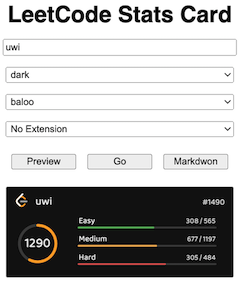

## Webアプリ・Webサイト

### 統計情報を見る

- [LeetCode Stats Card](https://github.com/JacobLinCool/LeetCode-Stats-Card) - ユーザの統計情報をGitHubのREADMEやWebサイトなどに表示することができる。

    

      
    

## コマンドラインツール

### ソースコードにバグがないか確認

- [Leetgo](https://github.com/j178/leetgo)  - サンプルの入出力の取得、テスト、解答コードの提出などができるツール。

    

      
    

