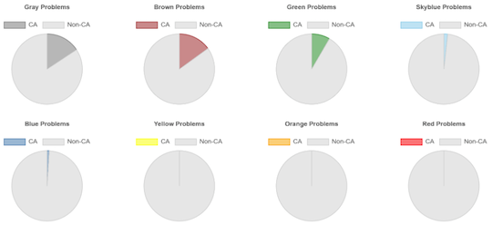

## 日本数学オリンピック

- [とある数学の凡人](https://www.youtube.com/c/toaru_math/featured) - 日本数学オリンピックの解説動画が多数公開されているYouTubeのチャンネル。最新情報は、[Twitter](https://twitter.com/toaru_math_bot)で確認できる。

## OMC (OnlineMathContest)

### YouTubeチャンネル

- [OnlineMathContest](https://www.youtube.com/channel/UC7s9Bwj4fUN_WhoahHBI1cg) - [OnlineMathContest](https://onlinemathcontest.com/)の公式YouTubeチャンネル。

### ユーザスクリプト

- [OMC Difficult Pies](https://greasyfork.org/ja/scripts/537420-omc-difficult-pies) - 回答状況を円グラフで難易度別に表示する。

    

      
    

### 記事

- [OMC水までの問題に使う知識まとめ](https://note.com/orangekid1210/n/nfab310b51ec3) - 同コンテストの水色diffレベルまでの問題を解くのに必要な知識・テクニックと該当する問題がまとめられている。
