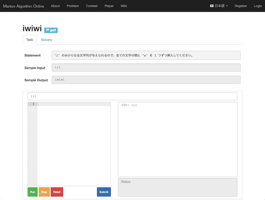

## くそなぞなぞ Beginner Contest

- [くそなぞなぞ Beginner Contest](https://twitter.com/BeginnerContest) - ウィットに富んだ「なぞなぞ」が出題されるコンテスト。

    

      
    

### 記事

- [くそなぞなぞ青色になるまでにやったこと - little star's memory](https://koboshi-kyopro.hatenablog.com/entry/2021/11/06/220449) - [koboshi](https://shitforces.herokuapp.com/account/koboshi)さんが、2021年11月6日に青色くそなぞなぞerに昇格。

## MAO (Markov Algorithm Online)

- [Markov Algorithm Online](https://mao.snuke.org/) - マルコフアルゴリズムを利用したパズル形式の問題を解くことができるWebサイト。
    <!-- markdown-link-check-disable -->
    - 有志による[チュートリアル](https://dic.nicovideo.jp/a/%E3%83%9E%E3%83%AB%E3%82%B3%E3%83%95%E3%82%A2%E3%83%AB%E3%82%B4%E3%83%AA%E3%82%BA%E3%83%A0)
    <!-- markdown-link-check-enable -->

    

      
    

## New Year's Puzzles

- [New Year's Puzzles](https://nyp.snuke.org/) - オートマトンなどを利用したパズル形式の問題を解くことができる。

    

      
    

## Painter Programming

- [Painter Programming](https://square1001.github.io/painter-programming/) - シンプルなルールなのに奥深い塗り絵パズル。

    

      
    

### 記事

- [大好評！たった6種類の文法で塗り絵パズルが楽しめる、新感覚プログラミング言語「Painter Programming」を作った話](https://qiita.com/e869120/items/92f19314ac5ea9a1e82a) - プログラミング言語「Painter Programming」の面白さ・楽しさ・奥深さを解説した記事。

## 正規表現パズル

- [正規表現パズル](https://gametsukurukun.com/regexp-puzzle/) - 正規表現を利用したパズルゲーム。

    

      
    

## Shitforces

- [Shitforces](https://shitforces.herokuapp.com/) - ウィットに富んだ「なぞなぞ」が出題されるコンテスト。[公式アカウント](https://twitter.com/shitforces)で、最新情報を確認することができる。

    

      
    

