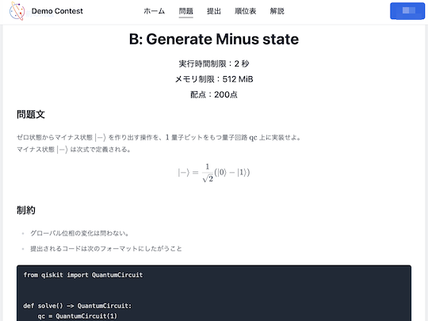
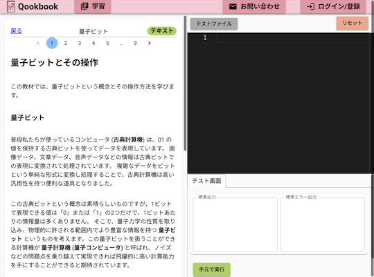

- [QCoder](https://www.qcoder.jp/) - 量子コンピュータに関する知識を競うプログラミングコンテストサービス。
    - [X(旧 Twitter)アカウント](https://twitter.com/QCoderOfficial)

    

      
    

    - [Qookbook](https://www.qookbook.net/) - 量子情報の知識を問題を解きながら身につけることができる。
        - [作者による紹介記事](https://kotamanegi.hatenablog.com/entry/2023/12/13/182110) - 量子コンピュータと競技プログラミングに関心があるユーザとの親和性、サービスの開発背景・概要などが紹介されている。

    

      
    

