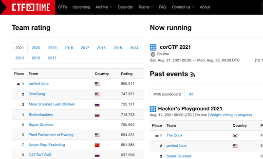

## CTF (Capture The Flag)

### Webアプリ・Webサイト

#### 問題を解く

- [AlpacaHack](https://alpacahack.com/) - 個人戦を対象としたコンテストサイト。一つのカテゴリにフォーカスした短期間コンテストが定期的に開催されている。また、コンテスト終了後に問題を復習することも可能。
    - [X(旧 Twitter)アカウント](https://x.com/AlpacaHack)

    

      
    

- [Dreamhack](https://dreamhack.io/ctf) - 韓国のコンテストサイト。個人戦が開催されており、レーティングが付与される。また、豊富な教育コンテンツも提供されている。
    - [System Hacking](https://dreamhack.io/lecture/roadmaps/2) - 「脆弱性を見つけて攻撃（Pwn）」の入門用コンテンツがまとめられている。

- [picoCTF](https://play.picoctf.org/practice) - アメリカの高校生を対象としたコンテストで出題された問題を解くことができる。問題数が多いのが特徴。

    

      
    

- [ksnctf](https://ksnctf.sweetduet.info/) - コンピュータセキュリティに関する問題を解くことができる。

    

      
    

- [CryptoHack](https://cryptohack.org/) - CTFのうち「暗号技術（Crypto）」に特化した学習用サイト。
    - [X(旧 Twitter)アカウント](https://x.com/cryptohack__)

    

      
    

- [SadServers](https://sadservers.com/) - Linux リモートサーバで発生しているさまざま問題を修正しながら、CTFに関する知識を学ぶことができる。

    

      
    

#### コンテストの開催日時・統計情報を見る

- [CTF TIME](https://ctftime.org/) - CTFのコンテスト一覧(新着・アーカイブ)やレーティングをはじめとする統計情報などが閲覧できるWebサイト。

    

      
    

### 記事

#### Tips

- [CTF-pwn-tip](https://github.com/Naetw/CTF-pwn-tips)  - Pwnに関するTipsがまとめられている。

!!! warning "注意"

    更新が停止しているため、いくつかの項目に関しては別の資料を参照する必要がある。

#### Advent Calendar

CTFに関する話題を扱ったアドベントカレンダー。

- [CTF Advent Calendar 2022](https://adventar.org/calendars/7550)
- [CTF Advent Calendar 2021](https://adventar.org/calendars/6914)

### ライブラリ

#### セキュリティ関連のユーティリティ

- [ptr-yudai/ptrlib](https://github.com/ptr-yudai/ptrlib)  - CTF用のPythonライブラリ。暗号・ネットワーク・セキュリティ上の弱点などに関する複雑なプログラムを簡単に書くことができる。

## ハッキング

### 問題を解く

<!-- markdown-link-check-disable -->

- [HackAll v3](https://hackall.tech/) - さまざまな方法を駆使して、ログイン認証の突破に挑戦するデモサイト。

    

      
    

<!-- markdown-link-check-enable -->
