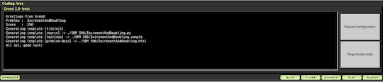

## 記事

### アルゴリズム部門

- [TopCoderをはじめよう！(2021年版) Python/C++対応版](https://qiita.com/recuraki/items/a359624c2981e82853d5) - Single Round Match (SRM)に参加するために必要な環境構築の方法と基本操作を日本語で解説した記事。注意事項が丁寧に解説されているのが特徴。

### ヒューリスティック部門

- [Topcoder Marathon Matchの始め方（最新版）](https://qiita.com/phocom/items/da0f8123f7a8d5201cbf) - Marathon Match (MM)の始め方を日本語で解説した記事。アカウント登録から環境構築、サンプルコードの動作確認、回答の作成、提出および結果の確認方法まで丁寧に紹介されている。
- [Topcoderマラソンマッチの探索問題で重要なこと](https://qiita.com/takapt0226/items/b2f6d1d77a034b529e21) - ヒューリスティック型コンテストにおいて、汎用的な内容(時間を確保する・注意深く考察する・有名アルゴリズムに囚われない)と探索問題に特化した知見がまとめられている記事。
- [MarathonMatchトレーニングのための過去問レビュー](http://web.archive.org/web/20150516031822/http://topcoder.g.hatena.ne.jp/tomerun/20141201) - [tomerun](https://atcoder.jp/users/tomerun)さんが、ヒューリスティック型コンテストの過去問についてジャンル分けとオススメ度をまとめた記事。

    !!! warning "注意"

        記事は、2014年12月1日時点の内容であるため、最近のコンテストと傾向が大きく異なる可能性もある。

## Webサイトと関連リンク

- [How To Compete in SRMs](https://www.topcoder.com/community/competitive-programming/how-to-compete) - Single Round Match (SRM) に登録・参加するための方法を説明した公式サイトのページ。
- [Topcoder ARENA (Applet)](https://www.topcoder.com/contest/arena/ContestAppletProd7.2.jnlp) - 過去問を解くときに必要なアプリをダウンロードするためのリンク。
- [Topcoder ARENA (Practice Problem List)](https://arena.topcoder.com/index.html#/u/practiceProblemList) - 過去問の一覧とその詳細が閲覧できるWebサイト。

    

      
    

- [Topcoder (Problem Search)](https://community.topcoder.com/tc?module=ProblemArchive) - 過去問を検索・閲覧できるWebサイト。

    

      
    

## プラグイン

- [Greed](https://github.com/zen0wu/topcoder-greed)  - 問題を解くときに、普段使っているエディタを使えるようにするためのJava Arenaプラグイン。入出力フォーマットに沿ったテンプレートコードの生成やサンプルのテストができる。対応言語は、C++、C#、Java、Python。また、環境構築の方法を日本語で解説した記事([Java Appletの導入](https://ferin-tech.hatenablog.com/entry/2017/02/22/223141)、[Greedの設定](https://imulan.hatenablog.jp/entry/2016/01/21/154640))もある。

    

      
    

    !!! warning "注意"

        近年は更新頻度がかなり低下しており、最新の環境に対応していない可能性もある。
