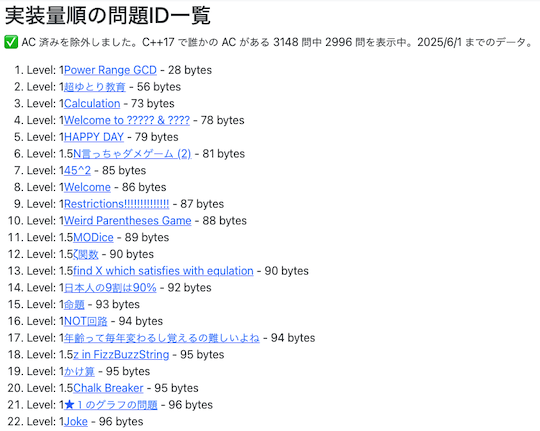

## Webアプリ・Webサイト

### 問題を解く

- [yukicoder problems](https://iilj.github.io/yukicoder-problems/#/table/) - 開催されたコンテストの問題一覧、ユーザの正誤状況などを確認できるWebアプリ。

    

      
    

- [yukicoder lazy solving](https://maruoka842.github.io/yukicoder-lazy-solving/) - 指定したユーザが正解していない問題を、実装量の少ない順に表示する。

    

      
    

## ユーザスクリプト

### 問題を解くときに便利な機能を導入

- [comfortable-yukicoder](https://greasyfork.org/ja/scripts/431129-comfortable-yukicoder) - [yukicoder](https://yukicoder.me/)に、汎用的な機能を追加するユーザスクリプト。主な機能は以下の通り。
    - 指定したページに移動できるタブを追加
    - 提出結果をハイライトする
    - 正誤状況の要約 など

    !!! warning "注意"

        ユーザスクリプトを初めて利用する場合は、事前に[スクリプトマネージャー](https://greasyfork.org/ja)を導入する必要がある。

    

      
    

## 記事

### 数学を学ぶ

#### 発展的な内容

- [yukicoder 1962 の解説の解説の解説](https://koba-e964.hatenablog.com/entry/2024/04/15/230008) - 筆者が有志の解説記事を読んで納得するまでの過程がまとめられている。正規表現と形式的べき級数を同一視し、それらの対応関係を定めた上で定式化および一般化が図られている。
    - [No.1962 Not Divide](https://yukicoder.me/problems/no/1962) - 問題へのリンク。
    - [問題作成者による解説](https://yukicoder.me/problems/no/1962/editorial) - 記事を読むときは、[yukicoder](https://yukicoder.me/)でログインを済ませておく必要がある。
    - [yukicoder 1962の解説の解説](https://sugarknri.hatenablog.com/entry/2022/06/08/180533) - 有志により上記の解説に対して、行間を補う形で説明されている。

## 補助ツール

### 問題を作成する

- [yukicoder-md](https://github.com/koyumeishi/yukicoder-md)  - 問題の作成を補助するツール。[CommonMark](https://commonmark.org/)形式で書かれた問題文をHTMLに変換する。
    - [Playground](https://koyumeishi.github.io/yukicoder-md/) - Webブラウザ版。

    !!! warning "注意"

        [Playground](https://koyumeishi.github.io/yukicoder-md/)では、一部の機能が利用できない。

    

      
    

### 問題の入出力データを検証する

- [testlib for yukicoder](https://github.com/riantkb/testlib_for_yukicoder)  - [testlib](https://github.com/MikeMirzayanov/testlib)を利用した入力生成・検証、正誤判定を行うためのサンプルコード集。
    - 同じコードで[yukicoder](https://yukicoder.me/)とローカル環境([Rime](https://github.com/icpc-jag/rime)の利用を想定)の動作確認ができる。
    - [yukicoderでtestlibを使うためのメモ](https://rian.hatenablog.jp/entry/2020/12/04/181523) - 作者による解説記事。
