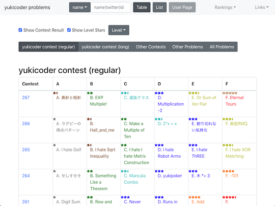
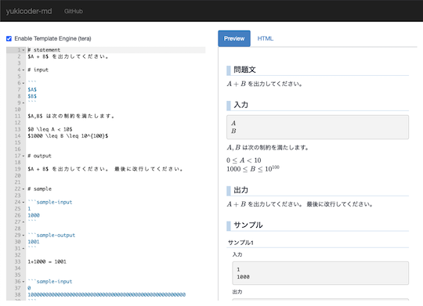

## Webアプリ・Webサイト・Bot

### 問題を解く

- [yukicoder problems](https://iilj.github.io/yukicoder-problems/#/table/) - 開催されたコンテストの問題一覧、ユーザの正誤状況などを確認できるWebアプリ。

    

      
    

### 最短コードの更新状況を知る

- [yukicoder最短コード更新お知らせ](https://twitter.com/yukigolfer) - 最短コードの更新を通知してくれるTwitter bot。別の作者による[AtCoder版](https://twitter.com/atgolfer1) もある。

    

      
    

## ユーザスクリプト

### 問題を解くときに便利な機能を導入

- [comfortable-yukicoder](https://greasyfork.org/ja/scripts/431129-comfortable-yukicoder) - [yukicoder](https://yukicoder.me/)に、汎用的な機能を追加するユーザスクリプト。主な機能は以下の通り。
    - 指定したページに移動できるタブを追加
    - 提出結果をハイライトする
    - 正誤状況の要約 など

    !!! warning "注意"

        ユーザスクリプトを初めて利用する場合は、事前に[スクリプトマネージャー](https://greasyfork.org/ja)を導入する必要がある。

    

      
    

## 補助ツール

### 問題を作成する

- [yukicoder-md](https://github.com/koyumeishi/yukicoder-md)  - 問題の作成を補助するツール。[CommonMark](https://commonmark.org/)形式で書かれた問題文をHTMLに変換する。
    - [Playground](https://koyumeishi.github.io/yukicoder-md/) - Webブラウザ版。

    !!! warning "注意"

        [Playground](https://koyumeishi.github.io/yukicoder-md/)では、一部の機能が利用できない。

    

      
    

### 問題の入出力データを検証する

- [testlib for yukicoder](https://github.com/riantkb/testlib_for_yukicoder)  - [testlib](https://github.com/MikeMirzayanov/testlib)を利用した入力生成・検証、正誤判定を行うためのサンプルコード集。
    - 同じコードで[yukicoder](https://yukicoder.me/)とローカル環境([Rime](https://github.com/icpc-jag/rime)の利用を想定)の動作確認ができる。
    - [yukicoderでtestlibを使うためのメモ](https://rian.hatenablog.jp/entry/2020/12/04/181523) - 作者による解説記事。
