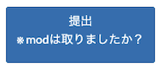
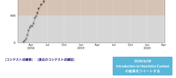
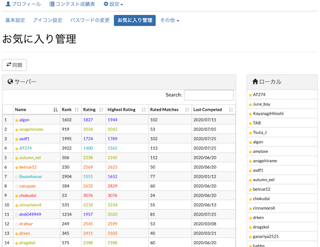

## 入出力例を利活用する

### 入出力をそれぞれまとめる

- [atcoder_collect_all_examples](https://greasyfork.org/ja/scripts/387240-atcoder-collect-all-examples) - 「問題」ページに入力例・出力例をそれぞれまとめる。

    

      
    

### データをダウンロード

- [AtCoder Sample Downloader](https://greasyfork.org/ja/scripts/425977-atcoder-sample-downloader) - 「問題」ページに、入出力例をダウンロードできるボタンを設置する。

    

      
    

### テストを実行

- [AtCoder Easy Test v2](https://greasyfork.org/ja/scripts/433152-atcoder-easy-test-v2) - 「問題」ページで、入出力例を使って素早くテスト(自作を含む)を実行できる。また、[Codeforces](https://codeforces.com/)や[yukicoder](https://yukicoder.me/)にも対応している。スクリプトの基本的な使用方法や技術解説に関しては、[作者による解説記事](https://qiita.com/magurofly/items/4b60dc02283e70230f71)を参照されたい。

    

      
    

## 問題を解く

### テンプレートを利用

- [AtCoder Template](https://greasyfork.org/ja/scripts/438105-atcoder-template) - 「問題」ページや「提出」ページで、言語別のテンプレートの登録・読み込み(自動・手動)をすることで、貼り付けの手間を減らせる。類似したスクリプトに「[paste template](https://greasyfork.org/ja/scripts/441552-paste-template)」がある。

    

      
    

### ヒントを見る

- [AtCoderTags_Hint](https://greasyfork.org/ja/scripts/393337-atcodertags-hint) - 「問題」ページにカテゴリーを表すヒントボタンを設置する。

    

      
    

### カテゴリーを投票

- [AtCoderTags_Helper](https://greasyfork.org/ja/scripts/393121-atcodertags-helper) - 「問題」ページから[AtCoderTags](https://atcoder-tags.herokuapp.com/)に投票できる。

    

      
    

### タイトルをコピー

- [Atcoder Title Copy](https://greasyfork.org/ja/scripts/434033-atcoder-title-copy) - 「問題」ページのタイトルをクリップボードにコピーできるボタンを追加する。

    

      
    

## ソースコードを提出する

### 問題を選択

- [AtCoder-Submission-RadioButton](https://greasyfork.org/ja/scripts/390828-atcoder-submission-radiobutton) - 「提出」ページに、各問題を選択するラジオボタンを設置する。[Chrome拡張版](https://chrome.google.com/webstore/detail/atcoder-submission-radiob/hkehpabdllmdfmflgjofmgcdbmjafcdd?hl=ja&gl=UA)もある。

    

      
    

### 言語のフィルタリング・選択

- [AtCoderLanguageButtons](https://greasyfork.org/ja/scripts/421663-atcoderlanguagebuttons) - 「問題」「提出」「コードテスト」の各ページに、提出する言語を簡単に切り替えられるボタンを設置する。

    

      
    

- [AtCoder Language Filter](https://greasyfork.org/ja/scripts/398148-atcoder-language-filter) - 「提出」ページで、提出する言語のフィルタリングと並び替えを行う。

    

      
    

### ケアレスミス対策

- [mod noticer](https://greasyfork.org/ja/scripts/429808-mod-noticer) - 「問題」ページで、剰余(mod)を取る必要がある問題に対して、提出ボタンに確認メッセージを追加する。

    

      
    

## 解説を読む・読めないようにする

- [AtCoder Editorial New Tab](https://greasyfork.org/ja/scripts/424207-atcoder-editorial-new-tab) - 「問題」ページにある「解説」ボタンを押すと、該当する解説を新しいタブで開くことができる。

- [AtCoder Hide Editorial](https://greasyfork.org/ja/scripts/425127-atcoder-hide-editorial) - 問題の「解説」に関するURLを取り除く。

    

      
    

## 提出コードを検索する

- [AtCoderSubmitSearchSettings](https://greasyfork.org/ja/scripts/390424-atcodersubmitsearchsettings) - 「すべての提出」ページで、古いバージョンで提出されたコードを検索できる。検索のデフォルト設定も指定できる。

    

      
    

- [AutoSubmissionsSettings.js](https://greasyfork.org/ja/scripts/390514-autosubmissionssettings-js) - 「すべての提出」ページで、指定した言語と結果で検索するボタンを追加する。

    

      
    

## コンテストの成績をSNSで共有する

- [AtCoder_Result_Tweet_Button](https://greasyfork.org/ja/scripts/370227-atcoder-result-tweet-button) - [AtCoder](https://atcoder.jp/)のユーザページに、参加したコンテスト情報をツイートするボタンを追加する。

    

      
    

## お気に入りのユーザの成績を見る

- [AtCoder Fav Rating](https://greasyfork.org/ja/scripts/406745-atcoder-fav-rating) - 「アカウント」ページにお気に入りの順位・レーティング(現在・最高)・参加回数を一覧で表示するボタンを設置する。

    

      
    

