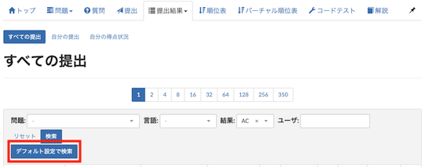

## 入出力例を使ってテストを実行

- [AtCoder Easy Test v2](https://greasyfork.org/ja/scripts/433152-atcoder-easy-test-v2) - 「問題」ページで、入出力例を使って素早くテスト(自作を含む)を実行できる。また、[Codeforces](https://codeforces.com/)や[yukicoder](https://yukicoder.me/)にも対応している。スクリプトの基本的な使用方法や技術解説に関しては、[作者による解説記事](https://qiita.com/magurofly/items/4b60dc02283e70230f71)を参照されたい。

    

      
    

## 提出コードを検索

- [AtCoderSubmitSearchSettings](https://greasyfork.org/ja/scripts/390424-atcodersubmitsearchsettings) - 「すべての提出」ページで、古いバージョンで提出されたコードを検索できる。検索のデフォルト設定も指定できる。

    

      
    

## 解説を見る

- [AtCoder Editorial New Tab](https://greasyfork.org/ja/scripts/424207-atcoder-editorial-new-tab) - 「問題」ページにある「解説」ボタンを押すと、該当する解説を新しいタブで開くことができる。

## 問題のカテゴリーを投票

- [AtCoderTags_Helper](https://greasyfork.org/ja/scripts/393121-atcodertags-helper) - 「問題」ページから[AtCoderTags](https://atcoder-tags.herokuapp.com/)に投票できる。

    

      
    

