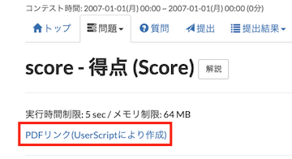
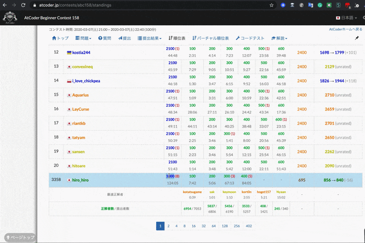

## 問題を見る

- [AtCoderLinkCompletionForJOI](https://greasyfork.org/ja/scripts/382313-atcoderlinkcompletionforjoi) - JOIの問題ページにPDFへのリンクを追加する。

    

      
    

## 順位表から提出コードを見る

- [AtCoder Jump to Submissions from Standings](https://greasyfork.org/ja/scripts/397528-atcoder-jump-to-submissions-from-standings) - 「順位表」ページの得点をダブルクリックすると、該当するコンテスタントの実装を見ることができる。[Codeforces](https://codeforces.com/)の仕様を参考にしている。

    

      
    

