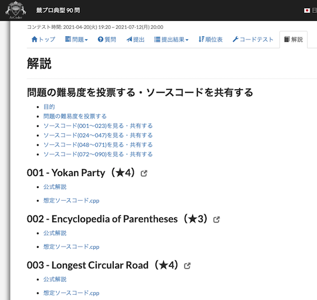
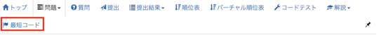

## 全ての問題を一度に開く

- [atcoder_all_open](https://greasyfork.org/ja/scripts/387471-atcoder-all-open) - 「全ての問題をワンクリックで開く」タブを追加する。

    

      
    

## 競プロ典型90問の解説を読む

- [add-typical90-link](https://greasyfork.org/ja/scripts/427326-add-typical90-link) - 「[競プロ典型90問](https://atcoder.jp/contests/typical90)」に、「解説リンク」タブを追加する。このタブから[GitHub](https://github.com/E869120/kyopro_educational_90/tree/main/editorial)で公開されている解説に移動できる。

    

      
    

- [AtCoder Editorial for Typical90](https://greasyfork.org/ja/scripts/427584-atcoder-editorial-for-typical90) - 「[競プロ典型 90 問](https://atcoder.jp/contests/typical90)」に解説タブを追加し、[GitHub](https://github.com/E869120/kyopro_educational_90)で公開されている問題の解説・想定ソースコードなどのリンクを表示する。

    

      
    

## 最短の提出コードを探す

- [Add Shortest Tab](https://greasyfork.org/ja/scripts/391692-add-shortest-tab) - 開いている問題について、コード長に並べた提出ページのタブを追加する。

    !!! warning "注意"
        コンテスト中の利用は非推奨。

    

      
    

