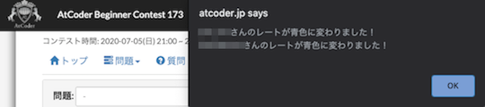

## 自分の提出コードの正誤判定

- [atcoder-bell](https://greasyfork.org/ja/scripts/377923-atcoder-bell) - ジャッジシステムでの正誤判定が終了すると、ベルが鳴る。
- [AtCoderResultNotifier](https://greasyfork.org/ja/scripts/371225-atcoderresultnotifier) - 提出結果を通知する。

    

      
    

## お気に入りユーザの成績・提出コードの正誤判定

- [AtcoderColorNEWS](https://greasyfork.org/ja/scripts/387896-atcodercolornews) - お気に入りに登録した人の色の変化を通知する。

    

      
    

- [AtCoder Standings Watcher](https://greasyfork.org/ja/scripts/428862-atcoder-standings-watcher) - コンテスト中に、お気に入りに登録したユーザの正誤情報を通知する。
