Webページの背景色の変更や文字・提出コード・問題の正誤状況を見やすくします。

また、コンテストの成績に応じて、各ページの情報を色付けすることもできます。

## 背景の色を変更する

### 任意

- [AtCoderBackGroundColorizer](https://greasyfork.org/ja/scripts/377844-atcoderbackgroundcolorizer) - 各ページの背景を任意の色に変更する。

    

      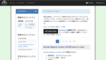
    

### ダークテーマ系

- [AtCoderDarkTheme](https://greasyfork.org/ja/scripts/388076-atcoderdarktheme) - ダークテーマに変更する。類似したスクリプトに、[AtCoder-Style-Changer](https://greasyfork.org/ja/scripts/429929-atcoder-style-changer)がある。

    

      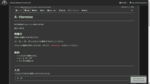
    

- [AtCoder Theme: Solarized Dark](https://greasyfork.org/ja/scripts/423564-atcoder-theme-solarized-dark) - 背景のテーマを「Solarized Dark」に変更する。

    

      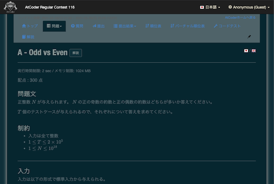
    

## 文字を強調する

### 全体

- [AtCoder Better Font](https://greasyfork.org/ja/scripts/464188-atcoder-better-font) - サイト全体の文章を識別しやすいフォントに変更する。

    

      
    

### コンテストの日時

- [HighlightAtCoderContestNot2100](https://greasyfork.org/en/scripts/426911-highlightatcodercontestnot2100) - レーティングの変動があるコンテストのうち、開始時間が21時以外の場合に赤字で強調する。

    

      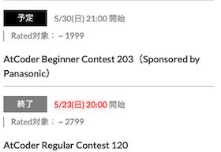
    

### 問題の実行時間制限・メモリ制限

- [Time Limit Emphasizer](https://greasyfork.org/ja/scripts/406381-time-limit-emphasizer) - 問題の実行時間制限が2secでない場合に赤大文字で強調する。

    

      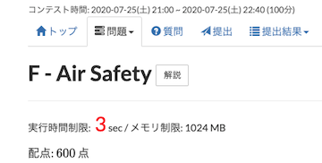
    

- [timemory-limit-emphasizer](https://greasyfork.org/ja/scripts/480675-timemory-limit-emphasizer) - 問題の実行時間制限が2secでない場合やメモリ制限が1024MBでない場合に赤大文字で強調する。

    

      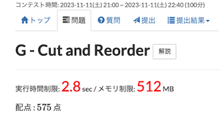
    

### 問題の制約条件

- [AtCoder Limit Colorizer](https://github.com/sevenc-nanashi/atcoder-limit-colorizer) - 問題の制約条件の大小に応じて、色分けする。

    

      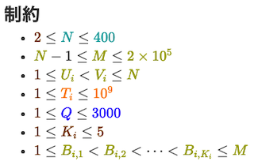
    

### 色を表す漢字

- [AtCoderCharacterColorizer](https://greasyfork.org/ja/scripts/429815-atcodercharactercolorizer) - 「問題」ページで、色を表す漢字(赤・青など)をハイライトする。

    

      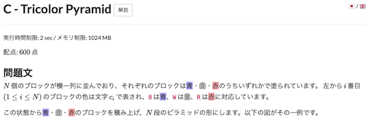
    

### よく似た文字を識別

- [Snuke? Smeke?](https://greasyfork.org/ja/scripts/377622-snuke-smeke) - 問題文の「すぬけ」と「すめけ」をハイライトする。

    

      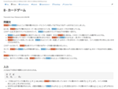
    

## AtCoderのエディタを変更

- [Ace to Monaco for AtCoder](https://greasyfork.org/ja/scripts/482276-ace-to-monaco-for-atcoder) - 「コードテスト」ページのエディタを[Monaco Editor](https://github.com/microsoft/monaco-editor)に変更する。

    

      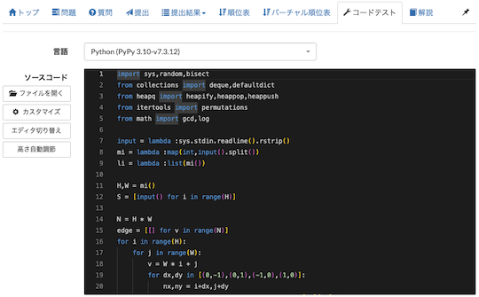
    

## 問題の提出・正誤状況を確認

### オリジナル

- [atcoder-tasks-page-colorizer](https://greasyfork.org/ja/scripts/380404-atcoder-tasks-page-colorizer) - [AtCoder](https://atcoder.jp/)の「問題」ページで、提出した問題に色付けする。

    

      
    

- [atcoder-tasks-page-colorize-during-contests](https://greasyfork.org/ja/scripts/426049-atcoder-tasks-page-colorize-during-contests) - 開催中のコンテストの「問題」に対して、提出した問題に色付けする。前述の[atcoder-tasks-page-colorizer](https://greasyfork.org/ja/scripts/380404-atcoder-tasks-page-colorizer)が対応していない「開催中のコンテスト」を対象としている。

    

      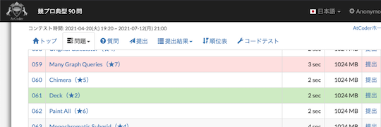
    

### 正解・不正解以外の状態を識別しやすく

- [AtCoder Error Colorizer](https://greasyfork.org/ja/scripts/478281-atcoder-error-colorizer) - 「提出結果」ページで、正解(AC)・不正解(WA)以外を表す状態の背景色を変更できる。スクリプトを直接書き換えることで、任意の色を指定することも可能。

    

      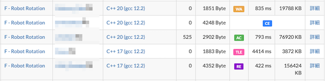
    

## コンテストの成績に応じて色付け、アイコンの追加・非表示

### 複数のページ

- [ac-rating-icon](https://greasyfork.org/ja/scripts/444140-ac-rating-icon) - 「順位表」と「プロフィール」ページに、レーティングに対応したアイコンを追加する。

    

      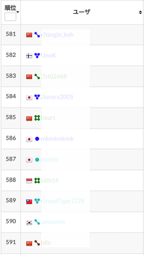
    

- [ac-hide-official-rating-icon](https://greasyfork.org/ja/scripts/499759-ac-hide-official-rating-icon) - 公式のレーティングアイコンを非表示にできる。

    

      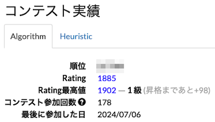
    

### コンテスト成績表

- [AtCoderPerformanceColorizer](https://greasyfork.org/ja/scripts/371693-atcoderperformancecolorizer) - ユーザの「コンテスト成績表」のパフォーマンス値、レーティングに色付けする。

    

      
    

- [AtCoderColouringDifference](https://greasyfork.org/ja/scripts/371703-atcodercolouringdifference) - ユーザの「コンテスト成績表」ページで"差分"の部分を色づけする。

    !!! warning "注意"
        スクリプトの実行対象URLがベータ版のため、修正が必要。

    

      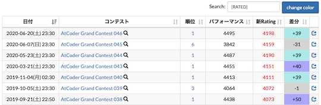
    

- [AtCoder_Kaomoji](https://greasyfork.org/ja/scripts/449980-atcoder-kaomoji) - ユーザの「コンテスト成績表」ページの"差分"に、レーティングの増減に応じた顔文字を追加する。

    

      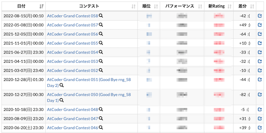
    

### 提出結果

- [AtCoder Submission User Colorizer](https://greasyfork.org/ja/scripts/397710-atcoder-submission-user-colorizer) - [AtCoder](https://atcoder.jp/)の「提出結果」ページのユーザ名を色付けする。

    

      
    

### 順位表

- [perf on standings](https://greasyfork.org/ja/scripts/422106-perf-on-standings) - 「順位表」ページで、Rated対象者の順位をパフォーマンス値に対応した色で塗る。

    

      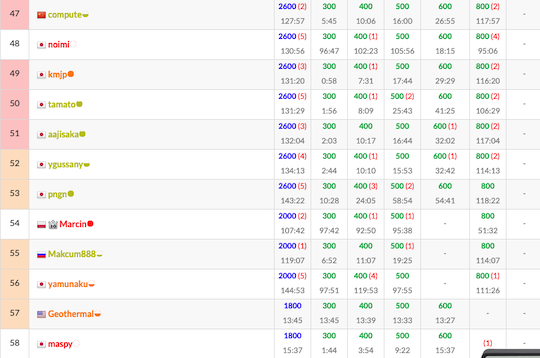
    

### 外部サービス

#### AtCoder Problems

- [Virtual Contest Result Highlighter](https://greasyfork.org/ja/scripts/500190-virtual-contest-result-highlighter) - AtCoder Problemsにおけるバーチャルコンテストの問題一覧と順位表に対して、提出結果に応じた色付けをする。

    

      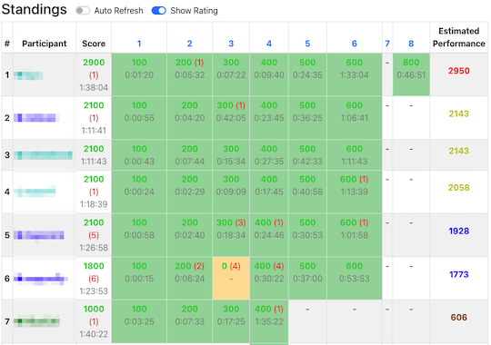
    

#### Misskey

- [Misskey AtCoder Color Buttons](https://greasyfork.org/ja/scripts/470709-misskey-atcoder-color-buttons) -  Misskeyの投稿フォームに、文字の色を変更できるボタンを追加する。配色は、AtCoderの各レーティング帯に対応。

    

      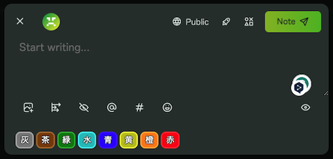
    

#### MojaCoder

- [MojaCoder Submission User Colorizer (by AtCoder Rating)](https://greasyfork.org/ja/scripts/475500-mojacoder-submission-user-colorizer-by-atcoder-rating) - [MojaCoder](https://mojacoder.app/)のユーザ名を対象として、AtCoderのレーティングに対応した色で表示する。

    

      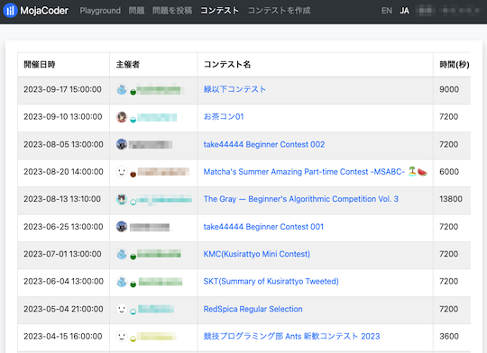
    

#### ICPC

- [ICPC Standing Colorizer](https://github.com/riantkb/icpc_standing_colorizer) - [ICPC 国内予選](https://icpcsec.firebaseapp.com/standings/)に、ユーザ名とAtCoderのレーティングに対応した色を表示する。

    

      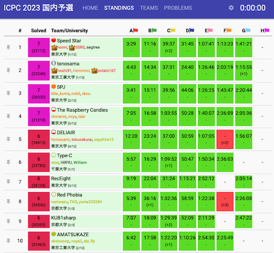
    

