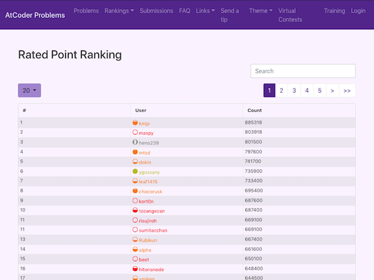

Webページの背景色の変更や文字・提出コード・問題の正誤状況を見やすくします。

また、コンテストの成績に応じて、各ページの情報を色付けすることもできます。

## 背景の色を変更する

### 任意

- [AtCoderBackGroundColorizer](https://greasyfork.org/ja/scripts/377844-atcoderbackgroundcolorizer) - 各ページの背景を任意の色に変更する。

    

      
    

### ダークテーマ系

- [AtCoderDarkTheme](https://greasyfork.org/ja/scripts/388076-atcoderdarktheme) - ダークテーマに変更する。類似したスクリプトに、[AtCoder-Style-Changer](https://greasyfork.org/ja/scripts/429929-atcoder-style-changer)がある。

    

      
    

- [AtCoder Theme: Solarized Dark](https://greasyfork.org/ja/scripts/423564-atcoder-theme-solarized-dark) - 背景のテーマを「Solarized Dark」に変更する。

    

      
    

## 文字を強調する

### コンテストの日時

- [HighlightAtCoderContestNot2100](https://greasyfork.org/en/scripts/426911-highlightatcodercontestnot2100) - レーティングの変動があるコンテストのうち、開始時間が21時以外の場合に赤字で強調する。

    

      
    

### 問題の実行時間制限

- [Time Limit Emphasizer](https://greasyfork.org/ja/scripts/406381-time-limit-emphasizer) - 問題の実行時間制限が2secでない場合に赤大文字で強調する。

    

      
    

### 色を表す漢字

- [AtCoderCharacterColorizer](https://greasyfork.org/ja/scripts/429815-atcodercharactercolorizer) - 「問題」ページで、色を表す漢字(赤・青など)をハイライトする。

    

      
    

### 問題名(難易度)

- [AtCoder Difficulty Colorizer for Typical 90](https://greasyfork.org/ja/scripts/425463-atcoder-difficulty-colorizer-for-typical-90) - 「[競プロ典型90問](https://atcoder.jp/contests/typical90)」の問題名を、難易度に応じた色に変更する。

    

      
    

### よく似た文字を識別

- [Snuke? Smeke?](https://greasyfork.org/ja/scripts/377622-snuke-smeke) - 問題文の「すぬけ」と「すめけ」をハイライトする。

    

      
    

## 提出コードを見やすくする

### 複数のページ

- [AtCoder Comfortable Editor](https://greasyfork.org/ja/scripts/445582-atcoder-comfortable-editor) - 提出に関するページで、コードの表示に関する設定(カラーテーマ、タブ、行数など)をカスタマイズできる。

    !!! warning "注意"
        後述の[AtCoder Beautiful Code View](https://greasyfork.org/ja/scripts/444280-atcoder-beautiful-code-view)との併用はできない。

    

        
    

### 提出結果

- [AtCoder Beautiful Code View](https://greasyfork.org/ja/scripts/444280-atcoder-beautiful-code-view) - [Monaco Editor](https://github.com/microsoft/monaco-editor)を利用して、「提出結果」ページのコードを見やすく表示する。

    

      
    

- [AtCoder Better Highlighter](https://greasyfork.org/ja/scripts/412865-atcoder-better-highlighter) - 「提出結果」ページのコードをハイライトして見やすくする。デフォルトで10種類以上の言語をサポートしており、対応言語の拡張や配色の変更も可能。

    

      
    

## 問題の提出・正誤状況を確認

### オリジナル

- [atcoder-tasks-page-colorizer](https://greasyfork.org/ja/scripts/380404-atcoder-tasks-page-colorizer) - [AtCoder](https://atcoder.jp/)の「問題」ページで、提出した問題に色付けする。

    

      
    

### 色付けの適用範囲を拡張

- [atcoder-tasks-dropdown-menu-colorizer](https://greasyfork.org/ja/scripts/444170-atcoder-tasks-dropdown-menu-colorizer) - 「問題」ページのドロップダウンメニューに、[atcoder-tasks-page-colorizer](https://greasyfork.org/ja/scripts/380404-atcoder-tasks-page-colorizer)と同じ色付けを行う。

    !!! warning "注意"
        Chrome拡張機能の[Comfortable Atcoder](https://chrome.google.com/webstore/detail/comfortable-atcoder/ipmmkccdccnephfilbjdnmnfcbopbpaj?hl=ja&gl=UA)をインストールする必要がある。

  

    
  

- [atcoder-tasks-page-colorize-during-contests](https://greasyfork.org/ja/scripts/426049-atcoder-tasks-page-colorize-during-contests) - 開催中のコンテストの「問題」に対して、提出した問題に色付けする。前述の[atcoder-tasks-page-colorizer](https://greasyfork.org/ja/scripts/380404-atcoder-tasks-page-colorizer)が対応していない「開催中のコンテスト」を対象としている。

    

      
    

## コンテストの成績に応じて色付け

### 複数のページ

- [ac-rating-icon](https://greasyfork.org/ja/scripts/444140-ac-rating-icon) - 「順位表」と「プロフィール」ページに、レーティングに対応したアイコンを追加する。

    

      
    

### コンテスト成績表

- [AtCoderPerformanceColorizer](https://greasyfork.org/ja/scripts/371693-atcoderperformancecolorizer) - ユーザの「コンテスト成績表」のパフォーマンス値、レーティングに色付けする。

    

      
    

- [AtCoderColouringDifference](https://greasyfork.org/ja/scripts/371703-atcodercolouringdifference) - ユーザの「コンテスト成績表」ページで"差分"の部分を色づけする。

    !!! warning "注意"
        スクリプトの実行対象URLがベータ版のため、修正が必要。

    

      
    

### 提出結果

- [AtCoder Submission User Colorizer](https://greasyfork.org/ja/scripts/397710-atcoder-submission-user-colorizer) - [AtCoder](https://atcoder.jp/)の「提出結果」ページのユーザ名を色付けする。

    

      
    

### 順位表

#### アルゴリズム部門

- [perf on standings](https://greasyfork.org/en/scripts/422106-perf-on-standings) - 「順位表」ページで、Rated対象者の順位をパフォーマンス値に対応した色で塗る。

    

      
    

#### ヒューリスティック部門

- [AtCoder Heuristic Rating coloring](https://greasyfork.org/ja/scripts/427070-atcoder-heuristic-rating-coloring) - [AtCoder Heuristic Contest](https://atcoder.jp/contests/archive?ratedType=0&category=1200&keyword=AtCoder+Heuristic+Contest)の「順位表」ページで、ユーザ名を同コンテストのレーティングに応じて色付けする。

    

      
    

### 外部サービス

#### AtCoder Problems

- [AC Problems Ranking Colorizer](https://greasyfork.org/ja/scripts/429485-ac-problems-ranking-colorizer) - [AtCoder Problems](https://kenkoooo.com/atcoder/) のランキングページで、ユーザ名をAtCoderのレーティングに対応した色に変更する。

    

      
    

#### Twitter

- [Colorful TL](https://greasyfork.org/ja/scripts/441551-colorful-tl) - TwitterのTimelineにおいて、ユーザ名をAtCoderのレーティングに対応した色に変更する。

#### ICPC

- [icpc2021_teamlist](https://github.com/riantkb/icpc2021_teamlist) - [ICPC 2021チーム一覧](http://www.yamagula.ic.i.u-tokyo.ac.jp/icpc2021/standings.html)に、ユーザ名とAtCoderのレーティングに対応した色を表示する。[Webサイト版](https://riantkb.github.io/icpc2021_teamlist/)もある。

    

      
    

- [ICPC-Yokohama-2020-Username-and-AtCoder-Color](https://github.com/TumoiYorozu/ICPC-Yokohama-2020-Username-and-AtCoder-Color) - ICPC 2020 Yokohama Liveの[順位表](https://icpcsec.firebaseapp.com/standings/)に、ユーザ名とAtCoderのレーティングに対応した色を表示する。

    

      
    

