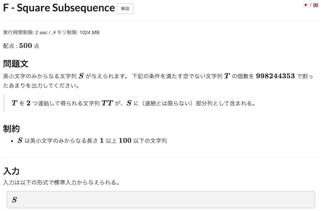
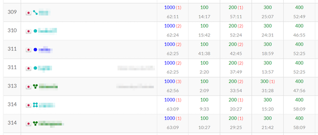

Webページの背景色の変更や文字・提出コード・問題の正誤状況を見やすくします。

また、コンテストの成績に応じて、各ページの情報を色付けすることもできます。

## 背景の色を変更する

### 任意

- [AtCoderBackGroundColorizer](https://greasyfork.org/ja/scripts/377844-atcoderbackgroundcolorizer) - 各ページの背景を任意の色に変更する。

    

      
    

### ダークテーマ系

- [AtCoderDarkTheme](https://greasyfork.org/ja/scripts/388076-atcoderdarktheme) - ダークテーマに変更する。類似したスクリプトに、[AtCoder-Style-Changer](https://greasyfork.org/ja/scripts/429929-atcoder-style-changer)がある。

    

      
    

- [AtCoder Theme: Solarized Dark](https://greasyfork.org/ja/scripts/423564-atcoder-theme-solarized-dark) - 背景のテーマを「Solarized Dark」に変更する。

    

      
    

## 文字を強調する

### 全体

- [AtCoder Better Font](https://greasyfork.org/ja/scripts/464188-atcoder-better-font) - サイト全体の文章を識別しやすいフォントに変更する。

    

      
    

### コンテストの日時

- [HighlightAtCoderContestNot2100](https://greasyfork.org/en/scripts/426911-highlightatcodercontestnot2100) - レーティングの変動があるコンテストのうち、開始時間が21時以外の場合に赤字で強調する。

    

      
    

### 問題の実行時間制限

- [Time Limit Emphasizer](https://greasyfork.org/ja/scripts/406381-time-limit-emphasizer) - 問題の実行時間制限が2secでない場合に赤大文字で強調する。

    

      
    

### 色を表す漢字

- [AtCoderCharacterColorizer](https://greasyfork.org/ja/scripts/429815-atcodercharactercolorizer) - 「問題」ページで、色を表す漢字(赤・青など)をハイライトする。

    

      
    

### よく似た文字を識別

- [Snuke? Smeke?](https://greasyfork.org/ja/scripts/377622-snuke-smeke) - 問題文の「すぬけ」と「すめけ」をハイライトする。

    

      
    

## 問題の提出・正誤状況を確認

### オリジナル

- [atcoder-tasks-page-colorizer](https://greasyfork.org/ja/scripts/380404-atcoder-tasks-page-colorizer) - [AtCoder](https://atcoder.jp/)の「問題」ページで、提出した問題に色付けする。

    

      
    

### 色付けの適用範囲を拡張

- [atcoder-tasks-dropdown-menu-colorizer](https://greasyfork.org/ja/scripts/444170-atcoder-tasks-dropdown-menu-colorizer) - 「問題」ページのドロップダウンメニューに、[atcoder-tasks-page-colorizer](https://greasyfork.org/ja/scripts/380404-atcoder-tasks-page-colorizer)と同じ色付けを行う。

    !!! warning "注意"
        Chrome拡張機能の[Comfortable Atcoder](https://chrome.google.com/webstore/detail/comfortable-atcoder/ipmmkccdccnephfilbjdnmnfcbopbpaj?hl=ja&gl=UA)をインストールする必要がある。

  

    
  

- [atcoder-tasks-page-colorize-during-contests](https://greasyfork.org/ja/scripts/426049-atcoder-tasks-page-colorize-during-contests) - 開催中のコンテストの「問題」に対して、提出した問題に色付けする。前述の[atcoder-tasks-page-colorizer](https://greasyfork.org/ja/scripts/380404-atcoder-tasks-page-colorizer)が対応していない「開催中のコンテスト」を対象としている。

    

      
    

## コンテストの成績に応じて色付け・アイコンの追加

### 複数のページ

- [ac-rating-icon](https://greasyfork.org/ja/scripts/444140-ac-rating-icon) - 「順位表」と「プロフィール」ページに、レーティングに対応したアイコンを追加する。

    

      
    

### コンテスト成績表

- [AtCoderPerformanceColorizer](https://greasyfork.org/ja/scripts/371693-atcoderperformancecolorizer) - ユーザの「コンテスト成績表」のパフォーマンス値、レーティングに色付けする。

    

      
    

- [AtCoderColouringDifference](https://greasyfork.org/ja/scripts/371703-atcodercolouringdifference) - ユーザの「コンテスト成績表」ページで"差分"の部分を色づけする。

    !!! warning "注意"
        スクリプトの実行対象URLがベータ版のため、修正が必要。

    

      
    

- [AtCoder_Kaomoji](https://greasyfork.org/ja/scripts/449980-atcoder-kaomoji) - ユーザの「コンテスト成績表」ページの"差分"に、レーティングの増減に応じた顔文字を追加する。

    

      
    

### 提出結果

- [AtCoder Submission User Colorizer](https://greasyfork.org/ja/scripts/397710-atcoder-submission-user-colorizer) - [AtCoder](https://atcoder.jp/)の「提出結果」ページのユーザ名を色付けする。

    

      
    

### 順位表

- [perf on standings](https://greasyfork.org/ja/scripts/422106-perf-on-standings) - 「順位表」ページで、Rated対象者の順位をパフォーマンス値に対応した色で塗る。

    

      
    

### 外部サービス

#### Misskey.io

- [Misskey AtCoder Color Buttons](https://greasyfork.org/ja/scripts/470709-misskey-atcoder-color-buttons) -  Misskey.ioの投稿フォームに、文字の色を変更できるボタンを追加する。配色は、AtCoderの各レーティング帯に対応。

    

      
    

#### ICPC

- [ICPC Standing Colorizer](https://github.com/riantkb/icpc_standing_colorizer) - [ICPC 2023 国内予選](https://icpcsec.firebaseapp.com/standings/)に、ユーザ名とAtCoderのレーティングに対応した色を表示する。

    

      
    

