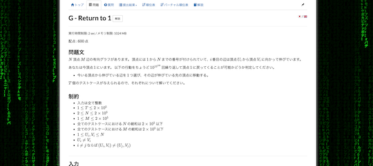
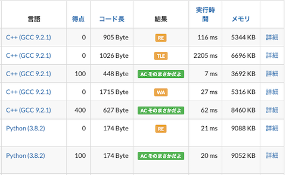
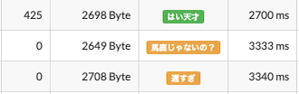
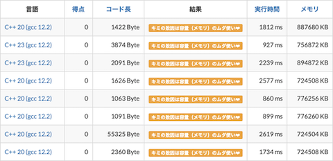
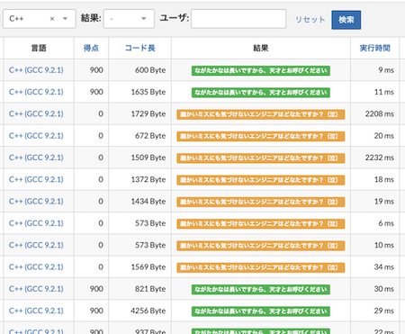
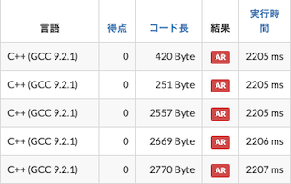
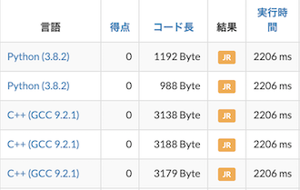
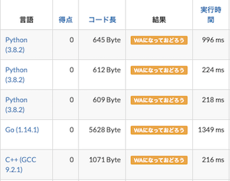

主にAtCoderにおける流行語などをヒントに作成されたスクリプトを掲載しています。

## 背景を変更する

- [AtCoder Super Hacker](https://twitter.com/nebocco27/status/1671870920858943491) - 凄腕ハッカー（の気分）になれるアニメーションを追加する。

    

      
    

## 問題文の一部を書き換え

- [文字化けcoder](https://greasyfork.org/ja/scripts/485969-%E6%96%87%E5%AD%97%E5%8C%96%E3%81%91coder) - 問題文の一部に文字化けが発生するようになる。

- [AtCoder♡♡](https://greasyfork.org/ja/scripts/512956-atcoder) - 問題文の一部に対して、「♡♡」を含む内容に置き換える。

    !!! info "参考"

        日本語の問題文のみ対応。

## 問題の正誤判定の表記を書き換え

- [AC そのまさかだよ](https://greasyfork.org/ja/scripts/439526-ac-%E3%81%9D%E3%81%AE%E3%81%BE%E3%81%95%E3%81%8B%E3%81%A0%E3%82%88) - 「提出結果」ページの正誤判定のうち、「AC(Acceptedの略記)」を「AC そのまさかだよ」に置き換える([元ネタの出典](https://twitter.com/microkents/status/1208346268872790016?ref_src=twsrc%5Etfw%7Ctwcamp%5Etweetembed%7Ctwterm%5E1208346268872790016%7Ctwgr%5E%7Ctwcon%5Es1_&ref_url=https%3A%2F%2Fkaage.hatenablog.com%2Fentry%2F2020%2F05%2F04%2F142125))。

    

      
    

- [AC Custom](https://greasyfork.org/ja/scripts/478609-ac-custom) - 「提出結果」ページの「自分の提出」で、AC (Accepted)・WA (Wrong Answer)・TLE (Time Limit Exceeded)の表記を変更できる。

    

      
    

- [AtCoderMLEtoHisoka](https://greasyfork.org/ja/scripts/478297-atcodermletohisoka) - 提出コードが「MLE (Memory Limit Exceeded)」となった場合に、「キミの敗因は容量（メモリ）のムダ使い❤︎」と表示する。

    

      
    

- [AtCoder-ngtkanaResult](https://greasyfork.org/ja/scripts/416384-atcoder-ngtkanaresult) - 「提出結果」ページの「結果」を[ngtkana](https://atcoder.jp/users/ngtkana)さんの言葉に置き換える。

    !!! warning "注意"
        不正解の詳細はマウスオーバーで表示される。

    

      
    

- [AtCoder TLE Police](https://greasyfork.org/ja/scripts/381104-atcoder-tle-police) - 提出したコードが'TLE'(Time Limit Exceeded)となった場合に'AR'(ArRested)に置き換える。

    

      
    

- [AtCoder TLE to JR](https://greasyfork.org/ja/scripts/455833-atcoder-tle-to-jr) - 提出したコードが「TLE」となった場合に「JR」に置き換える。

    

      
    

- [AtCoder WAになっておどろう](https://greasyfork.org/ja/scripts/455937-atcoder-wa%E3%81%AB%E3%81%AA%E3%81%A3%E3%81%A6%E3%81%8A%E3%81%A9%E3%82%8D%E3%81%86) - 「提出結果」ページの正誤判定のうち、「WA(Wrong Answerの略記)」を「WAになっておどろう」に置き換える。

    

      
    

