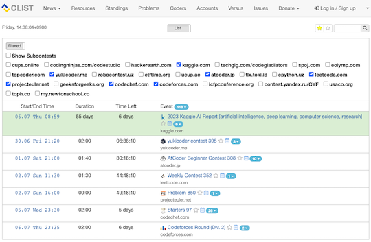
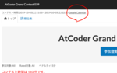
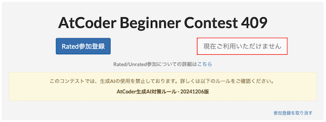
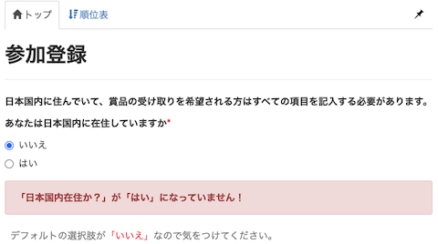
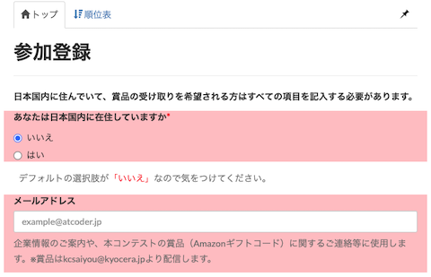
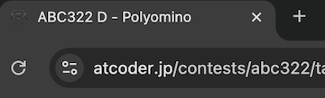
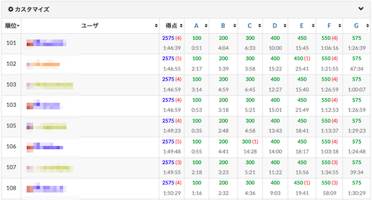
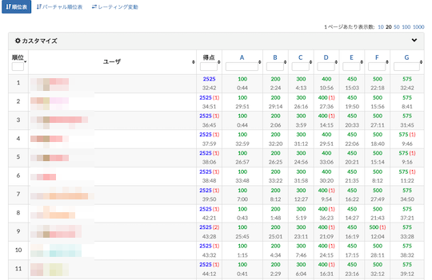
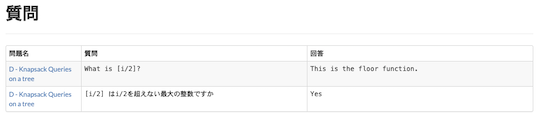
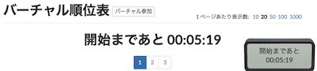

## 開催日時を確認しやすくする

- [CLIST Contest Filter](https://greasyfork.org/ja/scripts/439442-clist-contest-filter) - [CLIST](https://clist.by/)のHomeページで、指定したコンテストサイトのみ表示する。

    

      
    

## 開催日時をGoogle Calenderに追加

- [AtCoder-Google-Calender](https://greasyfork.org/ja/scripts/390758-atcoder-google-calender) - 予定されたコンテストの日時をGoogle Calenderに追加するリンクを設置する。

    

      
    

## 直近のAtCoder Beginner Contest (ABC)を閲覧

- [AtCoder-RedirectRecentABC](https://greasyfork.org/ja/scripts/508772-atcoder-redirectrecentabc) - 直近(開催中を含む)のAtCoder Beginner Contest (ABC)を閲覧できるようにする。

## Ratedで参加登録

- [AtCoderUnratedButtonDisabler](https://greasyfork.org/ja/scripts/537742-atcoderunratedbuttondisabler) - 各コンテストの「トップ」ページで、「Unrated参加登録」のボタンを押せないようにする。

    

      
    

## 企業コンテストの参加登録補助・記入ミスを防ぐ

- [ac-register-checker](https://greasyfork.org/ja/scripts/467401-ac-register-checker) - 企業コンテストの参加登録フォームで、「あなたは日本国内に在住していますか」が「いいえ」の場合に警告を表示する。

    

      
    

- [AtCoder未記入チェッカー](https://greasyfork.org/ja/scripts/467421-atcoder%E6%9C%AA%E8%A8%98%E5%85%A5%E3%83%81%E3%82%A7%E3%83%83%E3%82%AB%E3%83%BC) - 参加登録フォームで、未記入の項目を赤くハイライトする。

    

      
    

- [AtCoder Registration Autofill](https://greasyfork.org/ja/scripts/467393-atcoder-registration-autofill) - 参加登録フォームに氏名・所属・連絡先などを入力すると、2回目以降は自動入力される。また、インストールした時点で、「あなたは日本国内に在住していますか」が「はい」に変更される。

## Webサイトを見やすく表示

### レイアウトの微調整

- [Style Fixes for AtCoder](https://greasyfork.org/ja/scripts/489300-style-fixes-for-atcoder) - [AtCoder](https://atcoder.jp/)の一部のページを、PCで閲覧したときに発生する表示上の不具合を改善・修正する。

- [AtCoder Title Changer](https://greasyfork.org/ja/scripts/544199-atcoder-title-changer/code) - 「問題」ページのブラウザタブに、コンテストの略称と問題名を「略称 - 問題名」の形式で表示する。

    

      
    

- [AtCoder Navbar Restrictor](https://greasyfork.org/ja/scripts/501929-atcoder-navbar-restrictor) - コンテストページで、名称が長い場合に改行せず、末尾に三点リーダー（...）をつけて省略表示する。

    

      
    

- [AtCoder Scroll Page Top Hider](https://greasyfork.org/ja/scripts/535017-atcoder-scroll-page-top-hider) - 「問題」ページにある「↑ページトップ」を非表示にする。

- [AtCoder Customize Panel Fix](https://greasyfork.org/ja/scripts/511359-atcoder-customize-panel-fix) - 「順位表」ページをリロードしたときに、カスタマイズパネルを開いたままにする。

- [AtCoder Standings AC Time Formatter](https://greasyfork.org/ja/scripts/523392-atcoder-standings-ac-time-formatter) - 「順位表」ページで、問題に正解するまでの所要時間を見やすくする。アルゴリズム部門だけでなく、ヒューリスティック部門にも対応している。

    

      
    

- [AtCoder の順位表を広げるやつ](https://greasyfork.org/ja/scripts/532077-atcoder-%E3%81%AE%E9%A0%86%E4%BD%8D%E8%A1%A8%E3%82%92%E5%BA%83%E3%81%92%E3%82%8B%E3%82%84%E3%81%A4) - 「順位表」ページで、表の幅を100%に広げるとともに、高さをやや狭くする。

    

      
    

### 操作性の改善

- [Atcoder Easy Accordion](https://greasyfork.org/ja/scripts/532617-atcoder-easy-accordion) - ドロップダウンリスト（プロフィールページや「提出結果」ページなど）にマウスのカーソルを合わせると、開くことができる。

### シングルディスプレイの表示を最適化

- [AtCoder Style Optimizer for Single Display](https://greasyfork.org/ja/scripts/463585-atcoder-style-optimizer-for-single-display) - [AtCoder](https://atcoder.jp/)の各ページの横幅を最大まで広げて表示する。

## Webサイトで表示されるエラーを解消

- [AtCoder-429 Error-Auto Reload](https://greasyfork.org/ja/scripts/514834-atcoder-429-error-auto-reload) - Webサイトで `429 Too Many Requests` が表示されたときに自動でリロードする。

## 時間を気にせず問題に集中する

- [AtCoderタイマー削除](https://greasyfork.org/ja/scripts/393176-calmatcoder) - コンテストが開催されている間のみ、タイマーを非表示にする。
- [auto click AtCoder clock once on page load](https://greasyfork.org/ja/scripts/499009-auto-click-atcoder-clock-once-on-page-load) - タイマーの表示・非表示をクリックで切り替えられる。

## 質問の重要情報のみを表示

- [ac-clar-shaper](https://greasyfork.org/ja/scripts/388211-ac-clar-shaper) - Clarから非本質な情報（アカウント名・全体公開の有無・投稿/更新日時）を消し、問題順にソートする。

    

      
    

## バーチャル参加でタイマーを表示

- [AtCoderVirtualTimer](https://greasyfork.org/ja/scripts/476928-atcodervirtualtimer) - [AtCoder](https://atcoder.jp/)のバーチャル参加（コンテストに仮想的に参加できる機能）で、開始までの時間と残り時間を表示する。

    

      
    

## 部活の共有アカウントで誤操作を防ぐ

- [Save_Paken_AtCoder_Account](https://greasyfork.org/ja/scripts/401642-save-paken-atcoder-account) - パ研の共有アカウントで誤ってコンテストに参加するのを防ぐ。
