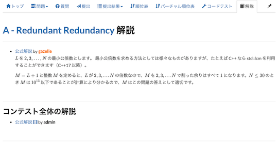
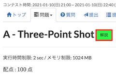
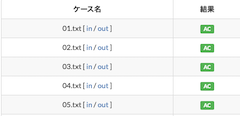

## 解説を読む

### まとめて表示

- [View All Editorials](https://greasyfork.org/ja/scripts/416554-view-all-editorials) - 「解説」ページに、問題の解説を表示する。

    

      
    

### 新しいタブで開く

- [AtCoder Editorial New Tab](https://greasyfork.org/ja/scripts/424207-atcoder-editorial-new-tab) - 「問題」ページにある「解説」ボタンを押すと、該当する解説を新しいタブで開くことができる。

### 該当ページに移動

- [AtCoder Traffic Light](https://greasyfork.org/ja/scripts/420136-atcoder-traffic-light) - 「問題」ページから、直接解説ページに移動できる。また、解説ボタンの色が読み込み状況に応じて変化する。

    

      
    

### 競プロ典型90問の復習

- [add-typical90-link](https://greasyfork.org/ja/scripts/427326-add-typical90-link) - 「[競プロ典型90問](https://atcoder.jp/contests/typical90)」に、「解説リンク」タブを追加する。このタブから[GitHub](https://github.com/E869120/kyopro_educational_90/tree/main/editorial)で公開されている解説に移動できる。

    

      
    

- [AtCoder Editorial for Typical90](https://greasyfork.org/ja/scripts/427584-atcoder-editorial-for-typical90) - 「[競プロ典型 90 問](https://atcoder.jp/contests/typical90)」に解説タブを追加し、[GitHub](https://github.com/E869120/kyopro_educational_90)で公開されている問題の解説・想定ソースコードなどのリンクを表示する。

    

      
    

### 解説を非表示に

- [AtCoder Hide Editorial](https://greasyfork.org/ja/scripts/425127-atcoder-hide-editorial) - 問題の「解説」に関するURLを取り除く。

    

      
    

## テストケースを見る

- [AtCoder TestCase Extension](https://greasyfork.org/ja/scripts/371832-atcoder-testcase-extension) - 公開されているテストケースのリンクを追加する。

    

      
    

