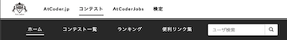
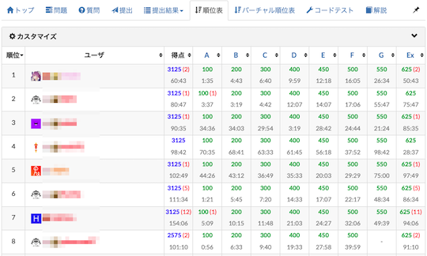
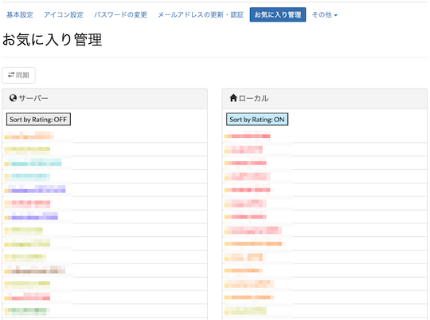

## ライバルを探す

### 属性が近いユーザを探す

- [AtCoder Profile2Ranking Link](https://greasyfork.org/en/scripts/426219-atcoder-profile2ranking-link) - 「プロフィール」ページで、国と地域・誕生年・所属のいずれかのリンクをクリックすると、「ランキング」ページで指定した属性と一致するユーザが表示される。

    

      
    

### ユーザ名を指定して検索

- [AtCoderUserSearchForm](https://greasyfork.org/ja/scripts/382092-atcoderusersearchform) - 「ホーム」ページにユーザ検索のフォームを追加する。日本語版ページのみ有効。

    

      
    

### ユーザを識別しやすくする

- [AC Iconner](https://greasyfork.org/ja/scripts/470954-ac-iconner) - ユーザ名の前に、ユーザページの「アイコン設定」で登録されている画像を表示する。

    

      
    

## お気に入りユーザを登録・確認

### お気に入りをより使いやすく

- [ac-favorite-manager](https://greasyfork.org/ja/scripts/387728-ac-favorite-manager) - ユーザ名のドロップダウンメニューに、お気に入りの管理画面のリンクを追加する。

    

      
    

- [AtCoder-Favorite-Person-Colors](https://greasyfork.org/ja/scripts/539986-atcoder-favorite-person-colors) - プロフィールの「お気に入り管理」で、各ユーザ名をレーティングに対応した色で塗る。また、レーティングの降順に並び替えられるボタンを追加する。

    

      
    

### コンテストの不参加者を非表示に

- [AtCoder Non-Participant Hider](https://greasyfork.org/ja/scripts/470676-atcoder-non-participant-hider) - 「順位表」ページで、コンテストの不参加者（お気に入りのみ）を非表示にできるフィルタを追加する。

    

      
    

- [AtCoder Standings Excluding Unrated User](https://greasyfork.org/ja/scripts/472242-atcoder-standings-excluding-unrated-user) - 「順位表」ページで、コンテストに参加登録していないお気に入りユーザを非表示にする。

    

      
    

### 成績を見る

- [AtCoder Fav Rating](https://greasyfork.org/ja/scripts/406745-atcoder-fav-rating) - 「アカウント」ページにお気に入りの順位・レーティング(現在・最高)・参加回数を一覧で表示するボタンを設置する。

    

      
    

### レーティング帯の変化を通知

- [AtcoderColorNEWS](https://greasyfork.org/ja/scripts/387896-atcodercolornews) - お気に入りに登録した人の色の変化を通知する。

    

      
    

## コンテスト後の情報収集・発信

### 順位表にTwitter IDを表示

- [AtCoder Contest Standings with Twitter ID](https://greasyfork.org/ja/scripts/446375-atcoder-contest-standings-with-twitter-id) - 「順位表」と「バーチャル順位表」ページに、Twitter IDを表示する。

  

    
  

### 成績をSNSで共有

- [AtCoderCustomResultSheetShare](https://greasyfork.org/ja/scripts/454451-atcodercustomresultsheetshare) - コンテストの成績をTwitterで共有するときに、ツイートする内容をカスタマイズできる。

- [Misskey share button for AtCoder](https://greasyfork.org/ja/scripts/470028-misskey-share-button-for-atcoder) - ユーザページの「コンテスト成績証」に、Misskeyで共有するためのボタンを追加する。

    

      
    

### 問題を解くと宣言

- [AtCoder Solve Declaration](https://greasyfork.org/ja/scripts/471128-atcoder-solve-declaration) - 「問題」ページに、「(問題を)ときます」とツイートするボタンを追加する。

    

      
    

### ツイートにハッシュタグを追加

- [AtCoder HashTag Setter](https://greasyfork.org/ja/scripts/422324-atcoder-hashtag-setter) - 「コンテスト」「問題」「提出」の各ページにあるTwitter Shareボタンを利用するときに、ツイートに関連したハッシュタグを追加する。

    

      
    

## 個人情報を保護する

### AtCoder IDを非表示に

- [AtCoder Anonymizer](https://greasyfork.org/ja/scripts/413425-atcoder-anonymizer) - 自分のIDを「Anonymous」で置き換える。

    !!! warning "注意"
        プロフィールページのURLやTwitter IDなどは変更されない。

    

      
    

