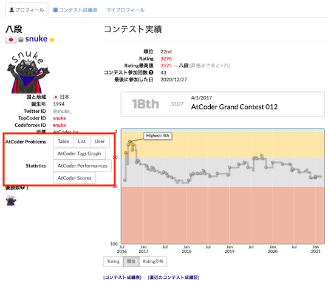
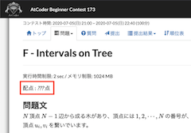

## 問題を探す

### 類題

- [ASPR](https://greasyfork.org/ja/scripts/431708-aspr) - AtCoder Beginners Contestの「問題」ページで、類似問題へのリンクを追加する。また、作者による[解説記事](https://qiita.com/dakkenkd425/items/366a81e5f34e1263627f)も公開されている。

    

      
    

### 外部サービスの利用

- [AtCoderUsers](https://greasyfork.org/ja/scripts/420811-atcoderusers) - 「プロフィール」ページに、[AtCoder Problems](https://kenkoooo.com/atcoder/)、[AtCoder Performances](https://atcoderapps.herokuapp.com/atcoderperformances/)、[AtCoder Scores](http://atcoder-scores.herokuapp.com/)、[AtCoder Tags](https://atcoder-tags.herokuapp.com/)のリンクを追加する。

    

      
    

## 問題を見る

### 一度に開く(特定のコンテスト)

- [atcoder_all_open](https://greasyfork.org/ja/scripts/387471-atcoder-all-open) - 「全ての問題をワンクリックで開く」タブを追加する。

    

      
    

### 一覧(特定のコンテスト)

- [atcoder-problem-navigator](https://greasyfork.org/ja/scripts/383360-atcoder-problem-navigator) - 「問題」ページで、各問題のリンクに飛べるナビゲーションバーを追加する。

    

      
    

### 難易度順に並び替え

- [atcoder-typical90-sort](https://greasyfork.org/ja/scripts/428698-atcoder-typical90-sort) - 「[競プロ典型90問](https://atcoder.jp/contests/typical90)」の問題を、難易度が低い順に並び替える。

    

      
    

### 関連コンテストサイト

- [AtCoderLinkCompletionForJOI](https://greasyfork.org/ja/scripts/382313-atcoderlinkcompletionforjoi) - JOIの問題ページにPDFへのリンクを追加する。

    

      
    

## 問題を解く

### テンプレートを利用

- [AtCoder Template](https://greasyfork.org/ja/scripts/438105-atcoder-template) - 「問題」ページや「提出」ページで、言語別のテンプレートの登録・読み込み(自動・手動)をすることで、貼り付けの手間を減らせる。類似したスクリプトに「[paste template](https://greasyfork.org/ja/scripts/441552-paste-template)」がある。

    

      
    

### コンテストIDをコピー

- [AtCoderDevotionScript](https://greasyfork.org/en/scripts/415819-atcoderdevotionscript) - 「問題」ページで、Ctrl + Qを押すと、[atcoder-cli](https://github.com/Tatamo/atcoder-cli)の利用に必要なコンテストIDをクリップボードに書き込むことができる。使い方の詳細は、作者の[紹介記事](https://iiiimmmmo.hatenablog.com/entry/2020/11/15/170008)を参照されたい。

    !!! warning "注意"
        macOSユーザは、ショートカットの干渉があるため、設定の変更が必要。

    

      
    

### 制約条件を確認

- [制約をチェックする](https://greasyfork.org/ja/scripts/434715-check-constraints) - 「問題」ページの制約に、確認用のチェックボックスを追加する。

    

      
    

### ヒントを見る

- [AtCoderTags_Hint](https://greasyfork.org/ja/scripts/393337-atcodertags-hint) - 「問題」ページにカテゴリーを表すヒントボタンを設置する。

    

      
    

### 配点を隠す

- [AtCoderScoreHider](https://greasyfork.org/ja/scripts/371898-atcoderscorehider) - 「提出」ページなどの配点を隠す。日本語版のみ対応。

    

      
    

### カテゴリーを投票

- [AtCoderTags_Helper](https://greasyfork.org/ja/scripts/393121-atcodertags-helper) - 「問題」ページから[AtCoderTags](https://atcoder-tags.herokuapp.com/)に投票できる。

    

      
    

### タイトルをコピー

- [Atcoder Title Copy](https://greasyfork.org/ja/scripts/434033-atcoder-title-copy) - 「問題」ページのタイトルをクリップボードにコピーできるボタンを追加する。

    

      
    

### タイトルを一部書き換え

- [AtCoder D is for DP](https://greasyfork.org/ja/scripts/450727-atcoder-d-is-for-dp) - 「問題」ページのD問題のタイトルを「DP」に書き換える。

    

      
    

